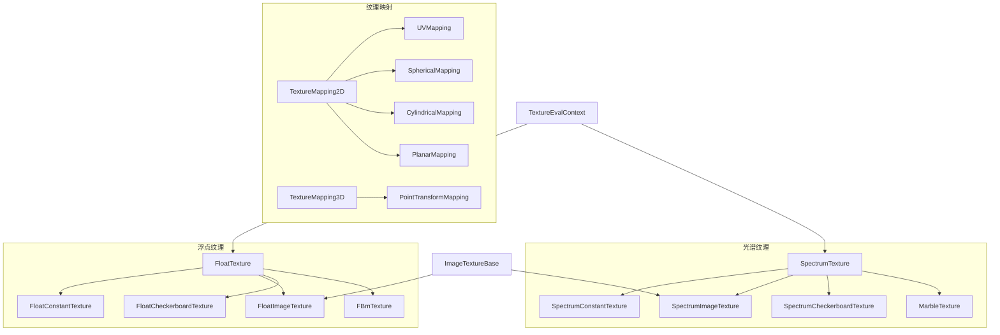

# textures.h / textures.cpp

## 概述
该文件实现了 PBRT-v4 中的纹理系统，提供了从简单常量到复杂程序化纹理的完整纹理类层次。纹理系统分为浮点纹理（`FloatTexture`）和光谱纹理（`SpectrumTexture`）两大类，通过纹理映射（`TextureMapping2D`/`TextureMapping3D`）将几何表面点映射到纹理空间。纹理模块为材质系统提供参数化的外观属性。

## 主要类与接口

### 纹理求值上下文与坐标
| 类/结构体 | 说明 |
|---|---|
| `TextureEvalContext` | 纹理求值上下文，包含表面点位置、UV、微分等信息 |
| `TexCoord2D` | 二维纹理坐标及其微分 |
| `TexCoord3D` | 三维纹理坐标及其微分 |

### 纹理映射
| 类 | 说明 |
|---|---|
| `UVMapping` | UV 纹理映射，支持缩放和偏移 |
| `SphericalMapping` | 球面纹理映射 |
| `CylindricalMapping` | 圆柱纹理映射 |
| `PlanarMapping` | 平面纹理映射 |
| `PointTransformMapping` | 基于点变换的三维纹理映射 |
| `TextureMapping2D` | 二维纹理映射的 TaggedPointer 接口 |
| `TextureMapping3D` | 三维纹理映射的 TaggedPointer 接口 |

### 浮点纹理
| 类 | 说明 |
|---|---|
| `FloatConstantTexture` | 常量浮点纹理 |
| `FloatBilerpTexture` | 双线性插值浮点纹理 |
| `FloatCheckerboardTexture` | 棋盘格浮点纹理 |
| `FloatDotsTexture` | 圆点浮点纹理 |
| `FloatImageTexture` | 图像浮点纹理（基于 MIPMap） |
| `FloatMixTexture` | 混合浮点纹理 |
| `FloatDirectionMixTexture` | 基于法线方向的混合浮点纹理 |
| `FloatScaledTexture` | 缩放浮点纹理 |
| `FloatPtexTexture` | Ptex 浮点纹理 |
| `FBmTexture` | 分形布朗运动噪声纹理 |
| `WindyTexture` | 风纹理（组合 FBm） |
| `WrinkledTexture` | 褶皱纹理（湍流噪声） |

### 光谱纹理
| 类 | 说明 |
|---|---|
| `SpectrumConstantTexture` | 常量光谱纹理 |
| `SpectrumBilerpTexture` | 双线性插值光谱纹理 |
| `SpectrumCheckerboardTexture` | 棋盘格光谱纹理 |
| `SpectrumDotsTexture` | 圆点光谱纹理 |
| `SpectrumImageTexture` | 图像光谱纹理 |
| `SpectrumMixTexture` | 混合光谱纹理 |
| `SpectrumDirectionMixTexture` | 基于法线方向的混合光谱纹理 |
| `SpectrumScaledTexture` | 缩放光谱纹理 |
| `SpectrumPtexTexture` | Ptex 光谱纹理 |
| `MarbleTexture` | 大理石纹理（使用噪声函数） |

### GPU 纹理
| 类 | 说明 |
|---|---|
| `GPUFloatImageTexture` | GPU 浮点图像纹理（使用 CUDA 纹理对象） |
| `GPUSpectrumImageTexture` | GPU 光谱图像纹理 |
| `GPUFloatPtexTexture` | GPU 浮点 Ptex 纹理 |
| `GPUSpectrumPtexTexture` | GPU 光谱 Ptex 纹理 |

### 纹理求值器
| 类 | 说明 |
|---|---|
| `UniversalTextureEvaluator` | 通用纹理求值器，可处理任何纹理类型 |
| `BasicTextureEvaluator` | 基础纹理求值器，仅处理常量和图像纹理（GPU 优化） |

## 架构图


## TextureEvalContext 详解

`TextureEvalContext`（定义于 `textures.h:30-69`）是纹理求值的输入上下文，封装了在某个表面点处计算纹理值所需的全部几何信息。

### 成员变量

| 字段 | 类型 | 含义 |
|---|---|---|
| `p` | `Point3f` | 表面交点的世界空间三维坐标。用于 3D 程序纹理（FBm / Marble 等）和 3D 纹理映射 |
| `uv` | `Point2f` | 表面的二维参数化坐标 (u, v)。用于 2D 纹理映射（UVMapping 等）和图像纹理查找 |
| `n` | `Normal3f` | 表面几何法线。用于 `DirectionMixTexture`（按法线方向混合纹理） |
| `dpdx` | `Vector3f` | 表面位置沿屏幕 x 像素方向的微分 ∂p/∂x。用于 3D 纹理的过滤/反走样 |
| `dpdy` | `Vector3f` | 表面位置沿屏幕 y 像素方向的微分 ∂p/∂y。同上 |
| `dudx` | `Float` | u 参数沿屏幕 x 方向的微分 ∂u/∂x。用于 2D 纹理 / MIPMap 的过滤级别选择 |
| `dudy` | `Float` | u 参数沿屏幕 y 方向的微分 ∂u/∂y。同上 |
| `dvdx` | `Float` | v 参数沿屏幕 x 方向的微分 ∂v/∂x。同上 |
| `dvdy` | `Float` | v 参数沿屏幕 y 方向的微分 ∂v/∂y。同上 |
| `faceIndex` | `int` | 面索引，用于 Ptex 纹理（每个面有独立的纹理数据） |

### 屏幕空间微分与纹理过滤

`dpdx/dpdy` 和 `dudx/dudy/dvdx/dvdy` 这组微分字段描述的是：当屏幕上向右（x）或向下（y）移动一个像素时，对应的表面位置 `p` 或 UV 坐标 `(u, v)` 变化了多少。这些微分通过**光线微分**（ray differentials）在交点处计算得到——渲染器在追踪主光线的同时，额外追踪相邻像素的偏移光线，从而得知一个像素在表面上覆盖的范围。

这些微分在纹理过滤中起关键作用：
- **MIPMap 级别选择**：通过 `dudx/dudy/dvdx/dvdy` 可以计算一个像素在纹理空间中覆盖的面积。覆盖面积大（远处物体或掠射角）→ 选择模糊的 MIP 级别以避免走样；覆盖面积小（近处物体）→ 选择精细的 MIP 级别以保留细节。
- **3D 纹理反走样**：`dpdx/dpdy` 用于估算 3D 程序纹理（FBm、Wrinkled 等）在一个像素内的变化幅度，从而控制噪声的截止频率。
- **Bump Mapping**：`dudx/dudy/dvdx/dvdy` 还用于 Bump Map 计算中确定有限差分步长（`materials.h:116-124`），例如 `du = 0.5 * (|dudx| + |dudy|)` 作为 u 方向的偏移量来计算位移纹理的梯度。

### 构造来源

`TextureEvalContext` 通常从 `SurfaceInteraction` 构造（`textures.h:36-46`）。`SurfaceInteraction` 中的微分信息（`dpdx`, `dpdy`, `dudx` 等）由光线微分在光线-表面交点处计算得到。简化的 `Interaction` 构造器（`textures.h:34`）只提供 `p` 和 `uv`，不包含微分信息。

### 与纹理坐标的关系

`TextureEvalContext` 是纹理映射的**输入**。纹理映射类（`TextureMapping2D` / `TextureMapping3D`）将其转换为纹理空间坐标：
- `TextureMapping2D::Map(ctx)` → `TexCoord2D`：输出 (s, t) 坐标及其微分 `dsdx/dsdy/dtdx/dtdy`
- `TextureMapping3D::Map(ctx)` → `TexCoord3D`：输出三维纹理坐标 `p` 及其微分 `dpdx/dpdy`

纹理类在 `Evaluate()` 时先通过 mapping 将 `TextureEvalContext` 映射到纹理坐标，再用纹理坐标查找或计算纹理值。

## 纹理映射详解

纹理映射负责将 `TextureEvalContext` 中的几何信息转换为纹理空间坐标。所有 2D 映射输出 `TexCoord2D`（`(s, t)` 坐标 + 微分），3D 映射输出 `TexCoord3D`（三维坐标 + 微分）。每种映射都正确传播微分信息，确保下游纹理过滤能正常工作。

### TexCoord2D / TexCoord3D

这两个结构体是纹理映射的输出（定义于 `textures.h:72-83`）：

```cpp
struct TexCoord2D {
    Point2f st;                        // 纹理空间 (s, t) 坐标
    Float dsdx, dsdy, dtdx, dtdy;     // s, t 对屏幕 x, y 的微分
};

struct TexCoord3D {
    Point3f p;                         // 纹理空间三维坐标
    Vector3f dpdx, dpdy;              // p 对屏幕 x, y 的微分
};
```

注意 `TexCoord2D` 中的 `(s, t)` 不一定等于原始的 `(u, v)`——经过映射后坐标空间可能已经完全不同（如球面映射将 3D 点转换为经纬度）。

### UVMapping

**定义**：`textures.h:86-106` | **输出**：`TexCoord2D`

最简单、最常用的 2D 映射。对表面的 UV 坐标做线性缩放和偏移：

```
s = su * u + du
t = sv * v + dv
```

参数 `su/sv` 控制纹理平铺次数（例如 `su=2` 意味着纹理在 u 方向重复两次），`du/dv` 控制纹理偏移。微分通过链式法则直接缩放：

```
dsdx = su * dudx,  dsdy = su * dudy
dtdx = sv * dvdx,  dtdy = sv * dvdy
```

### SphericalMapping

**定义**：`textures.h:108-144` | **输出**：`TexCoord2D`

将表面点投影到以原点为中心的球面上，输出球面坐标 `(θ/π, φ/2π)` 作为 `(s, t)`。步骤：

1. 将世界空间点 `p` 通过 `textureFromRender` 变换到纹理空间得到 `pt`
2. 计算 `pt` 方向向量的球面坐标 `(θ, φ)`，归一化到 `[0,1]`
3. 通过解析导数 `∂s/∂pt` 和 `∂t/∂pt`，结合链式法则 `dsdx = (∂s/∂pt) · (∂pt/∂x)` 传播微分

适用于需要将纹理"包裹"在球体上的场景，例如地球贴图。

### CylindricalMapping

**定义**：`textures.h:146-172` | **输出**：`TexCoord2D`

将表面点投影到以 z 轴为中心轴的圆柱面上：

```
s = (π + atan2(y, x)) / 2π    // 圆柱面的角度方向
t = z                           // 圆柱面的高度方向
```

1. 将 `p` 变换到纹理空间得到 `pt`
2. `s` 由 `pt` 在 xy 平面的极角决定，`t` 直接取 `pt.z`
3. 微分传播：`∂s/∂pt` 仅依赖 xy 分量（`-y/(x²+y²)`, `x/(x²+y²)`, 0），`∂t/∂pt = (0, 0, 1)`

适用于圆柱形物体（柱子、管道等）的纹理贴图。

### PlanarMapping

**定义**：`textures.h:174-202` | **输出**：`TexCoord2D`

将表面点投影到由两个向量 `vs`、`vt` 定义的平面上：

```
s = ds + dot(pt, vs)
t = dt + dot(pt, vt)
```

1. 将 `p` 变换到纹理空间得到向量 `vec`
2. `s` 和 `t` 分别是 `vec` 在 `vs`、`vt` 方向上的投影长度，加上偏移 `ds`、`dt`
3. 微分传播：`dsdx = dot(vs, dpdx)`，利用投影的线性性质

适用于平面纹理投影（类似投影仪），纹理沿投影方向没有变化。`vs` 和 `vt` 不要求正交，可以实现任意仿射变换。

### PointTransformMapping

**定义**：`textures.h:228-245` | **输出**：`TexCoord3D`

唯一的 3D 纹理映射。通过 `textureFromRender` 变换将表面点直接变换到纹理空间：

```
p_tex  = textureFromRender(p)
dpdx_tex = textureFromRender(dpdx)
dpdy_tex = textureFromRender(dpdy)
```

3D 纹理（FBm、Marble、Wrinkled 等）使用此映射。由于这些程序纹理在三维空间中定义，不需要展开为 2D 坐标，直接在变换后的三维坐标上求值即可。`textureFromRender` 变换使得同一个程序纹理可以在不同位置/方向/缩放下使用。

### TextureMapping2D / TextureMapping3D

**定义**：`textures.h:204-266`

这两个类是 `TaggedPointer` 分发接口：

- `TextureMapping2D`：持有 `UVMapping | SphericalMapping | CylindricalMapping | PlanarMapping` 之一，调用 `Map()` 时通过 `Dispatch` 分发到具体实现
- `TextureMapping3D`：当前仅包含 `PointTransformMapping` 一种实现

`TextureMapping2D::Create()` 根据场景文件中的 `"mapping"` 参数（`"uv"` / `"spherical"` / `"cylindrical"` / `"planar"`）选择具体映射类型。

### 映射选择总结

| 映射 | 维度 | 输入 | 坐标语义 | 典型用途 |
|---|---|---|---|---|
| `UVMapping` | 2D | `ctx.uv` | 缩放/偏移后的 UV | 图像纹理、棋盘格、圆点 |
| `SphericalMapping` | 2D | `ctx.p` | 球面经纬度 (θ, φ) | 环境贴图、球体贴图 |
| `CylindricalMapping` | 2D | `ctx.p` | 圆柱角度 + 高度 | 圆柱体贴图 |
| `PlanarMapping` | 2D | `ctx.p` | 平面投影坐标 | 平面投影、墙壁贴图 |
| `PointTransformMapping` | 3D | `ctx.p` | 变换后的 3D 坐标 | FBm、Marble、Wrinkled 等程序纹理 |

所有 2D 映射都依赖 `textureFromRender` 变换（`UVMapping` 除外，它直接操作 UV），使得纹理坐标独立于物体在场景中的位置。

## 纹理类详解

纹理系统分为两大体系：**浮点纹理**（`FloatTexture`）输出单个 `Float`，用于粗糙度、凹凸映射等标量属性；**光谱纹理**（`SpectrumTexture`）输出 `SampledSpectrum`，用于颜色、反射率等光谱属性。大多数纹理类型都有 Float 和 Spectrum 两个版本，内部逻辑相同，仅输出类型不同。

`FloatTexture` 和 `SpectrumTexture` 本身是 `TaggedPointer` 分发接口（定义于 `base/texture.h`），通过 `Dispatch` 机制将 `Evaluate()` 调用路由到具体纹理类。

### ConstantTexture — 常量纹理

**定义**：`textures.h:269-304` | **场景名**：`"constant"` | **映射**：无

最简单的纹理，始终返回固定值，不依赖任何几何信息：

```cpp
Float Evaluate(TextureEvalContext ctx) const { return value; }
```

`FloatConstantTexture` 存储一个 `Float`，`SpectrumConstantTexture` 存储一个 `Spectrum`。当材质参数在场景文件中指定为常量时，pbrt 自动创建 `ConstantTexture` 来封装。

### BilerpTexture — 双线性插值纹理

**定义**：`textures.h:306-357` | **场景名**：`"bilerp"` | **映射**：`TextureMapping2D`

在纹理空间的四个角 `(0,0)/(1,0)/(0,1)/(1,1)` 设置四个值 `v00/v10/v01/v11`，通过双线性插值计算中间点的值：

```
result = (1-s)(1-t)·v00 + s(1-t)·v10 + (1-s)t·v01 + s·t·v11
```

适用于在纹理空间中创建简单的渐变效果。Float 版本的四个角值为标量，Spectrum 版本为光谱值。

### CheckerboardTexture — 棋盘格纹理

**定义**：`textures.h:359-422` + `textures.cpp:182-278` | **场景名**：`"checkerboard"` | **映射**：`TextureMapping2D` 或 `TextureMapping3D`

经典的黑白棋盘格图案，支持 2D 和 3D 两种模式（通过 `dimension` 参数选择，默认 2D）。内部持有两个子纹理 `tex[0]` 和 `tex[1]`，通过 `Checkerboard()` 函数计算混合权重 `w`：

```cpp
return (1 - w) * tex[0].Evaluate(ctx) + w * tex[1].Evaluate(ctx);
```

`Checkerboard()` 函数实现了**反走样过滤**：利用微分信息估算一个像素覆盖的格子数量，当覆盖多个格子时返回接近 0.5 的混合权重（趋向均匀灰色），避免远处出现摩尔纹。内部使用三角滤波器的积分函数 `d(x)` 和带状滤波函数 `bf(x, r)` 实现解析反走样。

### DotsTexture — 圆点纹理

**定义**：`textures.h:424-477` + `textures.cpp:287-340` | **场景名**：`"dots"` | **映射**：`TextureMapping2D`

在纹理空间中生成随机分布的波尔卡圆点图案。通过 `InsidePolkaDot(st)` 判断当前点是否在某个圆点内部：

```cpp
return InsidePolkaDot(c.st) ? insideDot.Evaluate(ctx) : outsideDot.Evaluate(ctx);
```

`InsidePolkaDot()` 使用 Perlin 噪声决定每个网格单元是否放置圆点以及圆点的位置偏移，半径固定为 0.35。在圆点内部使用 `insideDot` 纹理，外部使用 `outsideDot` 纹理。

### ImageTexture — 图像纹理

**定义**：`textures.h:504-625` + `textures.cpp:358-477` | **场景名**：`"imagemap"` | **映射**：`TextureMapping2D`

从图像文件加载纹理数据，是实际渲染中最常用的纹理类型。

#### ImageTextureBase

公共基类（`textures.h:524-568`），负责：
- **MIPMap 加载与缓存**：通过 `TexInfo` 作为缓存键，使用 `textureCache`（`static std::map`）+ `textureCacheMutex` 实现线程安全的全局纹理缓存，避免重复加载同一图像
- 存储 `mapping`、`filename`、`scale`（缩放因子）、`invert`（是否反转）、`mipmap` 指针

#### FloatImageTexture

求值过程（`textures.h:579-591`）：
1. 通过 mapping 得到纹理坐标 `(s, t)` 及微分
2. 翻转 t 坐标：`c.st[1] = 1 - c.st[1]`（图像坐标原点在左上，纹理坐标原点在左下）
3. 调用 `mipmap->Filter<Float>(st, {dsdx, dtdx}, {dsdy, dtdy})` 进行 MIPMap 过滤查找
4. 乘以 `scale`，可选 `invert`（`1 - v`）

#### SpectrumImageTexture

与 Float 版本流程相同，但 `Filter` 返回 `RGB`，需要根据 `spectrumType` 转换为对应的光谱类型：
- `SpectrumType::Unbounded` → `RGBUnboundedSpectrum`（可超过 1，用于辐照度等）
- `SpectrumType::Albedo` → `RGBAlbedoSpectrum`（钳制到 [0,1]，用于反射率）
- `SpectrumType::Illuminant` → `RGBIlluminantSpectrum`（用于光源发射）

#### 场景参数

| 参数 | 默认值 | 说明 |
|---|---|---|
| `filename` | `""` | 图像文件路径 |
| `scale` | `1.0` | 全局缩放因子 |
| `invert` | `false` | 是否反转（`1 - value`） |
| `maxanisotropy` | `8.0` | 各向异性过滤最大比率 |
| `filter` | `"bilinear"` | 过滤模式 |
| `wrap` | `"repeat"` | 边界环绕模式 |
| `encoding` | PNG 为 `"sRGB"`，其他 `"linear"` | 颜色编码 |

### MixTexture — 混合纹理

**定义**：`textures.h:802-888` | **场景名**：`"mix"` | **映射**：无（使用子纹理的映射）

按第三个纹理 `amount` 的值在两个纹理之间做线性插值：

```
result = (1 - amount) * tex1 + amount * tex2
```

`amount` 本身也是一个 `FloatTexture`，可以是另一个棋盘格、图像等纹理，实现空间变化的混合比例。求值时做了短路优化：`amount == 0` 时不求值 `tex2`，`amount == 1` 时不求值 `tex1`。

### DirectionMixTexture — 方向混合纹理

**定义**：`textures.h:831-918` | **场景名**：`"directionmix"` | **映射**：无

根据表面法线 `n` 与指定方向 `dir` 的夹角在两个纹理之间混合：

```
amount = |dot(n, dir)|
result = amount * tex1 + (1 - amount) * tex2
```

法线与 `dir` 方向一致时 `amount → 1`（使用 `tex1`），垂直时 `amount → 0`（使用 `tex2`）。使用 `AbsDot` 取绝对值，所以法线正反面效果相同。典型用途：为朝上的面和侧面赋予不同材质（如雪覆盖效果）。

`dir` 在 `Create()` 中会被 `renderFromTexture` 变换并归一化到渲染空间。

### ScaledTexture — 缩放纹理

**定义**：`textures.h:1028-1076` | **场景名**：`"scale"` | **映射**：无

将一个纹理的输出乘以另一个浮点纹理的值：

```
result = tex.Evaluate(ctx) * scale.Evaluate(ctx)
```

`Create()` 中做了优化：若 `scale` 是常量纹理且值为 1 则直接返回原纹理；若 `scale` 是常量且 `tex` 是图像纹理，则直接修改图像纹理的内部 `scale` 值（`MultiplyScale`），避免额外的间接调用。

### PtexTexture — Ptex 纹理

**定义**：`textures.h:920-970` + `textures.cpp:599-751` | **场景名**：`"ptex"` | **映射**：无（使用 Ptex 内置的每面 UV）

[Ptex](https://ptex.us/) 是 Walt Disney Animation Studios 开发的纹理格式，每个网格面有独立的纹理数据，不需要全局 UV 展开。

#### PtexTextureBase

公共基类，负责初始化 Ptex 缓存（`Ptex::PtexCache`，最多 100 文件 / 4GB 内存）和验证纹理文件。`SampleTexture()` 方法通过 Ptex 库的 B-spline 过滤器求值，使用 `ctx.faceIndex` 定位面，使用 `ctx.uv` 和微分信息进行过滤。

#### FloatPtexTexture / SpectrumPtexTexture

CPU 版本通过 `SampleTexture()` 读取 Ptex 数据。单通道纹理直接返回值；三通道纹理在 Float 版本中取平均，在 Spectrum 版本中转换为 RGB 光谱。

### FBmTexture — 分形布朗运动噪声纹理

**定义**：`textures.h:479-502` | **场景名**：`"fbm"` | **映射**：`TextureMapping3D` | **仅 Float**

使用分形布朗运动（Fractional Brownian motion）生成自然界常见的"1/f"噪声：

```cpp
return FBm(c.p, c.dpdx, c.dpdy, omega, octaves);
```

- `octaves`：叠加的噪声层数（默认 8），每层频率翻倍
- `omega`（场景参数 `roughness`，默认 0.5）：每层幅度的衰减因子，控制高频细节的强度

`FBm()` 函数（定义在 `util/noise.h`）利用 `dpdx/dpdy` 自动确定截止频率，避免对亚像素尺度的噪声进行采样。

### WindyTexture — 风纹理

**定义**：`textures.h:1078-1100` | **场景名**：`"windy"` | **映射**：`TextureMapping3D` | **仅 Float**

组合两层 FBm 噪声模拟风吹水面的效果：

```cpp
Float windStrength = FBm(0.1 * c.p, 0.1 * c.dpdx, 0.1 * c.dpdy, 0.5, 3);
Float waveHeight = FBm(c.p, c.dpdx, c.dpdy, 0.5, 6);
return abs(windStrength) * waveHeight;
```

第一层 FBm（低频、3 个八度）模拟大尺度的风力分布，第二层 FBm（正常频率、6 个八度）模拟小尺度的波浪高度。乘积使得有风的区域波浪大，无风区域平静。无可配置参数。

### WrinkledTexture — 褶皱纹理

**定义**：`textures.h:1102-1126` | **场景名**：`"wrinkled"` | **映射**：`TextureMapping3D` | **仅 Float**

使用湍流函数（FBm 取绝对值后求和）生成褶皱表面效果：

```cpp
return Turbulence(c.p, c.dpdx, c.dpdy, omega, octaves);
```

与 FBm 的区别在于 `Turbulence()` 对每层噪声取绝对值后再叠加，产生更"皱巴巴"的尖锐折痕效果，而非 FBm 的平滑波动。参数与 FBm 相同：`octaves`（默认 8）和 `roughness`（默认 0.5）。

### MarbleTexture — 大理石纹理

**定义**：`textures.h:774-800` + `textures.cpp:479-520` | **场景名**：`"marble"` | **映射**：`TextureMapping3D` | **仅 Spectrum**

通过 FBm 噪声调制正弦函数模拟大理石纹理：

```cpp
Float marble = p.y + variation * FBm(p, dpdx, dpdy, omega, octaves);
Float t = 0.5 + 0.5 * sin(marble);
```

1. 以 y 坐标为基础频率，叠加 FBm 噪声产生不规则的条纹变形
2. 用 `sin()` 将结果映射为周期性的条纹图案，归一化到 [0,1]
3. 以 `t` 为参数在预定义的 9 个 RGB 颜色控制点上做三次 Bézier 样条插值，产生蓝灰色调的大理石颜色

参数：`octaves`（默认 8）、`roughness`（默认 0.5）、`scale`（坐标缩放，默认 1）、`variation`（噪声扰动幅度，默认 0.2）。

### GPU 纹理

**定义**：`textures.h:627-1026` | **场景名**：与 CPU 版本相同（`"imagemap"` / `"ptex"`）

GPU 版本在 `Create()` 时根据 `gpu` 参数自动选择。

#### GPUFloatImageTexture / GPUSpectrumImageTexture

使用 CUDA 纹理对象（`cudaTextureObject_t`）代替 CPU 端的 `MIPMap`，通过 `tex2DGrad()` 利用 GPU 硬件完成 MIPMap 过滤和各向异性过滤。`Create()` 中将图像数据上传为 `cudaMipmappedArray`，配置 `cudaTextureDesc`（地址模式、滤波模式、各向异性等级等），创建 CUDA 纹理对象。同样有全局纹理缓存（`lumTextureCache` / `rgbTextureCache`）避免重复上传。

#### GPUFloatPtexTexture / GPUSpectrumPtexTexture

GPU 不支持原生 Ptex 查找，因此在构造时预计算每个面中心点的值，存储为 `pstd::vector<Float>` 或 `pstd::vector<RGB>`。求值时直接按 `faceIndex` 索引取值，不做任何过滤——这是精度的妥协，换取 GPU 兼容性。

### 纹理求值器

**定义**：`textures.h:1139-1213`

纹理求值器是对 `FloatTexture::Evaluate()` / `SpectrumTexture::Evaluate()` 的封装层，用于在材质中统一调用纹理：

#### UniversalTextureEvaluator

`CanEvaluate()` 始终返回 `true`，通过 `TaggedPointer::Dispatch` 分发到任何纹理类型。CPU 渲染器使用此求值器。

#### BasicTextureEvaluator

`CanEvaluate()` 仅接受常量纹理和图像纹理（含 GPU 版本），其他类型返回 `false`。求值时通过 `Is<T>()` / `Cast<T>()` 手动分发，避免 `Dispatch` 的虚调用开销。**GPU 渲染器使用此求值器**——GPU wavefront 渲染管线中只有 `BasicTextureEvaluator` 能处理的纹理类型才会走 GPU 快速路径，其他复杂纹理回退到 `UniversalTextureEvaluator`。

### 纹理类型总览

| 纹理 | 场景名 | Float | Spectrum | 映射 | 核心逻辑 |
|---|---|---|---|---|---|
| Constant | `"constant"` | ✓ | ✓ | 无 | 返回固定值 |
| Bilerp | `"bilerp"` | ✓ | ✓ | 2D | 四角双线性插值 |
| Checkerboard | `"checkerboard"` | ✓ | ✓ | 2D/3D | 棋盘格图案，带解析反走样 |
| Dots | `"dots"` | ✓ | ✓ | 2D | 噪声驱动的随机圆点 |
| Image | `"imagemap"` | ✓ | ✓ | 2D | 图像文件 + MIPMap 过滤 |
| Mix | `"mix"` | ✓ | ✓ | 无 | 按 amount 插值两个子纹理 |
| DirectionMix | `"directionmix"` | ✓ | ✓ | 无 | 按法线方向混合子纹理 |
| Scaled | `"scale"` | ✓ | ✓ | 无 | 纹理值 × 浮点缩放纹理 |
| Ptex | `"ptex"` | ✓ | ✓ | 无 | 每面独立纹理数据 |
| FBm | `"fbm"` | ✓ | ✗ | 3D | 分形布朗运动噪声 |
| Windy | `"windy"` | ✓ | ✗ | 3D | 双层 FBm 模拟风浪 |
| Wrinkled | `"wrinkled"` | ✓ | ✗ | 3D | 湍流噪声（|FBm| 求和） |
| Marble | `"marble"` | ✗ | ✓ | 3D | FBm 调制正弦 + 颜色样条 |

## 依赖关系
- **依赖**：`pbrt/pbrt.h`, `pbrt/base/texture.h`, `pbrt/interaction.h`, `pbrt/paramdict.h`, `pbrt/util/colorspace.h`, `pbrt/util/math.h`, `pbrt/util/mipmap.h`, `pbrt/util/noise.h`, `pbrt/util/spectrum.h`, `pbrt/util/taggedptr.h`, `pbrt/util/transform.h`, `pbrt/util/vecmath.h`, `Ptexture.h`
- **被依赖**：`pbrt/materials.h`（所有材质类型）, `pbrt/scene.h`/`scene.cpp`, `pbrt/shapes.cpp`, GPU 渲染管线
