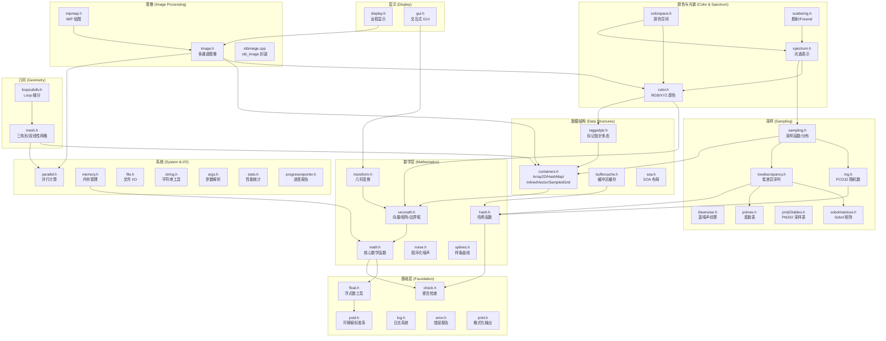
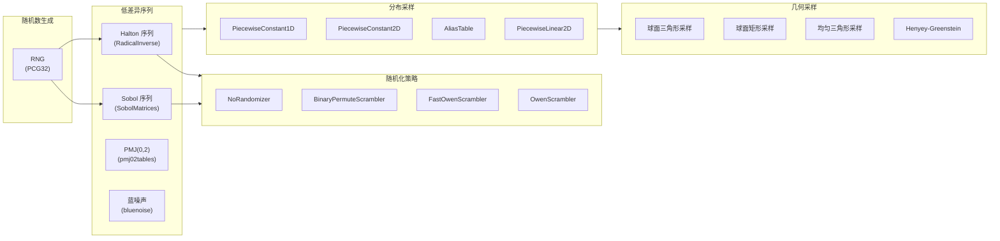
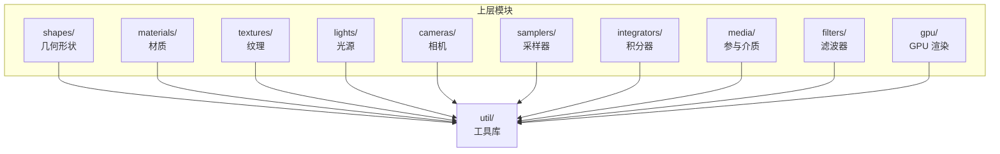
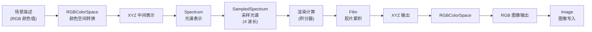
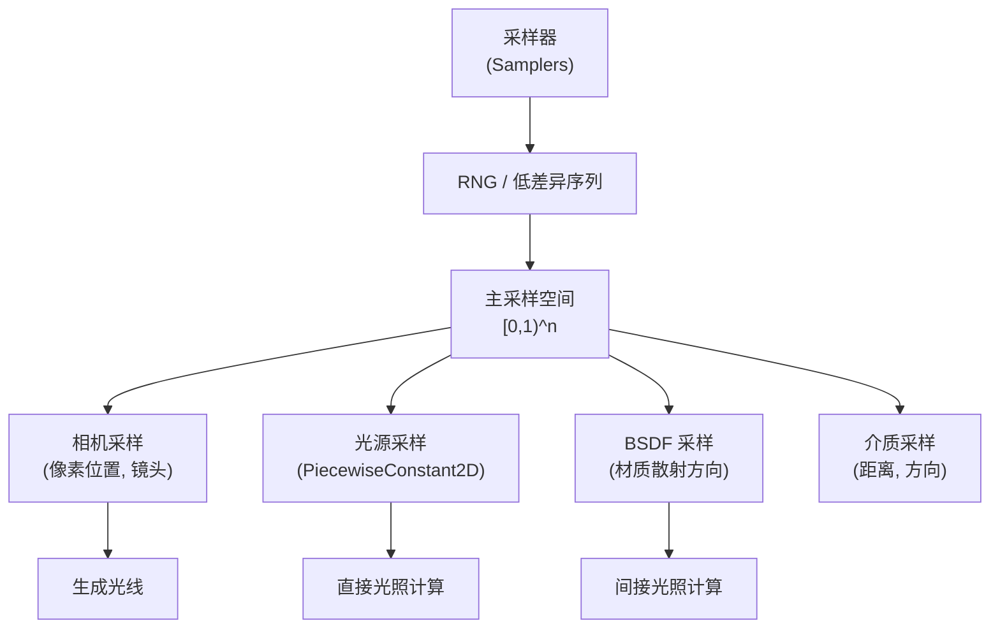
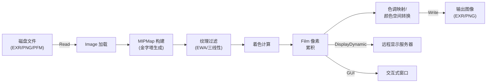

# pbrt-v4 工具库 (`src/pbrt/util/`)

## 概述

`util/` 目录是 pbrt-v4 渲染引擎的基础工具库，包含 **96 个源文件**，为整个渲染系统提供底层基础设施。该模块涵盖了数学计算、向量与矩阵运算、颜色与光谱处理、图像读写、采样算法、并行计算、内存管理、容器与数据结构、文件操作、日志与错误处理等核心功能。所有工具代码均通过 `PBRT_CPU_GPU` 宏标注，支持 CPU 和 GPU 双端执行。

---

## 文件列表

### 数学基础 (Mathematics)

| 文件 | 用途 |
|------|------|
| `math.h` / `math.cpp` | 核心数学函数：常量 (Pi, InvPi 等)、位操作 (ReverseBits, Morton 编码)、插值、多项式求解、区间算术 (`Interval`)、Gaussian、ErfInv 等 |
| `math_test.cpp` | 数学函数单元测试 |
| `float.h` / `float.cpp` | 浮点数工具：NaN/Inf 检测、FMA 运算、`NextFloatUp`/`NextFloatDown`、`Half` 半精度浮点、浮点常量 (`Infinity`, `MachineEpsilon`, `OneMinusEpsilon`) |
| `float_test.cpp` | 浮点数工具单元测试 |

### 向量数学与几何变换 (Vector Math & Transforms)

| 文件 | 用途 |
|------|------|
| `vecmath.h` / `vecmath.cpp` | 向量数学核心：`Tuple2`/`Tuple3` 模板基类、`Vector2`/`Vector3`、`Point2`/`Point3`、`Normal3`、`Bounds2`/`Bounds3`、`SquareMatrix`、`DirectionCone` 等 |
| `vecmath_test.cpp` | 向量数学单元测试 |
| `transform.h` / `transform.cpp` | 几何变换：`Transform` 类（4x4 矩阵变换），支持平移、旋转、缩放、LookAt、透视/正交投影，及对 Point、Vector、Normal、Ray、Bounds 的变换操作；`AnimatedTransform` 动画插值变换 |
| `transform_test.cpp` | 几何变换单元测试 |

### 颜色与光谱 (Color & Spectrum)

| 文件 | 用途 |
|------|------|
| `color.h` / `color.cpp` | 颜色类型：`RGB`、`XYZ` 颜色空间类、`RGBSigmoidPolynomial`（RGB 到光谱的多项式转换）、`RGBToSpectrumTable` 查找表、`ColorEncoding` 颜色编码接口 |
| `color_test.cpp` | 颜色工具单元测试 |
| `colorspace.h` / `colorspace.cpp` | RGB 颜色空间定义：`RGBColorSpace` 类，内置 sRGB、DCI-P3、Rec2020、ACES2065-1 标准颜色空间，支持 RGB-XYZ 互转和颜色空间转换 |
| `spectrum.h` / `spectrum.cpp` | 光谱表示与运算：`Spectrum` 多态接口（使用 TaggedPointer）、`SampledSpectrum`（采样光谱）、`SampledWavelengths`（采样波长）、多种光谱类型（`BlackbodySpectrum`、`ConstantSpectrum`、`PiecewiseLinearSpectrum`、`DenselySampledSpectrum`、`RGBAlbedoSpectrum`、`RGBUnboundedSpectrum`、`RGBIlluminantSpectrum`）、CIE 标准观察者函数 |
| `spectrum_test.cpp` | 光谱单元测试 |

### 图像处理 (Image Processing)

| 文件 | 用途 |
|------|------|
| `image.h` / `image.cpp` | 图像类：`Image` 多通道图像存储，支持 U256/Half/Float 像素格式，支持 EXR/PNG/PFM 格式读写，支持多种 WrapMode（Black/Clamp/Repeat/OctahedralSphere），提供重采样、通道选择等功能 |
| `image_test.cpp` | 图像单元测试 |
| `mipmap.h` / `mipmap.cpp` | MIP 贴图：`MIPMap` 多级纹理过滤，支持 Point/Bilinear/Trilinear/EWA 各向异性过滤 |
| `stbimage.cpp` | stb_image 第三方库封装，提供 PNG/BMP/HDR 等常见格式的底层读取支持 |

### 采样与低差异序列 (Sampling & Low-Discrepancy)

| 文件 | 用途 |
|------|------|
| `sampling.h` / `sampling.cpp` | 采样函数集合：离散/线性/双线性采样、球面三角形/矩形采样、Henyey-Greenstein 相位函数采样、正态/指数/帐篷分布采样、可见波长采样；`PiecewiseConstant1D`/`PiecewiseConstant2D` 分段常数分布、`AliasTable` 别名表快速采样、`PiecewiseLinear2D` 分段线性 2D 分布；MIS 权重函数（Balance Heuristic、Power Heuristic） |
| `sampling_test.cpp` | 采样单元测试 |
| `lowdiscrepancy.h` / `lowdiscrepancy.cpp` | 低差异序列：`DigitPermutation` 数字排列、`RadicalInverse` 基数反转、Sobol 序列索引计算、Halton 序列、各种随机化策略（`NoRandomizer`、`BinaryPermuteScrambler`、`FastOwenScrambler`、`OwenScrambler`） |
| `rng.h` / `rng.cpp` | 随机数生成器：`RNG` 类，基于 PCG32 算法，支持均匀整数/浮点数生成、序列控制、前进/倒退 |
| `rng_test.cpp` | 随机数生成器单元测试 |
| `sobolmatrices.h` / `sobolmatrices.cpp` | Sobol 生成矩阵数据：1024 维 Sobol 矩阵（32 位和 64 位），van der Corput 序列矩阵 |
| `pmj02tables.h` / `pmj02tables.cpp` | PMJ(0,2) 蓝噪声采样表：5 组共 65536 个预计算的 PMJ02BN 采样点 |
| `bluenoise.h` / `bluenoise.cpp` | 蓝噪声纹理：48 张 128x128 的蓝噪声纹理表，用于时空蓝噪声采样 |
| `primes.h` / `primes.cpp` | 素数表：前 1000 个素数，用于低差异序列的基数选择 |

### 并行计算 (Parallel Computing)

| 文件 | 用途 |
|------|------|
| `parallel.h` / `parallel.cpp` | 并行基础设施：`ParallelInit`/`ParallelCleanup` 线程池管理、`ParallelFor`/`ParallelFor2D` 并行循环、`ThreadLocal` 线程本地存储、`ThreadPool` 工作线程池、`AtomicFloat`/`AtomicDouble` 原子浮点操作 |
| `parallel_test.cpp` | 并行计算单元测试 |

### 内存管理 (Memory Management)

| 文件 | 用途 |
|------|------|
| `memory.h` / `memory.cpp` | 内存管理工具：`ScratchBuffer` 临时分配缓冲区（基于 bump allocator）、`TrackedMemoryResource` 内存跟踪分配器、`GetCurrentRSS` 进程内存查询 |
| `buffercache.h` / `buffercache.cpp` | 缓冲区缓存：`BufferCache<T>` 模板类，用于去重存储顶点/索引等几何数据缓冲，基于分片哈希表实现线程安全 |
| `buffercache_test.cpp` | 缓冲区缓存单元测试 |
| `pstd.h` / `pstd.cpp` | 可移植标准库：CPU/GPU 通用的 `pstd::array`、`pstd::optional`、`pstd::span`、`pstd::vector`、`pstd::pmr` 多态内存分配器，`pstd::bit_cast` 类型双关 |
| `pstd_test.cpp` | pstd 单元测试 |

### 容器与数据结构 (Containers & Data Structures)

| 文件 | 用途 |
|------|------|
| `containers.h` | 容器集合：`TypePack` 编译期类型列表操作、`Array2D` 二维数组、`InlinedVector<T,N>` 小缓冲优化向量、`HashMap` 开放寻址哈希映射表、`SampledGrid<T>` 三维采样网格（支持三线性插值）、`InternCache` 字符串/对象驻留缓存 |
| `containers_test.cpp` | 容器单元测试 |
| `taggedptr.h` | 标记指针：`TaggedPointer` 模板类，在指针高位存储类型标签，实现轻量级多态分发（替代虚函数），广泛用于 Material、Light、Shape、Spectrum 等多态接口 |
| `taggedptr_test.cpp` | 标记指针单元测试 |
| `hash.h` | 哈希函数：`MurmurHash64A` 哈希算法、`MixBits` 位混合、`HashBuffer` 批量哈希、可变参数 `Hash(...)` 通用哈希接口 |
| `hash_test.cpp` | 哈希单元测试 |
| `soa.h` | 结构体数组 (SOA) 布局：`SOA<T>` 模板特化，为 `SampledSpectrum`、`SampledWavelengths` 等关键数据类型提供 GPU 友好的 SOA 内存布局 |

### 散射与物理计算 (Scattering & Physics)

| 文件 | 用途 |
|------|------|
| `scattering.h` / `scattering.cpp` | 散射工具函数：`Reflect` 镜面反射、`Refract` 折射（含全内反射处理）、`HenyeyGreenstein` 相位函数、Fresnel 方程（`FrDielectric`、`FrComplex`、`FrConductor`） |
| `noise.h` / `noise.cpp` | 程序化噪声：Perlin 噪声 (`Noise`)、梯度噪声 (`DNoise`)、分形布朗运动 (`FBm`)、湍流函数 (`Turbulence`) |
| `splines.h` | 样条曲线：`BlossomCubicBezier` 贝塞尔求值、`EvaluateCubicBezier` 三次贝塞尔曲线计算、`SubdivideCubicBezier` 细分、`CubicBezierControlPoints` 控制点计算 |
| `splines_test.cpp` | 样条曲线单元测试 |

### 几何网格 (Geometry Mesh)

| 文件 | 用途 |
|------|------|
| `mesh.h` / `mesh.cpp` | 网格数据：`TriangleMesh` 三角形网格（含顶点、法线、UV、切线、面索引）、`BilinearPatchMesh` 双线性面片网格，支持 PLY 文件写入 |
| `loopsubdiv.h` / `loopsubdiv.cpp` | Loop 细分曲面：`LoopSubdivide` 函数，将三角形网格进行 Loop 细分 |

### 字符串与解析 (String & Parsing)

| 文件 | 用途 |
|------|------|
| `string.h` / `string.cpp` | 字符串工具：`Atoi`/`Atof` 安全转换、字符串分割 (`SplitString`)、UTF-8/UTF-16 编码转换、`InternedString` 字符串驻留、`InternCache` 驻留池 |
| `string_test.cpp` | 字符串工具单元测试 |
| `args.h` / `args.cpp` | 命令行参数解析：`normalizeArg` 参数规范化、`initArg` 类型转换、`ParseArg`/`ParseArgs` 参数匹配 |
| `args_test.cpp` | 参数解析单元测试 |
| `print.h` / `print.cpp` | 格式化输出：`StringPrintf` 类型安全的格式化字符串、`ToString` 通用对象转字符串、ostream 操作符重载 |
| `print_test.cpp` | 格式化输出单元测试 |

### 文件 I/O (File I/O)

| 文件 | 用途 |
|------|------|
| `file.h` / `file.cpp` | 文件操作：`ReadFileContents` 读文件、`WriteFileContents` 写文件、`ReadDecompressedFileContents` 解压读取、`ReadFloatFile` 浮点数文件读取、`ResolveFilename` 路径解析、`HasExtension` 扩展名检查、glob 模式匹配 |
| `file_test.cpp` | 文件操作单元测试 |

### 日志与错误处理 (Logging & Error Handling)

| 文件 | 用途 |
|------|------|
| `log.h` / `log.cpp` | 日志系统：`LogLevel` 日志级别（Verbose/Error/Fatal）、`LOG_VERBOSE`/`LOG_ERROR`/`LOG_FATAL` 宏、GPU 日志收集 (`GPULogItem`)、利用率统计日志 |
| `error.h` / `error.cpp` | 错误报告：`FileLoc` 源文件位置信息、`Warning`/`Error`/`ErrorExit` 分级错误报告函数，支持场景文件行列号定位 |
| `check.h` / `check.cpp` | 断言检查：`CHECK`/`CHECK_EQ`/`CHECK_LT` 等宏，`DCHECK` 仅在调试构建生效；`PrintStackTrace` 堆栈追踪 |
| `stats.h` / `stats.cpp` | 性能统计：`StatsAccumulator` 统计收集器、`StatRegisterer` 统计注册、计数器/百分比/比率/分布等多种统计类型、像素级统计 (`PixelStatsAccumulator`)、`STAT_COUNTER`/`STAT_MEMORY_COUNTER` 等宏 |
| `progressreporter.h` / `progressreporter.cpp` | 进度报告：`ProgressReporter` 进度条显示、`Timer` 高精度计时器 |

### 显示与 GUI (Display & GUI)

| 文件 | 用途 |
|------|------|
| `display.h` / `display.cpp` | 远程显示服务器：`ConnectToDisplayServer`/`DisconnectFromDisplayServer`、`DisplayStatic`/`DisplayDynamic` 静态/动态图像推送 |
| `gui.h` / `gui.cpp` | 图形用户界面：`GUI` 类（基于 GLFW/OpenGL），支持交互式相机控制、曝光调整、帧缓冲显示，用于实时预览渲染结果 |

---

## 架构图

### 模块功能分组

### 核心类继承与关系

```mermaid
classDiagram
    class Tuple2~Child,T~ {
        +T x, y
        +operator+()
        +operator-()
        +operator*()
    }
    class Tuple3~Child,T~ {
        +T x, y, z
        +operator+()
        +operator-()
        +operator*()
    }
    class Vector2~T~ {
        +Length()
        +LengthSquared()
    }
    class Vector3~T~ {
        +Length()
        +LengthSquared()
    }
    class Point2~T~ {
        +operator+(Vector2)
        +operator-(Point2)
    }
    class Point3~T~ {
        +operator+(Vector3)
        +operator-(Point3)
    }
    class Normal3~T~ {
        +FaceForward()
    }
    class Bounds2~T~ {
        +Point2 pMin, pMax
        +Area()
        +Intersect()
        +Union()
    }
    class Bounds3~T~ {
        +Point3 pMin, pMax
        +Volume()
        +SurfaceArea()
        +IntersectP()
    }
    class SquareMatrix~N~ {
        +Determinant()
        +Inverse()
        +Transpose()
    }
    class Transform {
        -SquareMatrix~4~ m, mInv
        +operator()(Point3) Point3
        +operator()(Vector3) Vector3
        +operator()(Normal3) Normal3
        +operator()(Ray) Ray
        +Translate()
        +Scale()
        +RotateX/Y/Z()
        +LookAt()
        +Perspective()
    }

    Tuple2 <|-- Vector2
    Tuple2 <|-- Point2
    Tuple3 <|-- Vector3
    Tuple3 <|-- Point3
    Tuple3 <|-- Normal3

    class RGB {
        +Float r, g, b
        +operator+,-,*,/()
    }
    class XYZ {
        +Float x, y, z
        +xy() Point2f
    }
    class RGBColorSpace {
        +Point2f r, g, b, w
        +DenselySampledSpectrum illuminant
        +ToRGB(XYZ) RGB
        +ToXYZ(RGB) XYZ
        +sRGB, DCI_P3, Rec2020, ACES2065_1
    }

    class Spectrum {
        <<TaggedPointer>>
        +operator()(Float lambda) Float
        +MaxValue() Float
        +Sample(SampledWavelengths)
    }
    class SampledSpectrum {
        -Float values[NSpectrumSamples]
        +operator+,-,*,/()
        +Average() Float
    }
    class SampledWavelengths {
        -Float lambda[NSpectrumSamples]
        -Float pdf[NSpectrumSamples]
        +SampleVisible(Float u)
        +TerminateSecondary()
    }

    class TaggedPointer~Types~ {
        -uintptr_t bits
        +Tag() uint
        +Ptr() void*
        +Dispatch(func)
    }
    Spectrum --|> TaggedPointer

    class Image {
        -PixelFormat format
        -Point2i resolution
        -int nChannels
        +GetChannel() Float
        +SetChannel()
        +Read(filename) Image
        +Write(filename)
    }
    class MIPMap {
        -vector~Image~ pyramid
        +Filter(st, dstdx, dstdy)
        +Levels() int
    }
    MIPMap --> Image

    class RNG {
        -uint64_t state, inc
        +Uniform~T~() T
        +SetSequence()
        +Advance()
    }

    class PiecewiseConstant1D {
        -vector~Float~ func, cdf
        +Sample(Float u) Float
        +Integral() Float
    }
    class PiecewiseConstant2D {
        -PiecewiseConstant1D marginal
        -vector~PiecewiseConstant1D~ conditional
        +Sample(Point2f u) Point2f
    }
    PiecewiseConstant2D --> PiecewiseConstant1D

    class ScratchBuffer {
        -char* ptr
        -int allocSize, offset
        +Alloc~T~() T*
        +Reset()
    }
```

### 采样系统关系

---

## 核心类与接口

### 数学核心

- **`Interval`**：区间算术类，用于精确的浮点误差边界跟踪。在光线-几何体求交等数值敏感操作中确保正确性。
- **`SquareMatrix<N>`**：N 阶方阵模板，支持矩阵乘法、转置、求逆、行列式计算。`SquareMatrix<4>` 用于几何变换，`SquareMatrix<3>` 用于颜色空间转换。
- **`Tuple2<Child,T>` / `Tuple3<Child,T>`**：使用 CRTP（奇异递归模板模式）的向量基类，为 Vector、Point、Normal 提供统一的算术运算实现。

### 几何变换

- **`Transform`**：封装 4x4 齐次变换矩阵及其逆矩阵。提供工厂方法 `Translate()`、`Scale()`、`RotateX/Y/Z()`、`LookAt()`、`Perspective()`、`Orthographic()` 等。核心操作 `operator()` 支持对 `Point3`、`Vector3`、`Normal3`、`Ray`、`Bounds3` 的变换。

### 颜色与光谱

- **`RGB` / `XYZ`**：三通道颜色值类型，提供完整的算术运算。
- **`RGBColorSpace`**：RGB 颜色空间定义，包含色品坐标和光源光谱。内置四种标准颜色空间。提供 RGB-XYZ 互转及颜色空间间转换。
- **`Spectrum`**：基于 `TaggedPointer` 的多态光谱接口。支持七种光谱表示：常数、分段线性、密集采样、黑体、三种 RGB 光谱。核心方法 `operator()(lambda)` 查询指定波长的光谱值。
- **`SampledSpectrum`**：固定 `NSpectrumSamples`（默认为 4）个波长的离散光谱表示，是渲染计算的核心数据类型。

### 采样

- **`PiecewiseConstant1D` / `PiecewiseConstant2D`**：分段常数概率分布函数，通过 CDF 反转法进行采样。`PiecewiseConstant2D` 先采样边际分布再采样条件分布。
- **`AliasTable`**：O(1) 时间复杂度的离散分布采样，预处理后每次采样仅需一次随机数。
- **`RNG`**：基于 PCG32 的伪随机数生成器，支持可重复序列、序列偏移和确定性前进/后退操作。

### 并行计算

- **`ParallelFor(start, end, func)`**：将一维循环任务自动分割并分配到线程池中并行执行。
- **`ParallelFor2D(extent, func)`**：将二维区域（如图像像素）分块并行处理。
- **`ThreadLocal<T>`**：基于哈希表的线程本地存储，自动为每个工作线程创建独立副本。
- **`AtomicFloat` / `AtomicDouble`**：使用 CAS 循环实现的原子浮点加法操作。

### 内存管理

- **`ScratchBuffer`**：轻量级 bump 分配器（线性分配器），适用于渲染过程中临时对象的快速分配。通过 `Reset()` 批量释放，避免逐个 `delete` 的开销。
- **`TrackedMemoryResource`**：内存跟踪分配器，记录当前和历史最大内存分配量。
- **`BufferCache<T>`**：基于内容哈希的缓冲区去重缓存，用于共享相同内容的顶点/索引缓冲区，减少内存冗余。采用分片锁实现并发安全。

### 容器

- **`Array2D<T>`**：支持任意偏移起始坐标的二维数组，广泛用于图像和纹理数据。
- **`InlinedVector<T,N>`**：小缓冲优化向量，N 个元素以内在栈上分配，超出后退化为堆分配。
- **`HashMap<T>`**：开放寻址哈希表，线程安全（读写锁分片），用于缓存和查找。
- **`SampledGrid<T>`**：三维体积数据网格，支持三线性插值查询和最大值查询。
- **`TaggedPointer<Types...>`**：在指针的高位编码类型标签，通过 `Dispatch` 实现编译时多态分发，性能优于虚函数。是 pbrt-v4 多态架构的核心机制。

### 格式化与诊断

- **`StringPrintf`**：类型安全的 `printf` 风格格式化函数，自动将自定义类型通过 `ToString()` 转换。
- **`CHECK` / `DCHECK` 宏族**：运行时断言检查，失败时输出详细的变量值和堆栈信息。`DCHECK` 仅在调试构建中生效。
- **`StatsAccumulator`**：统一的渲染性能统计收集框架，支持计数器、百分比、比率、数值分布等多种统计类型。

---

## 依赖关系

### 本模块依赖的外部库

| 外部依赖 | 用途 |
|----------|------|
| C++ 标准库 | 线程 (`<thread>`, `<mutex>`)、文件 I/O、数学函数、容器等 |
| stb_image | PNG/BMP/HDR 等图像格式解码（通过 `stbimage.cpp` 封装） |
| OpenEXR | EXR 高动态范围图像格式读写（在 `image.cpp` 中使用） |
| GLFW + OpenGL/GLAD | GUI 窗口管理和 OpenGL 渲染（在 `gui.cpp` 中使用） |
| CUDA | GPU 渲染支持（条件编译 `PBRT_BUILD_GPU_RENDERER`） |
| zlib | 压缩文件解压读取（在 `file.cpp` 中使用） |

### 本模块依赖的内部模块

| 内部依赖 | 说明 |
|----------|------|
| `pbrt/pbrt.h` | 全局类型定义（`Float`、`Allocator` 等）和编译配置宏 |
| `pbrt/ray.h` | `Ray`、`RayDifferential` 类型（被 `transform.h` 使用） |
| `pbrt/interaction.h` | 交互点类型（被 `soa.h` 使用） |
| `pbrt/bsdf.h` | BSDF 类型（被 `soa.h` 使用） |

### 依赖本模块的其他模块

`util/` 是整个 pbrt-v4 系统的基础设施层，几乎所有上层模块都依赖它：

---

## 数据流

### 颜色/光谱数据流

### 采样数据流

### 图像处理管线

---

## 测试文件

本模块包含 17 个测试文件（`*_test.cpp`），覆盖核心功能的单元测试：

| 测试文件 | 测试目标 |
|----------|----------|
| `args_test.cpp` | 命令行参数解析 |
| `buffercache_test.cpp` | 缓冲区去重缓存 |
| `color_test.cpp` | RGB/XYZ 颜色运算 |
| `containers_test.cpp` | Array2D、InlinedVector、HashMap 等容器 |
| `file_test.cpp` | 文件读写操作 |
| `float_test.cpp` | 浮点精度、Half 半精度 |
| `hash_test.cpp` | MurmurHash、Hash 函数 |
| `image_test.cpp` | 图像读写与格式转换 |
| `math_test.cpp` | 数学函数、区间算术 |
| `parallel_test.cpp` | 并行循环、原子操作 |
| `print_test.cpp` | StringPrintf 格式化 |
| `pstd_test.cpp` | pstd 容器（span、optional 等） |
| `rng_test.cpp` | PCG32 随机数生成器 |
| `sampling_test.cpp` | 采样分布与逆采样 |
| `spectrum_test.cpp` | 光谱表示与转换 |
| `splines_test.cpp` | 贝塞尔样条求值 |
| `taggedptr_test.cpp` | TaggedPointer 分发机制 |
| `transform_test.cpp` | 几何变换正确性 |
| `vecmath_test.cpp` | 向量/矩阵/边界框运算 |
