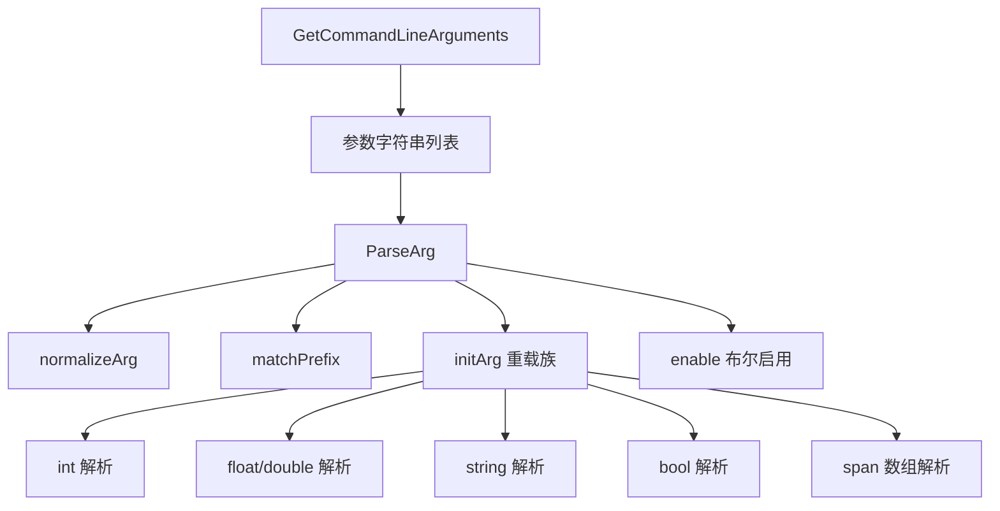
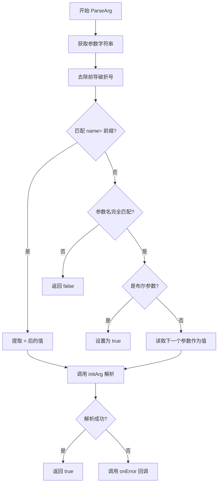

# args.h / args.cpp

## 概述
该文件提供了命令行参数解析的工具函数集，用于 PBRT 渲染器的启动配置。它支持多种参数类型（整数、浮点数、字符串、布尔值等）的解析，并提供了灵活的参数名匹配机制（忽略大小写、下划线和连字符）。在渲染管线中，该模块是程序入口点处理用户输入的基础设施。

## 主要类与接口
| 类/结构体/函数 | 说明 |
|---|---|
| `normalizeArg` | 将参数名转换为小写并移除 `-` 和 `_` 字符，实现灵活的参数名匹配 |
| `initArg(string, int*)` | 将字符串解析为整数值 |
| `initArg(string, float*)` | 将字符串解析为单精度浮点数 |
| `initArg(string, double*)` | 将字符串解析为双精度浮点数 |
| `initArg(string, span<float>)` | 将逗号分隔的字符串解析为浮点数数组 |
| `initArg(string, span<double>)` | 将逗号分隔的字符串解析为双精度浮点数数组 |
| `initArg(string, span<int>)` | 将逗号分隔的字符串解析为整数数组 |
| `initArg(string, char**)` | 将字符串复制为 C 风格字符串 |
| `initArg(string, string*)` | 将字符串赋值给 std::string |
| `initArg(string, bool*)` | 解析 "true"/"false" 字符串为布尔值 |
| `initArg(string, optional<T>*)` | 将字符串解析为 optional 包装的值 |
| `matchPrefix` | 检查字符串是否以指定前缀开头 |
| `enable(bool*)` | 布尔参数的特化启用函数，设置为 true |
| `ParseArg` | 核心参数解析模板函数，支持 `--arg=value` 和 `--arg value` 两种格式 |
| `GetCommandLineArguments` | 从 `argv` 获取命令行参数列表，跨平台支持（Windows UTF-16 编码） |

## 架构图

## 算法流程图

## 依赖关系
- **依赖**：
  - `pbrt/pbrt.h` — 基础类型定义
  - `pbrt/util/print.h` — `StringPrintf` 格式化输出
  - `pbrt/util/pstd.h` — `pstd::span`、`pstd::optional` 容器
  - `pbrt/util/string.h` — `SplitStringToFloats`、`SplitStringToDoubles`、`SplitStringToInts` 字符串分割函数
  - `Windows.h`（仅 Windows）— UTF-16 参数处理
- **被依赖**：被渲染器主入口程序使用，用于解析命令行参数
