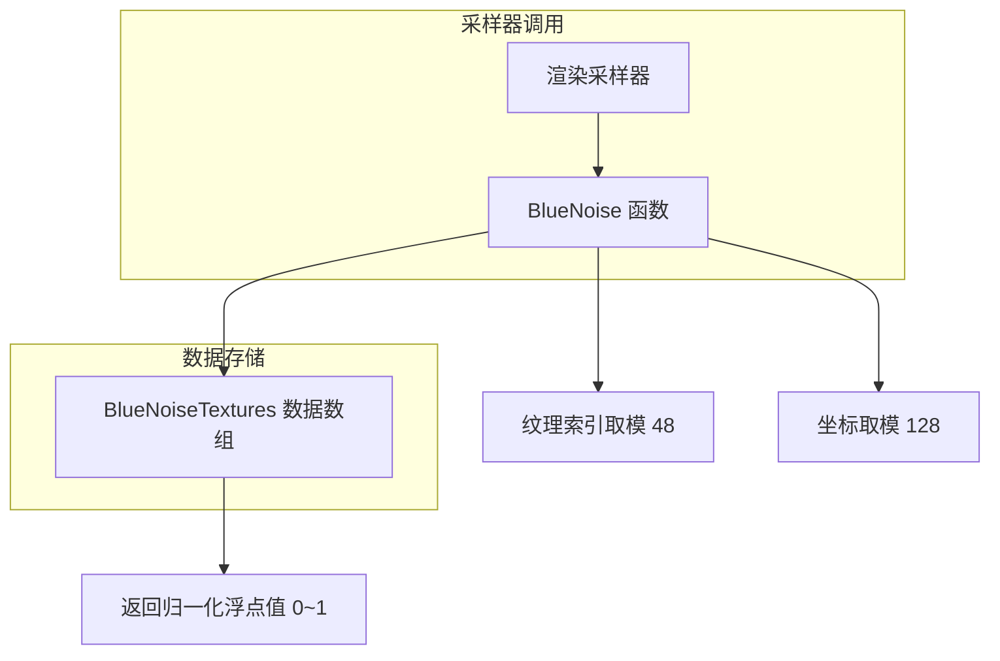

# bluenoise.h / bluenoise.cpp

## 概述
该文件提供蓝噪声（Blue Noise）纹理的查询功能，用于在渲染中生成高质量的抖动采样。蓝噪声具有频谱上没有低频成分的特性，可以显著改善采样的视觉质量。在渲染管线中，蓝噪声常用于像素采样的抖动（dithering）和去相关（decorrelation），以减少可感知的规律性噪声伪影。

## 主要类与接口
| 类/结构体/函数 | 说明 |
|---|---|
| `BlueNoiseResolution` | 蓝噪声纹理的分辨率常量，值为 128 |
| `NumBlueNoiseTextures` | 蓝噪声纹理数量常量，值为 48 |
| `BlueNoiseTextures` | 存储所有蓝噪声纹理的三维数组（48 张 128x128 纹理），数据类型为 `uint16_t` |
| `BlueNoise(int, Point2i)` | 查询函数，根据纹理索引和二维坐标返回 [0,1] 范围内的蓝噪声值 |

## 架构图

## 依赖关系
- **依赖**：
  - `pbrt/pbrt.h` — 基础类型定义
  - `pbrt/util/check.h` — CHECK 断言宏
  - `pbrt/util/vecmath.h` — `Point2i` 二维整数点类型
- **被依赖**：被渲染器的采样器模块使用，用于提供低差异抖动值以改善采样质量

> **注意**：`bluenoise.cpp` 文件体积非常大（约 6.8MB），其内容主要是预计算的蓝噪声纹理数据数组的定义。
