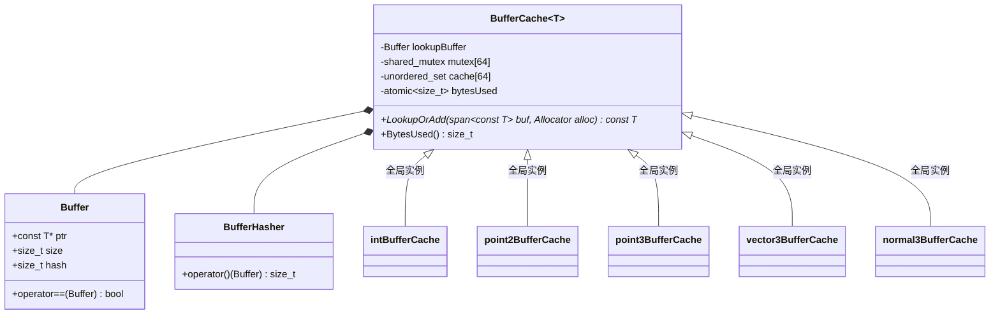
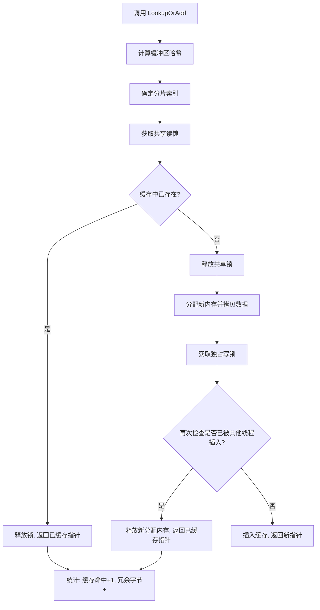

# buffercache.h / buffercache.cpp

## 概述
该文件实现了一个通用的缓冲区缓存（Buffer Cache）系统，用于在渲染场景加载过程中去重和共享几何数据缓冲区。当多个网格使用相同的顶点、法线或索引数据时，缓存能够避免重复存储，显著降低内存占用。在渲染管线中，该模块是场景加载和几何数据管理的核心基础设施。

## 主要类与接口
| 类/结构体/函数 | 说明 |
|---|---|
| `BufferCache<T>` | 模板类，基于哈希的缓冲区去重缓存，使用分片锁实现线程安全 |
| `BufferCache::LookupOrAdd` | 核心方法：查找缓存中是否存在相同内容的缓冲区，若存在则返回已缓存指针，否则新建并缓存 |
| `BufferCache::BytesUsed` | 返回缓存已使用的字节数 |
| `BufferCache::Buffer` | 内部结构体，封装数据指针、大小和哈希值 |
| `BufferCache::BufferHasher` | 内部哈希函数对象，用于 unordered_set |
| `intBufferCache` | 全局整数缓冲区缓存（用于索引数据） |
| `point2BufferCache` | 全局 Point2f 缓冲区缓存（用于 UV 坐标） |
| `point3BufferCache` | 全局 Point3f 缓冲区缓存（用于顶点位置） |
| `vector3BufferCache` | 全局 Vector3f 缓冲区缓存（用于切线等向量数据） |
| `normal3BufferCache` | 全局 Normal3f 缓冲区缓存（用于法线数据） |
| `InitBufferCaches` | 初始化所有全局缓冲区缓存实例 |

## 架构图

## 算法流程图

## 依赖关系
- **依赖**：
  - `pbrt/pbrt.h` — 基础类型定义
  - `pbrt/util/check.h` — CHECK/DCHECK 断言宏
  - `pbrt/util/hash.h` — `HashBuffer` 哈希函数
  - `pbrt/util/print.h` — 格式化输出
  - `pbrt/util/pstd.h` — `pstd::span` 容器
  - `pbrt/util/stats.h` — 性能统计计数器
  - `pbrt/util/vecmath.h` — `Point2f`、`Point3f`、`Vector3f`、`Normal3f` 类型
- **被依赖**：被几何形状加载模块（三角形网格等）使用，用于顶点、索引和法线缓冲区的去重
