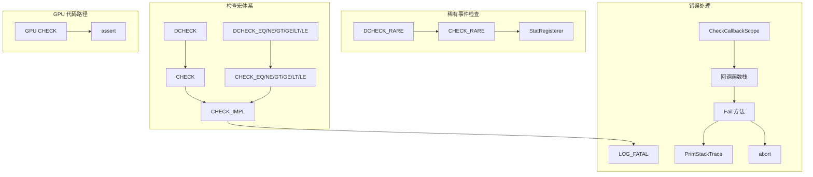

# check.h / check.cpp

## 概述
该文件定义了 PBRT 渲染器使用的运行时断言和检查宏系统，提供比标准 `assert` 更详细的错误信息输出。它同时支持 CPU 和 GPU 代码路径，并区分始终启用的 `CHECK` 宏和仅在调试构建中启用的 `DCHECK` 宏。在渲染管线中，该模块是贯穿整个代码库的防御性编程基础设施。

## 主要类与接口
| 类/结构体/函数 | 说明 |
|---|---|
| `CHECK(x)` | 运行时条件检查宏，失败时输出表达式文本并触发 LOG_FATAL |
| `CHECK_EQ(a, b)` | 检查 a == b，失败时输出两个操作数的值 |
| `CHECK_NE(a, b)` | 检查 a != b |
| `CHECK_GT(a, b)` | 检查 a > b |
| `CHECK_GE(a, b)` | 检查 a >= b |
| `CHECK_LT(a, b)` | 检查 a < b |
| `CHECK_LE(a, b)` | 检查 a <= b |
| `CHECK_IMPL(a, b, op)` | CHECK 比较宏的内部实现，捕获两个操作数的值用于错误输出 |
| `DCHECK` / `DCHECK_*` | Debug 版本的检查宏，仅在 `PBRT_DEBUG_BUILD` 时启用，Release 构建中为空操作 |
| `CHECK_RARE(freq, condition)` | 稀有条件检查宏，用统计方式跟踪条件为真的频率是否超过预期阈值 |
| `DCHECK_RARE(freq, condition)` | Debug 版本的稀有条件检查 |
| `CheckCallbackScope` | RAII 类，注册在检查失败时调用的回调函数，用于输出额外上下文信息 |
| `PrintStackTrace` | 打印当前调用栈，支持 macOS、Linux 和 Windows 三个平台 |

## 架构图

## 依赖关系
- **依赖**：
  - `pbrt/pbrt.h` — 基础类型和平台宏定义
  - `pbrt/util/log.h` — `LOG_FATAL`、`LOG_VERBOSE` 日志宏
  - `pbrt/util/stats.h` — `StatRegisterer`、`StatsAccumulator` 统计系统
  - `<cxxabi.h>`、`<execinfo.h>`（macOS/Linux）— 栈回溯和符号反修饰
  - `<dbghelp.h>`（Windows）— 调试符号解析
- **被依赖**：被 PBRT 代码库中几乎所有模块广泛使用，是最基础的工具模块之一
