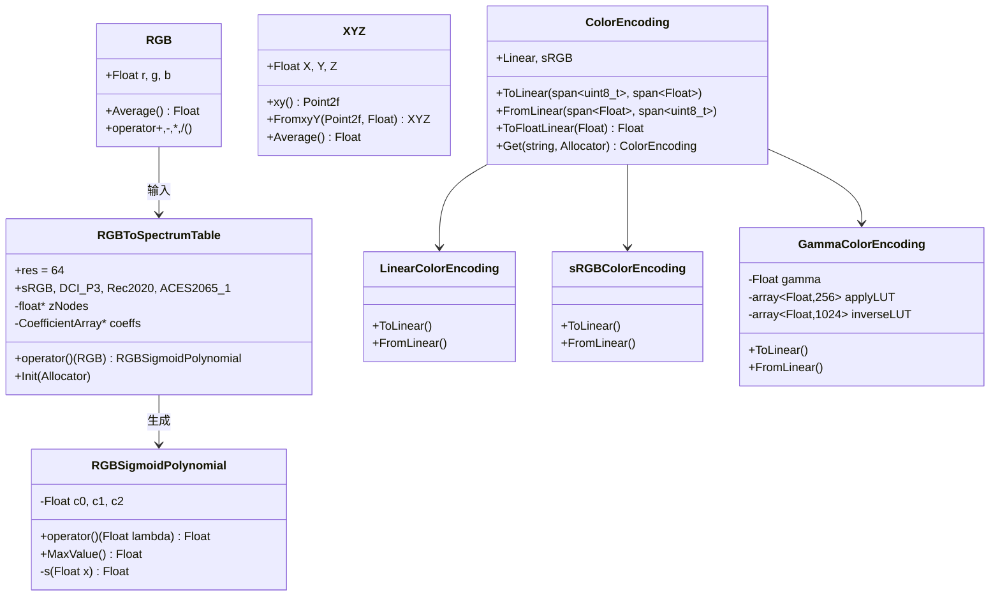
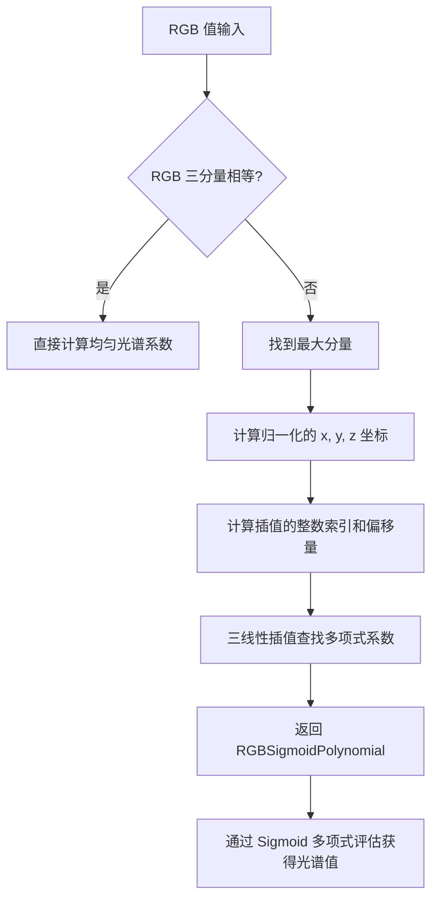

# color.h / color.cpp

## 概述
该文件定义了 PBRT 渲染器的颜色表示与转换系统，包括 RGB 和 CIE XYZ 两大色彩空间的类型定义，以及 RGB 到光谱（Spectrum）的转换机制。它还实现了多种颜色编码方式（线性、sRGB、Gamma）的转换接口和白平衡（White Balance）功能。在渲染管线中，该模块是色彩处理的核心，连接了光谱渲染与显示输出之间的桥梁。

## 主要类与接口
| 类/结构体/函数 | 说明 |
|---|---|
| `RGB` | RGB 颜色类，包含 r/g/b 三个分量，支持完整的算术运算 |
| `XYZ` | CIE XYZ 颜色类，包含 X/Y/Z 三个分量，提供 xy 色度坐标和 xyY 转换 |
| `RGBSigmoidPolynomial` | RGB 到光谱转换的 Sigmoid 多项式表示，用三个系数 c0/c1/c2 参数化 |
| `RGBToSpectrumTable` | RGB 到光谱的查找表，通过三线性插值获取多项式系数，支持 sRGB/DCI-P3/Rec2020/ACES2065-1 色彩空间 |
| `ColorEncoding` | 颜色编码接口（TaggedPointer），统一管理线性/sRGB/Gamma 编码 |
| `LinearColorEncoding` | 线性颜色编码，直接的 [0,255] 到 [0,1] 映射 |
| `sRGBColorEncoding` | sRGB 颜色编码，使用 sRGB 传输函数 |
| `GammaColorEncoding` | 自定义 Gamma 颜色编码，使用查找表加速转换 |
| `LinearToSRGB` | 线性值到 sRGB 值的转换，使用 Minimax 多项式近似 |
| `LinearToSRGB8` | 线性值到 sRGB 8-bit 整数的转换 |
| `SRGBToLinear` | sRGB 值到线性值的转换 |
| `SRGB8ToLinear` | 8-bit sRGB 值到线性值的查找表转换 |
| `WhiteBalance` | 基于 Bradford 变换矩阵的白平衡计算 |
| `LMSFromXYZ` / `XYZFromLMS` | Bradford 色适应变换矩阵常量 |

## 架构图


## RGB 到光谱的转换原理（RGBSigmoidPolynomial）

### 核心问题

RGB 只有 3 个数，而光谱是一条连续曲线 S(λ)，λ ∈ [360, 830] nm。从 3 个值"反推"一条曲线是严重欠定的——无数条不同的光谱都能产生相同的 RGB。pbrt 需要一种方式选出一条"合理"的光谱。

### 解法：Sigmoid ∘ 二次多项式

pbrt 用 3 个系数 `(c0, c1, c2)` 参数化一条光谱曲线：

```
S(λ) = sigmoid(c0·λ² + c1·λ + c2)
```

其中 sigmoid 函数定义为（`color.h:357-361`）：

```
s(x) = 0.5 + x / (2·√(1 + x²))
```

这个 sigmoid 把任意实数映射到 **(0, 1)** 区间，保证输出的光谱值始终在 0~1 之间——这对表示反射率（albedo）很自然。

### 系数从哪来：预计算查找表 + 三线性插值

3 个系数不是实时求解的，而是通过 `RGBToSpectrumTable` 离线优化后存在一张 **64×64×64×3** 的查找表里（`color.cpp:31-68`）。查找过程：

1. **归一化**：找到 RGB 中的最大分量 `maxc`，用它做归一化。表有 3 份（`coeffs[maxc]`），分别对应 R/G/B 为最大分量的情况
2. **坐标计算**：
   - `z = rgb[maxc]`（最大分量值，通过非均匀节点 `zNodes` 索引）
   - `x = rgb[(maxc+1)%3] / z × 63`
   - `y = rgb[(maxc+2)%3] / z × 63`
3. **三线性插值**：在 (x, y, z) 三个轴上对 8 个邻近格点做 Lerp，得到 `c0, c1, c2`
4. **灰色特判**：当 R=G=B 时，直接计算 `c2 = (v − 0.5) / √(v·(1−v))`，c0=c1=0（常数光谱，即 sigmoid 的逆函数）

### RGBToSpectrumTable：系数查找表详解

`RGBToSpectrumTable` 是 `RGBSigmoidPolynomial` 的"工厂"——给它一个 RGB，它通过查表返回一组 `(c0, c1, c2)` 系数。两者的关系：

```
RGB → RGBToSpectrumTable::operator()(rgb) → RGBSigmoidPolynomial(c0,c1,c2) → S(λ)
       ^^^^^^^^^^^^^^^^^^^^^^^^^^^^^^^^^^^^
       查表 + 三线性插值，输出三个系数
```

**内部数据结构**（`color.h:368-395`）：

- **系数表** `CoefficientArray`：类型为 `float[3][64][64][64][3]` 的五维数组
  - 第 1 维 `[3]`：R/G/B 哪个分量最大（3 种情况各一份表）
  - 第 2–4 维 `[64][64][64]`：归一化后 RGB 值的三维网格
  - 第 5 维 `[3]`：输出的 c0、c1、c2 三个系数
- **z 轴节点** `zNodes`：64 个非均匀分布的浮点值，用于最大分量的索引（低值区节点更密，高值区更疏）

**每个颜色空间独立一张表**（`color.h:384-387`）：

```cpp
static const RGBToSpectrumTable *sRGB;
static const RGBToSpectrumTable *DCI_P3;
static const RGBToSpectrumTable *Rec2020;
static const RGBToSpectrumTable *ACES2065_1;
```

同样的 `RGB(1, 0, 0)` 在 sRGB 和 Rec2020 中代表不同的物理颜色，对应的光谱曲线也不同，所以系数表必须分开。这些表的数据是离线优化生成的（存储在 `color.cpp` 的 extern 数组中），优化目标是让重建出的光谱经 CIE 积分后尽可能还原回原始 RGB。

### 三种使用场景：RGB 到光谱的完整调用链

`RGBSigmoidPolynomial` 本身只是一条参数化的光谱曲线。真正将 RGB 转为可用光谱对象的是 `spectrum.cpp:230-247` 中三个类的构造函数，它们各自的归一化策略不同：

**1. RGBAlbedoSpectrum** — 反射率，RGB 必须在 [0,1]（`spectrum.cpp:230-234`）

```cpp
RGBAlbedoSpectrum(const RGBColorSpace &cs, RGB rgb) {
    rsp = cs.ToRGBCoeffs(rgb);   // 直接查表，sigmoid 输出天然在 (0,1)
}
// 求值：S(λ) = rsp(λ)
```

**2. RGBUnboundedSpectrum** — 纹理值，RGB 可以 >1（`spectrum.cpp:236-240`）

```cpp
RGBUnboundedSpectrum(const RGBColorSpace &cs, RGB rgb) {
    Float m = std::max({rgb.r, rgb.g, rgb.b});
    scale = 2 * m;                          // 记住缩放因子
    rsp = cs.ToRGBCoeffs(rgb / scale);      // 归一化到 [0, 0.5] 后查表
}
// 求值：S(λ) = scale · rsp(λ)
```

**3. RGBIlluminantSpectrum** — 光源发射，额外乘以光源光谱（`spectrum.cpp:242-247`）

```cpp
RGBIlluminantSpectrum(const RGBColorSpace &cs, RGB rgb)
    : illuminant(&cs.illuminant) {          // 保存光源光谱指针（如 D65）
    Float m = std::max({rgb.r, rgb.g, rgb.b});
    scale = 2 * m;
    rsp = cs.ToRGBCoeffs(rgb / scale);
}
// 求值：S(λ) = scale · rsp(λ) · illuminant(λ)
```

总结对比：

| 类 | 求值公式 | 归一化方式 | 典型用途 |
|---|---|---|---|
| `RGBAlbedoSpectrum` | `rsp(λ)` | 无，要求输入在 [0,1] | 材质反射率 |
| `RGBUnboundedSpectrum` | `scale · rsp(λ)` | `scale = 2·max`，查表用 `rgb/scale` | HDR 纹理、非物理量 |
| `RGBIlluminantSpectrum` | `scale · rsp(λ) · illuminant(λ)` | 同上，额外乘以光源光谱 | 光源发射 RGB |

> **为什么 `scale = 2 * max` 而不是 `max`？** 归一化后 RGB 的最大分量落在 0.5 而非 1.0。sigmoid 在 [0, 0.5] 区间接近线性，查表的插值精度更高；而在接近 1.0 时 sigmoid 趋于饱和，微小的系数变化会导致较大误差。

**完整调用链示例**：

```
用户输入 RGB(2.5, 1.0, 0.3)
         │
         ▼
RGBUnboundedSpectrum(cs, rgb)               ← spectrum.cpp:236
    scale = 2 × 2.5 = 5.0
    normalized = (0.5, 0.2, 0.06)
         │
         ▼
cs.ToRGBCoeffs(normalized)                  ← colorspace.cpp:43
    return (*rgbToSpectrumTable)(ClampZero(rgb))
         │
         ▼
RGBToSpectrumTable::operator()(normalized)  ← color.cpp:31
    maxc=0, z=0.5, x=0.2/0.5×63, y=0.06/0.5×63
    三线性插值 → (c0, c1, c2)
         │
         ▼
RGBSigmoidPolynomial(c0, c1, c2)
         │
         ▼  运行时对任意 λ 求值
S(λ) = 5.0 × sigmoid(c0·λ² + c1·λ + c2)
```

### 整体流程

```
RGB(0.8, 0.2, 0.1)
       │
       ▼
 ┌──────────────────────────────┐
 │ RGBToSpectrumTable            │
 │  maxc = 0 (R最大)             │
 │  z = 0.8                      │
 │  x = 0.2/0.8 × 63 = 15.75   │
 │  y = 0.1/0.8 × 63 = 7.875   │
 │  三线性插值 → c0, c1, c2      │
 └──────────────┬───────────────┘
                ▼
  RGBSigmoidPolynomial(c0, c1, c2)
                │
                ▼  对任意波长 λ 求值
  S(λ) = sigmoid(c0·λ² + c1·λ + c2)
                │
                ▼  输出一条平滑光谱曲线
  S(360)=0.05, S(500)=0.12, S(630)=0.78, ...
```

### 为什么这样设计

- **sigmoid 保证值域**：反射率天然在 (0,1)，不需要额外 clamp
- **二次多项式足够表达**：可见光只有 360–830nm，一个抛物线经过 sigmoid 变形后已经能逼近大多数自然光谱的形状
- **查找表高效**：预计算的优化结果保证了"逆向重建"的 RGB 尽可能接近输入，运行时只需一次插值 + 一次多项式求值
- **每个颜色空间独立的表**：sRGB / DCI-P3 / Rec2020 / ACES 的原色不同，同一个 RGB 值对应的物理光谱不同，所以各有一张独立的系数表

## ColorEncoding：图像编码与线性值的转换

### 解决的问题

图像文件中存储的像素字节值（uint8）并不直接等于物理线性亮度。例如一个 `uint8 = 128` 的像素，在不同编码方式下对应不同的线性值：

| 编码 | `uint8(128)` → 线性值 | 典型用途 |
|---|---|---|
| `LinearColorEncoding` | `128/255 = 0.502` | RAW 数据、法线贴图等线性数据 |
| `sRGBColorEncoding` | `SRGBToLinear(128/255) ≈ 0.216` | 绝大多数 8-bit 图像（PNG/JPEG） |
| `GammaColorEncoding(2.2)` | `(128/255)^2.2 ≈ 0.218` | 指定了自定义 gamma 的图像 |

sRGB 编码把更多的字节码分配给暗部区域（人眼对暗部更敏感），所以同一个 128 对应的线性值远比直觉更暗。

### 接口设计

`ColorEncoding`（`color.h:402-420`）使用 `TaggedPointer` 多态分发到三种具体实现：

```cpp
class ColorEncoding : public TaggedPointer<LinearColorEncoding, sRGBColorEncoding, GammaColorEncoding> {
    void ToLinear(span<const uint8_t> vin, span<Float> vout);   // 解码：字节 → 线性
    void FromLinear(span<const Float> vin, span<uint8_t> vout); // 编码：线性 → 字节
    Float ToFloatLinear(Float v);                                // 单值解码
};
```

### 在渲染管线中的位置

```
图像文件 (PNG/JPEG/EXR)
    │  存储的是 uint8/uint16 编码值
    ▼
ColorEncoding::ToLinear()     ← 读取纹理时解码
    │  线性浮点值
    ▼
渲染器内部计算（光照、材质……）
    │  线性浮点结果
    ▼
ColorEncoding::FromLinear()   ← 写出图像时编码
    │
    ▼
输出文件 (PNG/EXR)
```

### 三种实现的细节

**LinearColorEncoding**（`color.h:424-444`）：
- `ToLinear`：`v_linear = byte / 255.0`，纯线性映射
- `FromLinear`：`byte = round(v * 255)`
- 无 gamma 校正，适用于法线贴图、位移贴图等本身就是线性数据的纹理

**sRGBColorEncoding**（`color.h:446-457`）：
- `ToLinear`：使用预计算查找表 `SRGB8ToLinear()`（256 项，`color.cpp:281-324`），直接按字节值索引
- `FromLinear`：使用 `LinearToSRGB8()`，内部是 minimax 多项式近似（`color.h:497-531`）
- sRGB 传输函数是分段的：低值段为线性 `v * 12.92`，高值段为幂函数 `1.055 * v^(1/2.4) - 0.055`

**GammaColorEncoding**（`color.h:459-477`）：
- 构造时预计算两张 LUT：
  - `applyLUT[256]`：解码用，`applyLUT[i] = (i/255)^gamma`
  - `inverseLUT[1024]`：编码用，反向映射
- 运行时纯查表，支持任意 gamma 值
- 适用于指定了非 sRGB gamma 曲线的图像格式

## 算法流程图


## 依赖关系
- **依赖**：
  - `pbrt/pbrt.h` — 基础类型 (`Float`)
  - `pbrt/util/check.h` — 断言宏
  - `pbrt/util/math.h` — 数学工具函数 (`EvaluatePolynomial`, `Sqr`, `SafeSqrt`, `Clamp`, `Lerp`, `FindInterval`)
  - `pbrt/util/pstd.h` — `pstd::span`, `pstd::array`, `pstd::optional`
  - `pbrt/util/taggedptr.h` — `TaggedPointer` 多态指针
  - `pbrt/util/vecmath.h` — `Point2f`, `SquareMatrix<3>`
  - `pbrt/util/print.h` — `StringPrintf`
  - `pbrt/util/error.h` — 错误报告
  - `pbrt/util/spectrum.h` — 光谱相关类型
  - `pbrt/util/string.h` — 字符串工具函数
  - `pbrt/options.h` — 全局选项（GPU 支持判断）
- **被依赖**：被颜色空间模块 (`colorspace.h`)、图像模块、材质系统以及光源模块广泛使用
