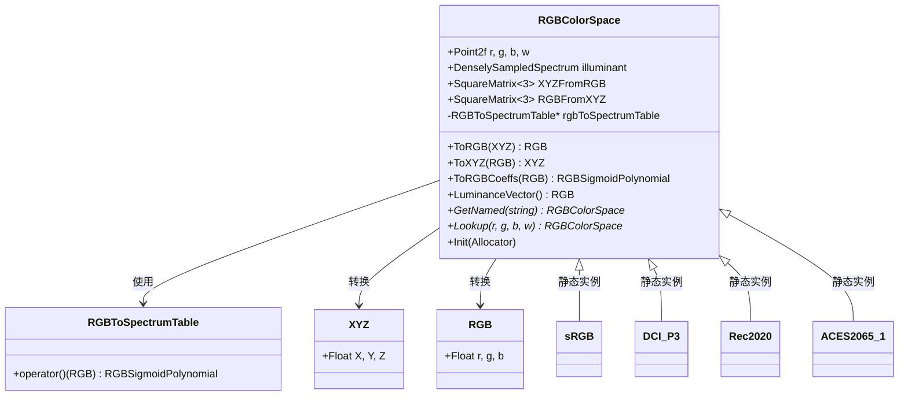
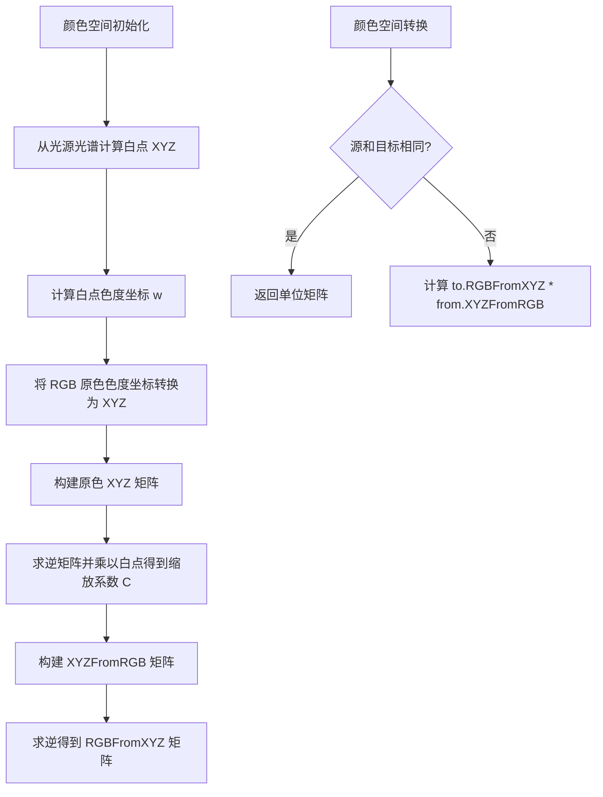

# colorspace.h / colorspace.cpp

## 概述
该文件定义了 RGB 颜色空间的抽象表示类 `RGBColorSpace`，封装了颜色空间的原色坐标、白点光源、XYZ 与 RGB 之间的转换矩阵，以及 RGB 到光谱的转换功能。内置支持 sRGB、DCI-P3、Rec2020 和 ACES2065-1 四种标准颜色空间。在渲染管线中，该模块负责不同颜色空间之间的精确转换，确保输入纹理和输出图像的色彩正确性。

## 四种预定义颜色空间对比

| | **sRGB** | **DCI-P3** | **Rec. 2020** | **ACES 2065-1** |
|---|---|---|---|---|
| **标准来源** | IEC 61966-2-1 / ITU-R BT.709 | SMPTE EG 432-1 (P3-D65 变体) | ITU-R BT.2020 | SMPTE ST 2065-1 |
| **典型用途** | 网页、普通显示器、大多数消费级内容 | 数字影院、Apple 显示器、HDR 内容 | UHD/4K/8K 广播电视、HDR10 | 电影后期制作交换格式、场景参考工作流 |
| **红色原色 (xy)** | (0.64, 0.33) | (0.68, 0.32) | (0.708, 0.292) | (0.7347, 0.2653) |
| **绿色原色 (xy)** | (0.30, 0.60) | (0.265, 0.690) | (0.170, 0.797) | (0.0, 1.0) |
| **蓝色原色 (xy)** | (0.15, 0.06) | (0.15, 0.06) | (0.131, 0.046) | (0.0001, −0.077) |
| **白点光源** | D65 (`stdillum-D65`) | D65 (`stdillum-D65`) | D65 (`stdillum-D65`) | D60 (`illum-acesD60`) |
| **色域覆盖** | ≈ CIE xy 色度图的 35.9% | ≈ 45.5%（比 sRGB 大约 25%） | ≈ 75.8%（覆盖大部分可见色） | > 100%（含虚色，完全包围可见色域） |
| **RGB 值范围** | [0, 1] 对应物理可显示色 | [0, 1] 对应物理可显示色 | [0, 1] 对应物理可显示色 | [0, 1] 内含虚色（负光谱能量） |
| **pbrt 中的作用** | 默认输入/输出色彩空间 | 宽色域纹理输入 | 宽色域 HDR 内容 | 场景参考级交换，最大程度保留色彩信息 |

**色域大小关系**：sRGB ⊂ DCI-P3 ⊂ Rec. 2020 ⊂ ACES 2065-1

> **注**：ACES 2065-1 的绿色原色 (0, 1) 和蓝色原色 (0.0001, −0.077) 位于 CIE xy 色度图的可见光谱轨迹**之外**，这意味着它的色域包含了人眼无法感知的"虚色"。这是有意为之——作为交换格式，它需要能无损包含所有其他颜色空间的色域。

## 什么决定了一个 RGB 颜色空间

一个 RGB 颜色空间由**三样东西**完全确定，对应构造函数的参数（`colorspace.cpp:22-24`）：

```cpp
RGBColorSpace(Point2f r, Point2f g, Point2f b,   // ① 三个原色的 xy 色度坐标
              Spectrum illuminant,                 // ② 光源光谱（决定白点）
              const RGBToSpectrumTable *rgbToSpec, // ③ RGB→光谱查找表
              Allocator alloc);
```

### ① 三原色色度坐标 (r, g, b)

每个原色用 CIE xy 色度图上的一个点表示，三个点围成一个三角形——这就是该颜色空间的**色域**。三角形越大，能表示的颜色范围越广。

- `RGB(1,0,0)` 对应的物理颜色就是 r 点
- `RGB(0,1,0)` 对应 g 点
- `RGB(0,0,1)` 对应 b 点
- 三角形内部的颜色可以用 [0,1] 范围的 RGB 混合出来
- 三角形外部的颜色在该空间中需要负值才能表示（超出色域）

这是颜色空间之间最本质的区别。同样的 `RGB(1, 0, 0)` 在 sRGB 中是 xy=(0.64, 0.33) 的红色，在 Rec2020 中是 xy=(0.708, 0.292) 的更饱和的红色——**物理上完全不同的颜色**。

### ② 光源光谱 (illuminant)

光源光谱定义了**白点**——当 RGB=(1,1,1) 时对应的物理光谱。构造时通过 CIE 积分得到白点的 XYZ 三刺激值：

```
W = SpectrumToXYZ(illuminant)   // 白点的绝对 XYZ
w = W.xy()                       // 白点的色度坐标
```

白点决定了颜色空间中"中性色"的色温。大多数颜色空间使用 D65（≈6500K 日光），ACES 使用 D60（≈6000K，略暖）。

注意 pbrt 存的是完整的光谱分布（`DenselySampledSpectrum illuminant`）而不只是一个 xy 坐标，因为 `RGBIlluminantSpectrum` 在将 RGB 转为光源发射光谱时需要乘以这条完整的光谱曲线。

### ③ RGB→光谱查找表 (rgbToSpectrumTable)

这张表让颜色空间知道如何将自己的 RGB 值反向转换为光谱曲线（详见 `color.md` 中 RGBToSpectrumTable 的说明）。每个颜色空间必须有自己独立的表，因为同一个 RGB 在不同颜色空间中代表不同的物理颜色，对应的光谱也不同。

### 从这三样东西能推导出什么

构造函数利用上述三个输入，**自动推导**出以下内部数据：

| 推导出的成员 | 含义 | 推导方式 |
|---|---|---|
| `w` (Point2f) | 白点 xy 色度坐标 | `SpectrumToXYZ(illuminant).xy()` |
| `XYZFromRGB` (3×3 矩阵) | RGB→XYZ 转换矩阵 | 由原色 XYZ + 白点缩放系数构建 |
| `RGBFromXYZ` (3×3 矩阵) | XYZ→RGB 转换矩阵 | `Inverse(XYZFromRGB)` |

也就是说，只要给定三原色、光源和查找表，颜色空间的所有转换能力就完全确定了。

## 主要类与接口
| 类/结构体/函数 | 说明 |
|---|---|
| `RGBColorSpace` | RGB 颜色空间类，封装原色坐标、白点、转换矩阵和光谱转换表 |
| `RGBColorSpace::RGBColorSpace(...)` | 构造函数，根据 RGB 原色色度坐标、光源光谱和光谱转换表初始化颜色空间 |
| `RGBColorSpace::ToRGB(XYZ)` | 将 XYZ 色彩值转换为该颜色空间的 RGB 值 |
| `RGBColorSpace::ToXYZ(RGB)` | 将该颜色空间的 RGB 值转换为 XYZ 色彩值 |
| `RGBColorSpace::ToRGBCoeffs(RGB)` | 将 RGB 值转换为光谱表示的多项式系数 |
| `RGBColorSpace::LuminanceVector()` | 返回 XYZ 转换矩阵中的亮度行，用于快速亮度计算 |
| `RGBColorSpace::GetNamed(string)` | 按名称查找预定义颜色空间（srgb/dci-p3/rec2020/aces2065-1） |
| `RGBColorSpace::Lookup(r, g, b, w)` | 按原色坐标和白点查找匹配的预定义颜色空间 |
| `RGBColorSpace::Init(Allocator)` | 初始化所有预定义颜色空间的静态实例 |
| `ConvertRGBColorSpace(from, to)` | 计算两个颜色空间之间的 3x3 转换矩阵 |
| `RGBColorSpace::sRGB` | sRGB 颜色空间静态实例（D65 光源） |
| `RGBColorSpace::DCI_P3` | DCI-P3 颜色空间静态实例（D65 光源） |
| `RGBColorSpace::Rec2020` | Rec. 2020 颜色空间静态实例（D65 光源） |
| `RGBColorSpace::ACES2065_1` | ACES 2065-1 颜色空间静态实例（D60 光源） |

## 架构图


## 核心原理详解

### XYZFromRGB 矩阵的构建过程

构造函数（`colorspace.cpp:22-35`）从原色色度坐标和光源光谱出发，推导出 RGB↔XYZ 的 3×3 转换矩阵。这是整个颜色空间的数学基础。

**第一步：从光源光谱计算白点 XYZ**

```
W = SpectrumToXYZ(illuminant)    // 对光源光谱做 CIE 积分，得到白点的 XYZ 三刺激值
w = W.xy()                        // 投影到 xy 色度坐标：w = (W.X/(X+Y+Z), W.Y/(X+Y+Z))
```

白点定义了"白色"在该颜色空间中的含义——当 RGB = (1,1,1) 时，对应的 XYZ 就应该等于 W。

**第二步：将原色色度坐标转为 XYZ**

```
R_xyz = XYZ::FromxyY(r)    // 从 xy 色度 + Y=1 转换为 XYZ
G_xyz = XYZ::FromxyY(g)    // 公式：X = x·Y/y, Z = (1-x-y)·Y/y
B_xyz = XYZ::FromxyY(b)
```

此时得到的是 Y=1 的归一化原色，还未考虑亮度缩放。

**第三步：构建原色矩阵并求缩放系数**

```
        ┌ R.X  G.X  B.X ┐
rgb =   │ R.Y  G.Y  B.Y │       // 3 个原色的 XYZ 按列排列
        └ R.Z  G.Z  B.Z ┘

C = rgb⁻¹ · W                    // 求解缩放系数向量 C = (c_r, c_g, c_b)
```

缩放系数 C 的含义：每个原色需要乘以多少倍，才能使 R+G+B 加起来恰好等于白点 W。

**第四步：构建最终的转换矩阵**

```
XYZFromRGB = rgb · diag(C[0], C[1], C[2])
```

即把原色矩阵的每一列乘以对应的缩放系数。验证：`XYZFromRGB · (1,1,1)ᵀ = W` ✓

```
RGBFromXYZ = XYZFromRGB⁻¹        // 求逆得到反向转换矩阵
```

**以 sRGB 为例**：

```
输入：r=(0.64,0.33), g=(0.30,0.60), b=(0.15,0.06), illuminant=D65

                    ┌ 0.4124  0.3576  0.1805 ┐
XYZFromRGB(sRGB) ≈  │ 0.2126  0.7152  0.0722 │
                    └ 0.0193  0.1192  0.9505 ┘

                    ┌  3.2406  -1.5372  -0.4986 ┐
RGBFromXYZ(sRGB) ≈  │ -0.9689   1.8758   0.0415 │
                    └  0.0557  -0.2040   1.0570 ┘
```

注意 `XYZFromRGB` 的第二行 `(0.2126, 0.7152, 0.0722)` 就是 `LuminanceVector()`——因为 XYZ 的 Y 分量就是亮度，所以 `Luminance(rgb) = 0.2126·r + 0.7152·g + 0.0722·b`。

---

### 颜色空间之间的转换

`ConvertRGBColorSpace`（`colorspace.cpp:37-41`）计算从一个颜色空间到另一个的 3×3 矩阵：

```
RGB_to = RGBFromXYZ_to · XYZFromRGB_from · RGB_from
```

即先从源空间转到 XYZ（设备无关中间空间），再从 XYZ 转到目标空间。XYZ 在这里充当了"通用翻译"的角色。

当源和目标相同时直接返回单位矩阵（`colorspace.cpp:38-39`）。

---

### ToRGBCoeffs：从 RGB 到光谱多项式

`ToRGBCoeffs`（`colorspace.cpp:43-46`）将 RGB 转换为光谱表示的 Sigmoid 多项式系数：

```cpp
RGBSigmoidPolynomial ToRGBCoeffs(RGB rgb) const {
    return (*rgbToSpectrumTable)(ClampZero(rgb));
}
```

它直接委托给 `RGBToSpectrumTable`（详见 `color.md`），先将负值 clamp 到 0，然后查表获取 `(c0, c1, c2)` 系数。每个颜色空间持有各自的 `rgbToSpectrumTable` 指针，确保同一 RGB 值在不同颜色空间下产生不同的光谱。

---

### LuminanceVector 的数学含义

```cpp
RGB LuminanceVector() const {
    return RGB(XYZFromRGB[1][0], XYZFromRGB[1][1], XYZFromRGB[1][2]);
}
```

CIE XYZ 中的 Y 分量直接对应人眼感知的**亮度**。`XYZFromRGB` 矩阵的第二行把 RGB 映射到 Y，因此这一行就是各通道的亮度权重。对 sRGB 来说就是经典的 `(0.2126, 0.7152, 0.0722)`——绿色贡献最大亮度，蓝色最小。

计算某个 RGB 值的亮度只需一次点乘：

```
Y = LuminanceVector() · rgb = 0.2126·r + 0.7152·g + 0.0722·b
```

---

### Lookup 的匹配策略

`Lookup`（`colorspace.cpp:63-74`）通过原色和白点坐标匹配预定义颜色空间，使用相对误差阈值 `1e-3`：

```cpp
auto closeEnough = [](Point2f a, Point2f b) {
    return (|a.x - b.x| / |b.x| < 1e-3) && (|a.y - b.y| / |b.y| < 1e-3);
};
```

这是为了处理不同数据源中色度坐标的微小舍入差异。例如图像文件（EXR/PNG）中的色度元数据可能与标准值略有出入，Lookup 能容忍这种差异并正确匹配到对应的预定义颜色空间，从而复用预计算的光谱转换表。

## 算法流程图


## 依赖关系
- **依赖**：
  - `pbrt/pbrt.h` — 基础类型
  - `pbrt/util/color.h` — `RGB`, `XYZ`, `RGBToSpectrumTable`, `RGBSigmoidPolynomial` 类型
  - `pbrt/util/math.h` — 矩阵运算工具
  - `pbrt/util/spectrum.h` — `Spectrum`, `DenselySampledSpectrum`, `GetNamedSpectrum`, `SpectrumToXYZ`
  - `pbrt/util/vecmath.h` — `Point2f`, `SquareMatrix<3>`
  - `pbrt/options.h` — 全局选项（GPU 构建判断）
  - `pbrt/gpu/util.h`（仅 GPU 构建）— CUDA 内存拷贝工具
- **被依赖**：被纹理系统、图像 I/O、相机模型和材质系统使用，用于确保色彩管理的正确性
