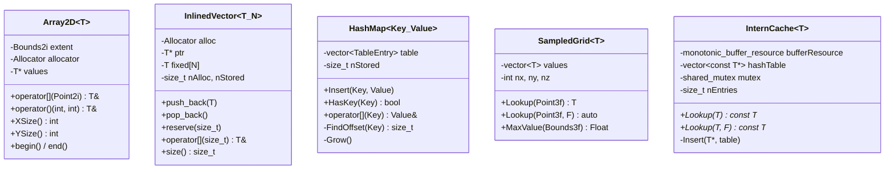
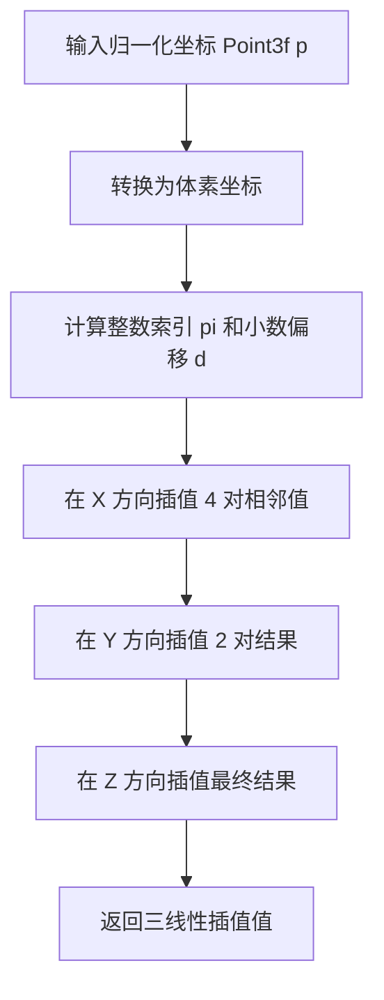
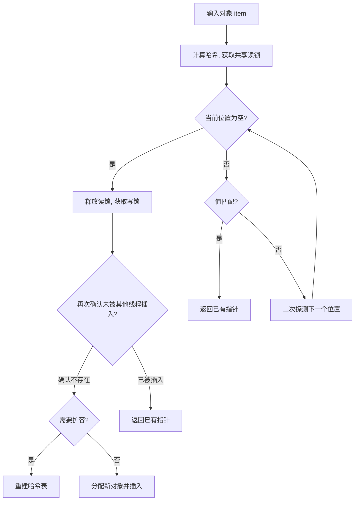

# containers.h

## 概述
该文件定义了 PBRT 渲染器使用的一系列自定义容器和类型工具，包括编译期类型包（TypePack）元编程工具、二维数组（Array2D）、内联向量（InlinedVector）、哈希映射表（HashMap）、三维采样网格（SampledGrid）和对象驻留缓存（InternCache）。这些容器针对渲染器的特定需求进行了优化，支持自定义内存分配器，并提供 CPU/GPU 兼容的接口。该模块是渲染管线中数据存储和管理的基础工具集。

## 主要类与接口
| 类/结构体/函数 | 说明 |
|---|---|
| **TypePack 元编程工具** | |
| `TypePack<Ts...>` | 编译期类型包，持有一组类型 |
| `IndexOf<T, TypePack>` | 获取类型 T 在 TypePack 中的索引 |
| `HasType<T, TypePack>` | 检查 TypePack 是否包含类型 T |
| `GetFirst<TypePack>` | 获取 TypePack 中第一个类型 |
| `RemoveFirst<TypePack>` | 移除 TypePack 中第一个类型 |
| `RemoveFirstN<n, TypePack>` | 移除前 N 个类型 |
| `TakeFirstN<n, TypePack>` | 取前 N 个类型 |
| `Prepend<T, TypePack>` | 在 TypePack 前添加类型 |
| `MapType<M, TypePack>` | 对 TypePack 中所有类型应用元函数 M |
| `AllInheritFrom<Base, TypePack>` | 检查所有类型是否继承自 Base |
| `ForEachType<F, TypePack>` | 对 TypePack 中每个类型调用函数 F |
| **容器类** | |
| `Array2D<T>` | 二维数组，支持任意矩形范围（Bounds2i）索引，使用自定义分配器 |
| `InlinedVector<T, N>` | 小对象优化的动态数组，前 N 个元素存储在栈上，超出后使用堆分配 |
| `HashMap<Key, Value>` | 开放寻址哈希映射表，使用二次探测解决冲突，支持自动扩容 |
| `SampledGrid<T>` | 三维采样数据网格，支持三线性插值查询和区域最大值查询 |
| `InternCache<T>` | 对象驻留缓存（字符串驻留的泛化版本），去重存储相同值的对象，线程安全 |

## 架构图

## 算法流程图
### SampledGrid 三线性插值

### InternCache 查找/插入

## 依赖关系
- **依赖**：
  - `pbrt/pbrt.h` — 基础类型和 `PBRT_CPU_GPU` 宏
  - `pbrt/util/check.h` — 断言宏
  - `pbrt/util/print.h` — `StringPrintf` 格式化输出
  - `pbrt/util/pstd.h` — `pstd::vector`, `pstd::optional`, `pstd::pmr` 分配器
  - `pbrt/util/vecmath.h` — `Bounds2i`, `Bounds3i`, `Point2i`, `Point3i`, `Point3f`, `Vector3f` 等几何类型
- **被依赖**：被渲染器的多个核心模块使用，包括加速结构、体积渲染、纹理系统、显示系统等
