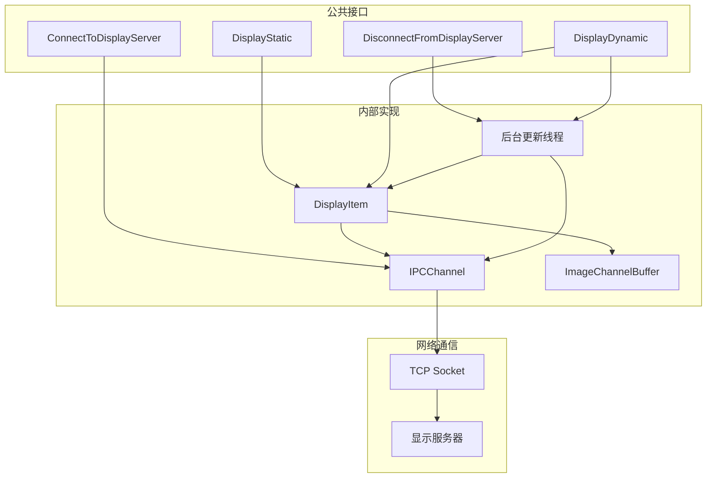
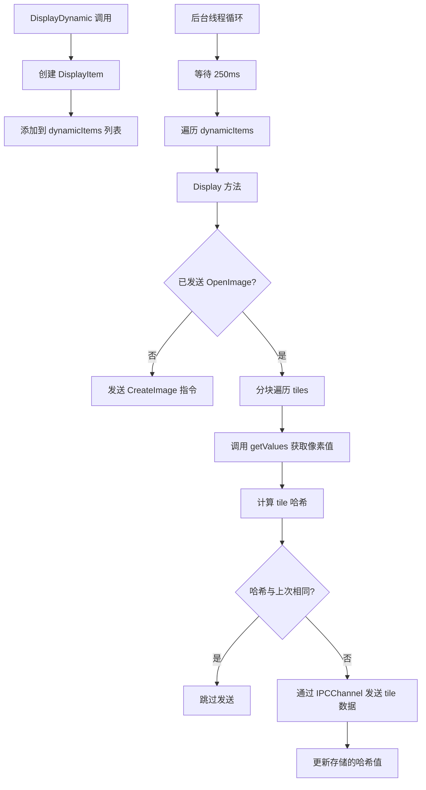

# display.h / display.cpp

## 概述
该文件实现了 PBRT 渲染器与外部显示服务器之间的实时通信系统，允许在渲染过程中将图像数据以 IPC（进程间通信）方式发送到远程显示服务器进行实时预览。支持静态图像（一次性发送）和动态图像（定期更新）两种模式。在渲染管线中，该模块用于提供渲染进度的实时可视化反馈。

## 主要类与接口
| 类/结构体/函数 | 说明 |
|---|---|
| `ConnectToDisplayServer(host)` | 连接到指定地址的显示服务器，并启动后台更新线程 |
| `DisconnectFromDisplayServer()` | 断开与显示服务器的连接，等待更新线程结束 |
| `DisplayStatic(title, resolution, channels, getValues)` | 发送静态图像数据（回调函数版本） |
| `DisplayStatic(title, image, channelDesc)` | 发送静态 Image 对象 |
| `DisplayStatic(title, values, xResolution)` | 发送一维标量数据作为静态图像 |
| `DisplayDynamic(title, resolution, channels, getValues)` | 注册动态更新图像（回调函数版本） |
| `DisplayDynamic(title, image, channelDesc)` | 注册动态更新的 Image 对象 |
| `DisplayDynamic(title, values, xResolution)` | 注册一维标量数据的动态更新 |
| `IPCChannel` | 内部类，封装 TCP socket 连接，处理消息序列化和发送 |
| `DisplayItem` | 内部类，管理单个显示项的 tile 分块、哈希比较和增量更新 |
| `ImageChannelBuffer` | 内部类，管理单个通道的 tile 缓冲区和变更检测 |

## 架构图

## 算法流程图

## 依赖关系
- **依赖**：
  - `pbrt/pbrt.h` — 基础类型
  - `pbrt/util/check.h` — 断言宏
  - `pbrt/util/color.h` — RGB 颜色类型
  - `pbrt/util/containers.h` — 容器工具
  - `pbrt/util/image.h` — `Image`, `ImageChannelDesc`, `ImageChannelValues` 图像类
  - `pbrt/util/pstd.h` — `pstd::span`, `pstd::optional`
  - `pbrt/util/vecmath.h` — `Point2i`, `Bounds2i` 几何类型
  - `pbrt/util/error.h` — 错误报告
  - `pbrt/util/hash.h` — `HashBuffer` 哈希函数
  - `pbrt/util/print.h` — 格式化输出
  - `pbrt/util/string.h` — 字符串工具
  - 系统网络库（`<sys/socket.h>` / `<winsock2.h>`）
- **被依赖**：被渲染器主循环和错误处理模块 (`error.cpp`) 调用，用于实时显示和优雅退出
