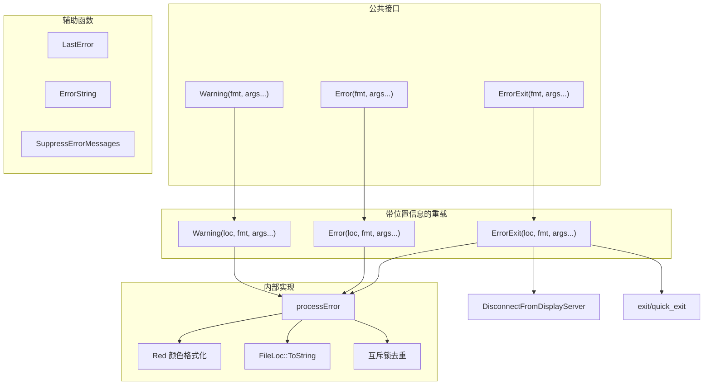

# error.h / error.cpp

## 概述
该文件实现了 PBRT 渲染器的统一错误报告系统，提供警告（Warning）、错误（Error）和致命错误退出（ErrorExit）三个级别的消息输出。它支持源文件位置信息的附加（通过 `FileLoc`），使用变参模板实现类似 printf 的格式化接口，并通过互斥锁确保多线程环境下的输出不混乱。在渲染管线中，该模块是所有错误和警告信息的统一出口。

## 主要类与接口
| 类/结构体/函数 | 说明 |
|---|---|
| `FileLoc` | 文件位置信息结构体，包含文件名、行号和列号，用于错误消息的定位 |
| `Warning(loc, message)` | 输出警告消息，附带可选的文件位置信息 |
| `Warning(fmt, args...)` | 模板版本，支持 printf 风格的格式化 |
| `Error(loc, message)` | 输出错误消息，附带可选的文件位置信息 |
| `Error(fmt, args...)` | 模板版本，支持格式化 |
| `ErrorExit(loc, message)` | 输出错误消息并终止程序（`[[noreturn]]`） |
| `ErrorExit(fmt, args...)` | 模板版本，支持格式化 |
| `SuppressErrorMessages()` | 静默模式，抑制 Warning 和 Error 的输出 |
| `LastError()` | 获取系统最近一次错误码（errno / GetLastError） |
| `ErrorString(errorId)` | 将系统错误码转换为可读字符串（strerror / FormatMessage） |

## 架构图

## 依赖关系
- **依赖**：
  - `pbrt/pbrt.h` — 基础类型
  - `pbrt/util/print.h` — `StringPrintf` 格式化输出，`Red` 颜色格式化
  - `pbrt/util/pstd.h` — 基础工具
  - `pbrt/util/check.h` — 断言宏
  - `pbrt/util/display.h` — `DisconnectFromDisplayServer`（在 ErrorExit 时断开显示服务器）
  - `pbrt/util/parallel.h` — 并行工具（头文件引用）
- **被依赖**：被 PBRT 代码库中几乎所有模块使用，是与 `check.h` 并列的核心基础设施模块
