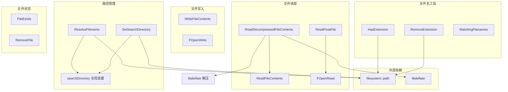
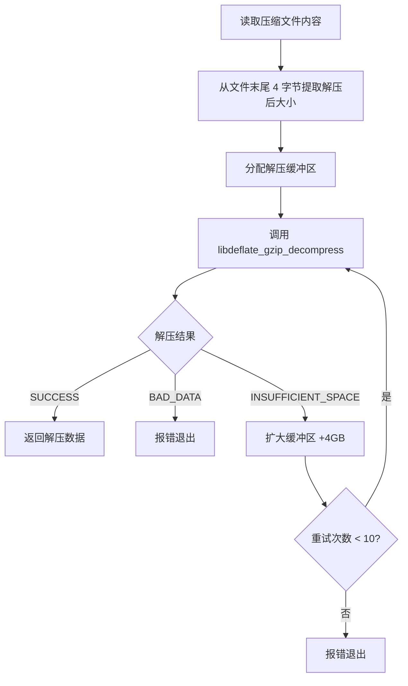
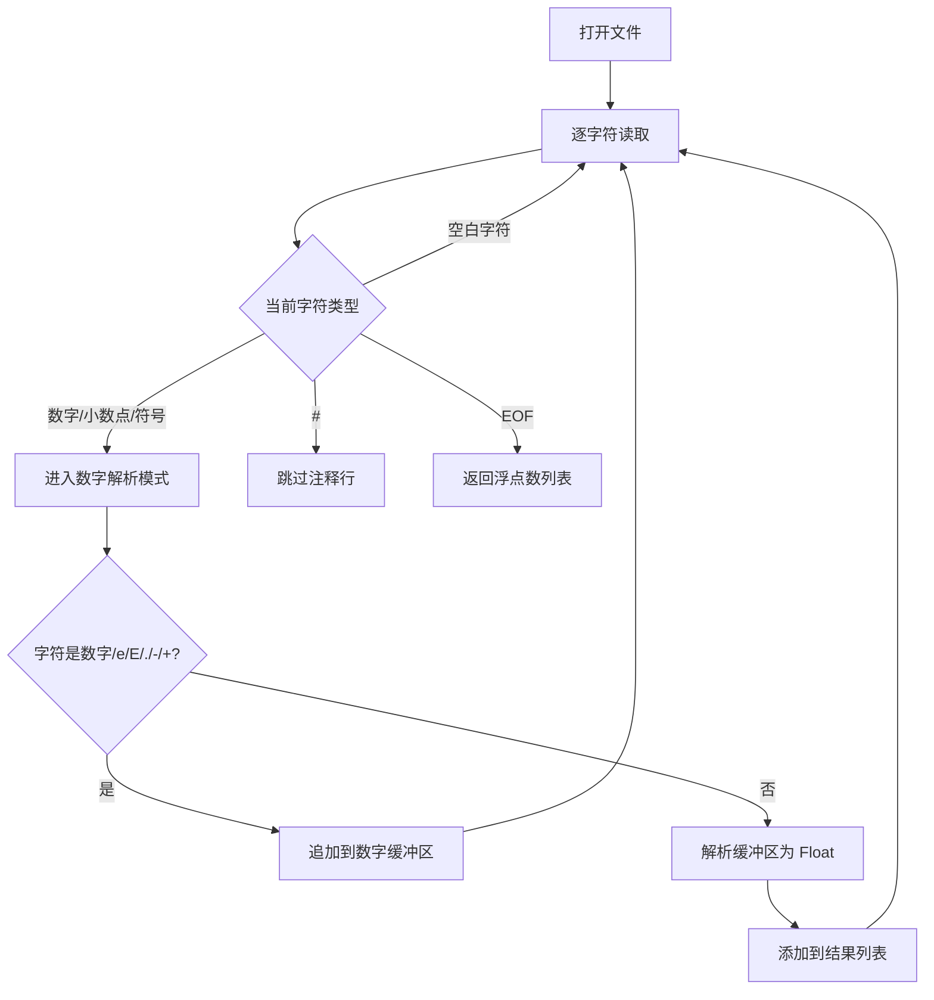

# file.h / file.cpp

## 概述
该文件提供了 PBRT 渲染器的文件系统操作工具集，包括文件读写、路径解析、文件名匹配、扩展名处理和浮点数文件解析等功能。它封装了跨平台（Windows/Linux/macOS）的文件操作差异，并集成了 gzip 压缩文件的解压功能。在渲染管线中，该模块是场景文件加载、纹理读取和输出图像写入的底层文件 I/O 基础设施。

## 主要类与接口
| 类/结构体/函数 | 说明 |
|---|---|
| `ReadFileContents(filename)` | 读取文件的全部内容为字符串（二进制模式） |
| `ReadDecompressedFileContents(filename)` | 读取 gzip 压缩文件并解压，使用 libdeflate 库 |
| `WriteFileContents(filename, contents)` | 将字符串内容写入文件 |
| `ReadFloatFile(filename)` | 解析文本文件中的浮点数列表，支持 `#` 注释 |
| `FileExists(filename)` | 检查文件是否存在 |
| `RemoveFile(filename)` | 删除文件 |
| `ResolveFilename(filename)` | 基于搜索目录解析相对路径为绝对路径 |
| `SetSearchDirectory(filename)` | 设置文件搜索目录（从文件路径中提取父目录） |
| `HasExtension(filename, ext)` | 检查文件是否具有指定扩展名（不区分大小写） |
| `RemoveExtension(filename)` | 移除文件扩展名 |
| `MatchingFilenames(filename)` | 匹配指定前缀的所有文件，返回文件名列表 |
| `FOpenRead(filename)` | 以二进制读模式打开文件（跨平台） |
| `FOpenWrite(filename)` | 以二进制写模式打开文件（跨平台） |

## 架构图

## 算法流程图
### ReadDecompressedFileContents 解压流程

### ReadFloatFile 解析流程

## 依赖关系
- **依赖**：
  - `pbrt/pbrt.h` — 基础类型 (`Float`)
  - `pbrt/util/pstd.h` — 基础工具
  - `pbrt/util/check.h` — 断言宏
  - `pbrt/util/error.h` — 错误报告 (`Error`, `ErrorExit`, `ErrorString`)
  - `pbrt/util/parallel.h` — `ThreadLocal` 线程局部存储（用于解压器）
  - `pbrt/util/string.h` — 字符串工具（`WStringFromUTF8`, `Atof`）
  - `libdeflate` — gzip 解压库
  - `filesystem/path.h` — 跨平台路径操作
- **被依赖**：被场景解析器、纹理加载器、图像 I/O 模块和几何数据加载器广泛使用
