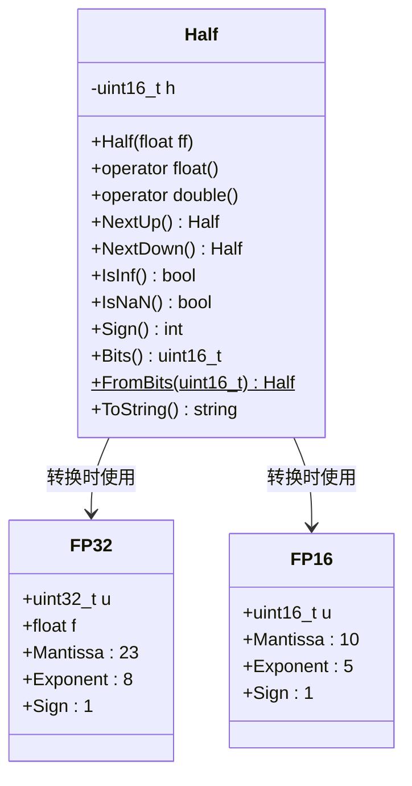
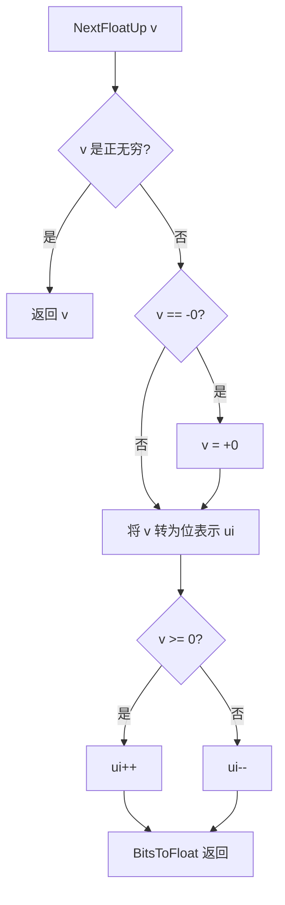

# float.h / float.cpp

## 概述
该文件提供了 pbrt 渲染器中浮点数操作的核心基础设施，包括浮点常量定义、位级操作、半精度浮点数（Half）类型实现，以及带方向舍入的算术运算。这些工具在光线追踪中对于控制浮点误差传播、保证数值鲁棒性至关重要。文件同时支持 CPU 和 GPU（CUDA）两种执行路径。

## 主要类与接口
| 类/结构体/函数 | 说明 |
|---|---|
| `Half` | 16 位半精度浮点数类，提供与 float/double 之间的转换、比较、取反、NextUp/NextDown 等操作 |
| `FP32` / `FP16` | 内部联合体，用于浮点数的位级分解（尾数、指数、符号位） |
| `IsNaN` / `IsInf` / `IsFinite` | 模板函数，判断浮点数/整数是否为 NaN、无穷大、有限值 |
| `FMA` | 融合乘加运算（Fused Multiply-Add），支持 float/double/long double |
| `FloatToBits` / `BitsToFloat` | 浮点数与其位表示之间的互转（支持 float 和 double） |
| `Exponent` / `Significand` / `SignBit` | 提取浮点数的指数、尾数和符号位 |
| `NextFloatUp` / `NextFloatDown` | 获取下一个更大/更小的可表示浮点数 |
| `gamma(n)` | 计算浮点误差界限 gamma(n) = nε/(1-nε) |
| `AddRoundUp` / `AddRoundDown` | 带方向舍入的加法（向上/向下） |
| `SubRoundUp` / `SubRoundDown` | 带方向舍入的减法 |
| `MulRoundUp` / `MulRoundDown` | 带方向舍入的乘法 |
| `DivRoundUp` / `DivRoundDown` | 带方向舍入的除法 |
| `SqrtRoundUp` / `SqrtRoundDown` | 带方向舍入的平方根 |
| `FMARoundUp` / `FMARoundDown` | 带方向舍入的融合乘加 |
| `FlipSign` | 翻转浮点数符号 |
| `Infinity` / `MachineEpsilon` / `OneMinusEpsilon` | 关键浮点常量 |

## 架构图

## 算法流程图

## 依赖关系
- **依赖**：
  - `pbrt/pbrt.h`（全局类型定义）
  - `pbrt/util/pstd.h`（bit_cast 等工具）
  - `pbrt/util/print.h`（ToString 中使用 StringPrintf）
  - `cuda_fp16.h`（GPU 编译时）
- **被依赖**：
  - `pbrt/util/math.h`（数学工具依赖浮点操作）
  - `pbrt/util/image.h`（图像处理使用 Half 类型）
  - `pbrt/util/lowdiscrepancy.h`（低差异序列使用 OneMinusEpsilon 等常量）
