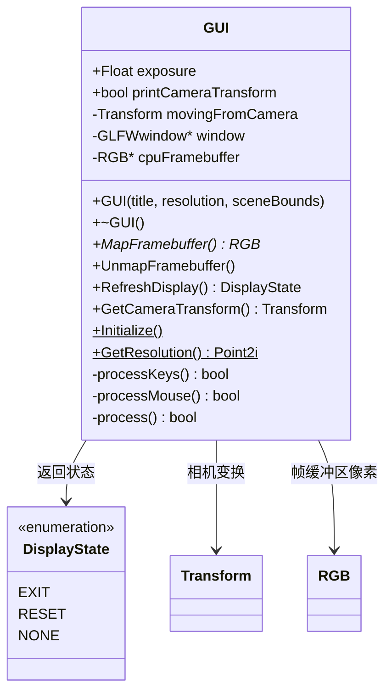
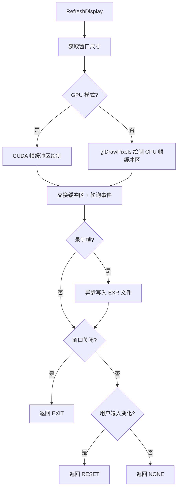

# gui.h / gui.cpp

## 概述
该文件实现了 pbrt 渲染器的实时交互式 GUI 显示窗口，基于 GLFW 和 OpenGL 构建。它允许用户在渲染过程中通过键盘和鼠标实时控制相机位姿、调整曝光度，并可选择性地录制帧序列。在 GPU 渲染模式下，还支持通过 CUDA-OpenGL 互操作将 GPU 帧缓冲区直接显示到屏幕上。

## 主要类与接口
| 类/结构体/函数 | 说明 |
|---|---|
| `DisplayState` | 枚举类型，定义显示状态：`EXIT`（退出）、`RESET`（重置渲染）、`NONE`（无变化） |
| `GUI` | 主 GUI 类，管理窗口创建、帧缓冲区、用户输入和显示刷新 |
| `GUI::GUI(title, resolution, sceneBounds)` | 构造函数，创建 GLFW 窗口并初始化 OpenGL/CUDA 帧缓冲区 |
| `GUI::MapFramebuffer()` | 映射帧缓冲区指针供渲染器写入像素数据 |
| `GUI::UnmapFramebuffer()` | 取消帧缓冲区映射 |
| `GUI::RefreshDisplay()` | 刷新显示，处理窗口事件，返回显示状态 |
| `GUI::GetCameraTransform()` | 获取当前相机变换矩阵 |
| `GUI::Initialize()` | 静态方法，初始化 GLFW |
| `GUI::GetResolution()` | 静态方法，获取主显示器分辨率 |
| `GUI::keyboardCallback` | 键盘事件回调，处理 WASD 移动、方向键旋转、曝光调节等 |
| `GUI::cursorPosCallback` | 鼠标移动回调 |
| `GUI::mouseButtonCallback` | 鼠标按键回调 |

## 架构图

## 算法流程图

## 依赖关系
- **依赖**：
  - `glad/glad.h`、`GLFW/glfw3.h`（OpenGL 加载与窗口管理）
  - `pbrt/pbrt.h`（全局类型定义）
  - `pbrt/gpu/cudagl.h`（GPU 模式下的 CUDA-GL 互操作）
  - `pbrt/util/color.h`（RGB 颜色类型）
  - `pbrt/util/transform.h`（变换矩阵）
  - `pbrt/util/vecmath.h`（向量/点类型）
  - `pbrt/options.h`（渲染选项）
  - `pbrt/util/error.h`（错误处理）
  - `pbrt/util/image.h`（图像写入）
  - `pbrt/util/parallel.h`（异步执行 RunAsync）
- **被依赖**：
  - 渲染器主循环（交互式渲染时使用）
