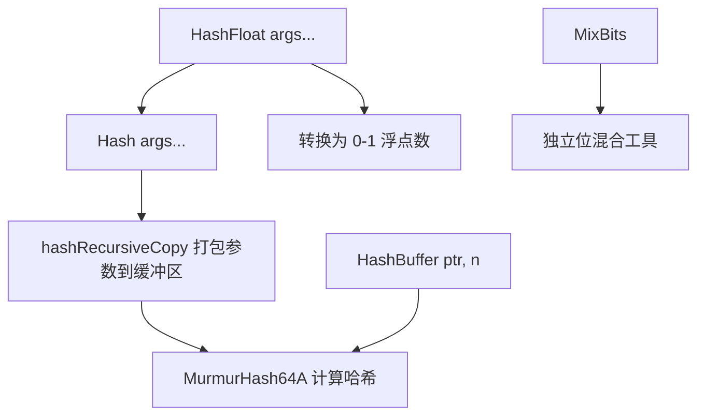

# hash.h

## 概述
该文件提供了 pbrt 渲染器中通用的哈希函数基础设施，核心实现为 MurmurHash64A 算法。它支持对任意类型的数据进行高效哈希，广泛用于采样器中的随机化、纹理缓存查找以及低差异序列生成等场景。所有函数均支持 CPU 和 GPU 两种执行路径。

## 主要类与接口
| 类/结构体/函数 | 说明 |
|---|---|
| `MurmurHash64A(key, len, seed)` | MurmurHash2 64 位哈希实现，对字节数组计算哈希值 |
| `MixBits(v)` | 位混合函数，对 64 位整数进行高质量位混合（用于改善哈希分布） |
| `HashBuffer(ptr, nElements, seed)` | 对类型化缓冲区计算哈希值，内部调用 MurmurHash64A |
| `Hash(args...)` | 可变参数模板哈希函数，将任意数量的参数打包后计算哈希 |
| `HashFloat(args...)` | 将 Hash 结果转换为 [0, 1) 范围的浮点数 |
| `hashRecursiveCopy(buf, args...)` | 辅助函数，将可变参数递归复制到缓冲区中 |

## 架构图

## 依赖关系
- **依赖**：
  - `pbrt/pbrt.h`（全局类型定义）
  - `pbrt/util/check.h`（断言检查）
- **被依赖**：
  - `pbrt/util/lowdiscrepancy.h`（低差异序列中的随机化，使用 Hash 和 MixBits）
  - `pbrt/util/mesh.h`（HashIntPair 使用 MixBits）
  - 采样器和纹理系统（通过哈希实现伪随机数生成）
