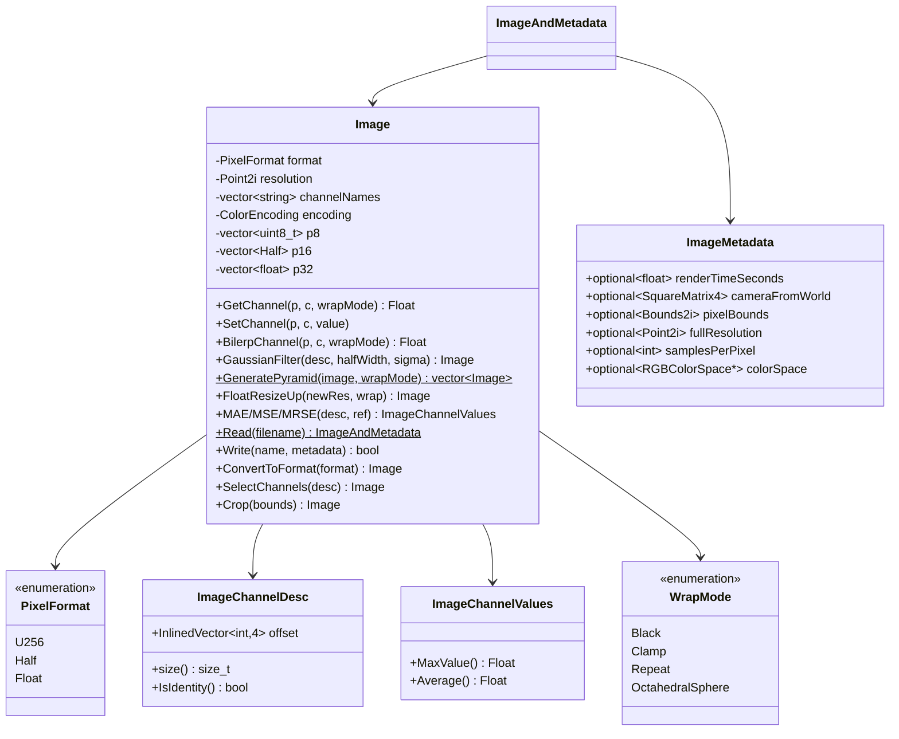
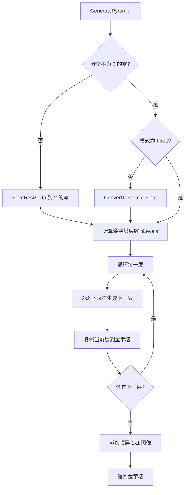

# image.h / image.cpp

## 概述
该文件实现了 pbrt 渲染器的核心图像处理系统，提供了多格式、多精度的图像存储与操作能力。Image 类支持 U256（8位）、Half（16位）、Float（32位）三种像素格式，具备通道管理、双线性插值、高斯滤波、MIP 金字塔生成、图像误差计算等功能。同时支持 EXR、PNG、PFM、HDR、QOI 等多种图像文件格式的读写。

## 主要类与接口
| 类/结构体/函数 | 说明 |
|---|---|
| `PixelFormat` | 像素格式枚举：U256（8位）、Half（16位）、Float（32位） |
| `WrapMode` | 纹理环绕模式枚举：Black、Clamp、Repeat、OctahedralSphere |
| `WrapMode2D` | 二维环绕模式，可为每个轴独立设置 |
| `ResampleWeight` | 图像重采样权重结构体，用于图像缩放 |
| `ImageMetadata` | 图像元数据，存储渲染时间、相机矩阵、像素范围、色彩空间等信息 |
| `ImageChannelDesc` | 图像通道描述符，用于选择和重排通道 |
| `ImageChannelValues` | 通道值容器，支持最大值和平均值计算 |
| `Image` | 核心图像类，管理像素数据的存储和操作 |
| `Image::GetChannel` / `SetChannel` | 读写单个像素通道值 |
| `Image::BilerpChannel` | 双线性插值采样 |
| `Image::GaussianFilter` | 可分离高斯滤波 |
| `Image::GeneratePyramid` | 生成 MIP 金字塔 |
| `Image::FloatResizeUp` | 使用 windowed sinc 滤波器放大图像 |
| `Image::MAE` / `MSE` / `MRSE` | 计算图像误差指标（平均绝对误差/均方误差/平均相对平方误差） |
| `Image::Read` / `Write` | 静态/成员方法，读写多种格式的图像文件 |
| `Image::ConvertToFormat` | 像素格式转换 |
| `Image::SelectChannels` / `Crop` | 通道选择和图像裁剪 |
| `Image::GetSamplingDistribution` | 生成基于亮度的采样分布 |
| `ImageAndMetadata` | 图像与元数据的组合结构体 |
| `RemapPixelCoords` | 根据环绕模式重映射像素坐标 |

## 架构图

## 算法流程图

## 依赖关系
- **依赖**：
  - `pbrt/pbrt.h`、`pbrt/util/check.h`、`pbrt/util/color.h`、`pbrt/util/containers.h`
  - `pbrt/util/float.h`（Half 类型）
  - `pbrt/util/math.h`（数学函数）
  - `pbrt/util/parallel.h`（并行处理）
  - `pbrt/util/pstd.h`、`pbrt/util/vecmath.h`
  - `pbrt/util/bluenoise.h`（蓝噪声抖动）
  - `pbrt/util/colorspace.h`（色彩空间转换）
  - `pbrt/util/error.h`、`pbrt/util/file.h`、`pbrt/util/string.h`、`pbrt/util/print.h`
  - 外部库：`lodepng`（PNG）、`OpenEXR`（EXR）、`stb_image`（通用格式）、`qoi`（QOI）
- **被依赖**：
  - `pbrt/util/gui.cpp`（帧录制使用 Image 写入）
  - 纹理系统、胶片/传感器系统（存储和处理渲染结果）
