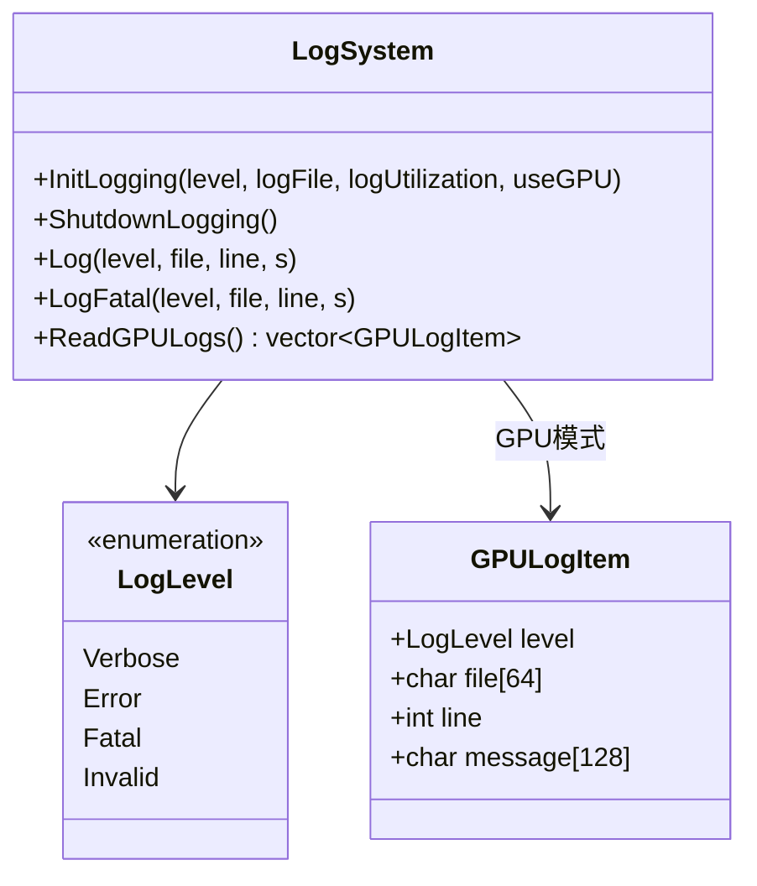
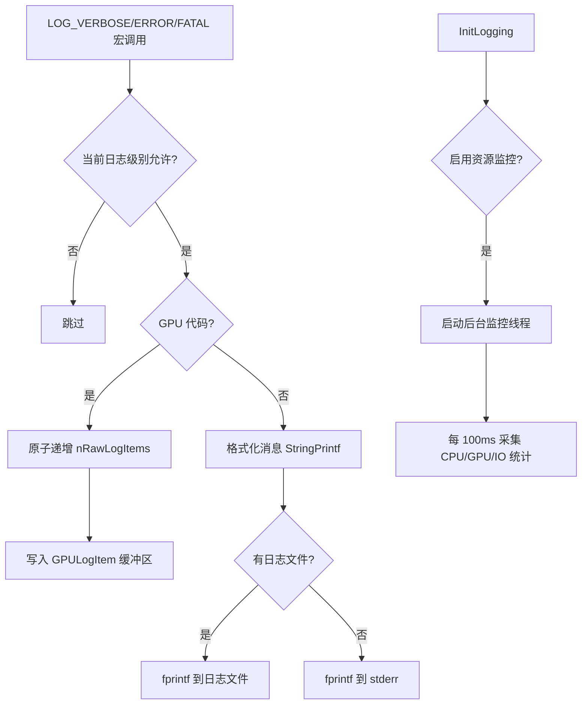

# log.h / log.cpp

## 概述
该文件实现了 pbrt 渲染器的日志系统，提供了多级别（Verbose、Error、Fatal）的日志记录功能。日志系统支持 CPU 和 GPU 两种执行路径，在 GPU 上通过设备端缓冲区收集日志，在 CPU 上支持输出到标准错误流或日志文件。此外还包含系统资源利用率监控功能（CPU 使用率、内存、I/O 和 GPU 利用率）。

## 主要类与接口
| 类/结构体/函数 | 说明 |
|---|---|
| `LogLevel` | 日志级别枚举：Verbose、Error、Fatal、Invalid |
| `GPULogItem` | GPU 日志项结构体，存储日志级别、文件名、行号和消息内容 |
| `InitLogging(level, logFile, logUtilization, useGPU)` | 初始化日志系统，设置日志级别和输出目标 |
| `ShutdownLogging()` | 关闭日志系统，停止资源监控线程 |
| `Log(level, file, line, s)` | 核心日志函数，记录指定级别的日志消息 |
| `LogFatal(level, file, line, s)` | 致命错误日志函数，记录后终止程序 |
| `ReadGPULogs()` | 从 GPU 设备内存读取日志项 |
| `LogLevelFromString(s)` | 从字符串解析日志级别 |
| `LOG_VERBOSE(...)` | 宏，记录详细级别日志 |
| `LOG_ERROR(...)` | 宏，记录错误级别日志 |
| `LOG_FATAL(...)` | 宏，记录致命错误日志并终止 |
| `logging::logLevel` | 全局日志级别变量 |
| `logging::logFile` | 全局日志文件句柄 |

## 架构图

## 算法流程图

## 依赖关系
- **依赖**：
  - `pbrt/pbrt.h`（全局类型定义）
  - `pbrt/util/print.h`（StringPrintf 格式化）
  - `pbrt/options.h`（渲染选项）
  - `pbrt/util/check.h`（断言与回调）
  - `pbrt/util/error.h`（错误处理）
  - `pbrt/util/file.h`（文件操作）
  - `pbrt/util/memory.h`（GetCurrentRSS 内存统计）
  - `pbrt/util/parallel.h`（并行工具）
  - `pbrt/util/string.h`（字符串解析）
  - `pbrt/gpu/util.h`（GPU 编译时的 CUDA 工具）
  - `nvml.h`（可选的 NVIDIA GPU 监控）
- **被依赖**：
  - 几乎所有 pbrt 模块均通过 LOG_VERBOSE/LOG_ERROR/LOG_FATAL 宏使用日志系统
