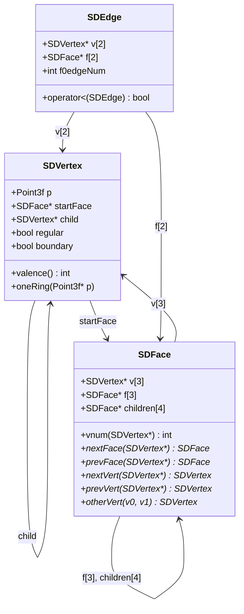
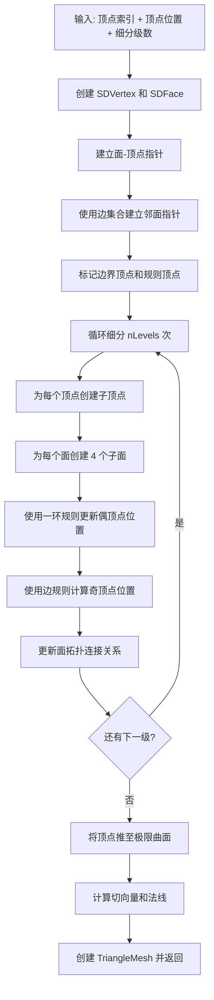

# loopsubdiv.h / loopsubdiv.cpp

## 概述
该文件实现了 Loop 细分曲面算法，用于将粗糙的三角网格细化为平滑的高分辨率三角网格。这是 pbrt 渲染器中几何处理管线的重要组成部分，允许用户通过少量控制顶点定义光滑曲面，渲染时通过多级细分得到逼真的曲面效果。算法最终将顶点推至极限曲面位置并计算切向量以生成法线。

## 主要类与接口
| 类/结构体/函数 | 说明 |
|---|---|
| `LoopSubdivide(renderFromObject, reverseOrientation, nLevels, vertexIndices, p, alloc)` | 主函数，执行 Loop 细分并返回 TriangleMesh 指针 |
| `SDVertex` | 细分顶点结构体，存储位置、起始面、子顶点以及边界/规则标志 |
| `SDVertex::valence()` | 计算顶点的化合价（相邻面数） |
| `SDVertex::oneRing(p)` | 获取顶点的一环邻域顶点位置 |
| `SDFace` | 细分面结构体，存储 3 个顶点、3 个邻面和 4 个子面 |
| `SDFace::nextFace/prevFace` | 获取相对于某顶点的下一个/上一个邻面 |
| `SDFace::nextVert/prevVert` | 获取相对于某顶点的下一个/上一个顶点 |
| `SDEdge` | 细分边结构体，用于邻面指针的建立 |
| `beta(valence)` | 计算偶顶点的细分权重 beta |
| `loopGamma(valence)` | 计算极限曲面推进的 gamma 权重 |
| `weightOneRing(vert, beta)` | 使用一环规则计算内部顶点新位置 |
| `weightBoundary(vert, beta)` | 使用边界规则计算边界顶点新位置 |

## 架构图

## 算法流程图

## 依赖关系
- **依赖**：
  - `pbrt/pbrt.h`（全局类型定义）
  - `pbrt/util/pstd.h`（span 等工具）
  - `pbrt/util/containers.h`（InlinedVector）
  - `pbrt/util/error.h`（错误处理）
  - `pbrt/util/memory.h`（单调缓冲区资源分配器）
  - `pbrt/util/mesh.h`（TriangleMesh 输出类型）
  - `pbrt/util/transform.h`（变换矩阵）
  - `pbrt/util/vecmath.h`（向量/点/法线类型）
- **被依赖**：
  - 场景解析中的 Loop 细分曲面形状（shapes）
