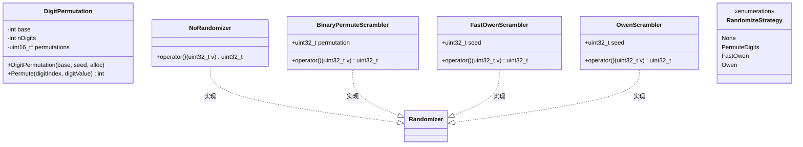
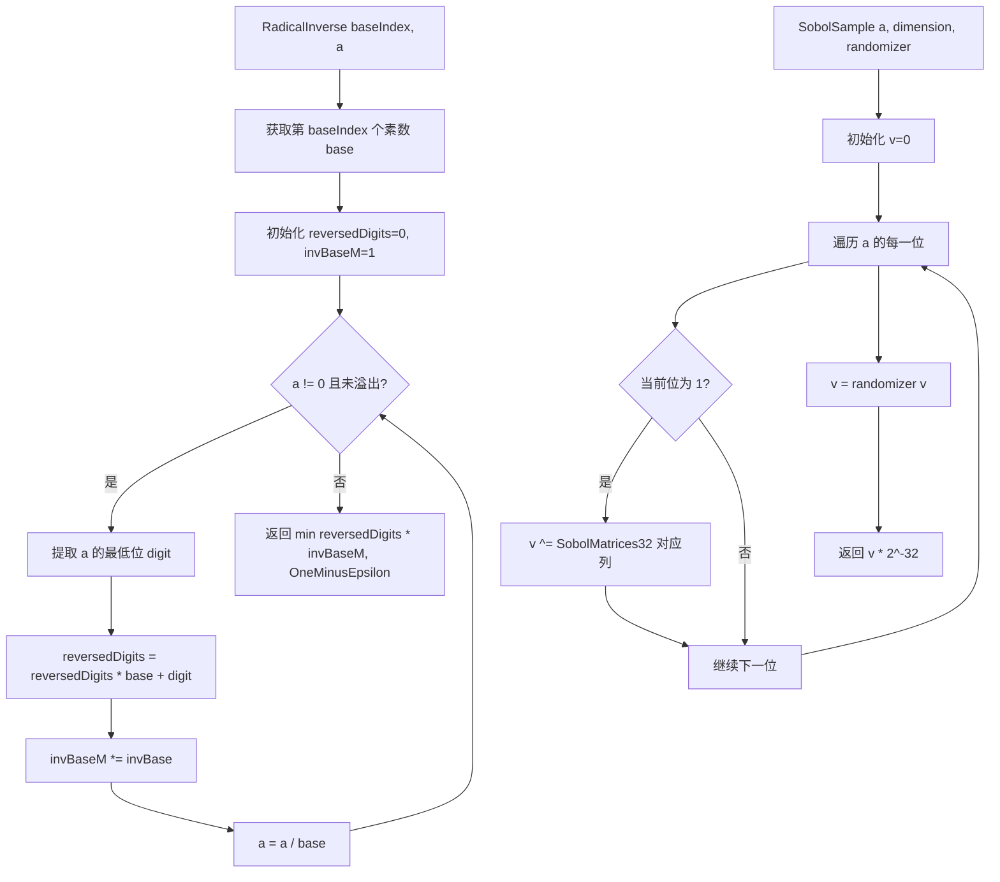

# lowdiscrepancy.h / lowdiscrepancy.cpp

## 概述
该文件实现了 pbrt 渲染器中低差异序列和准蒙特卡罗采样的核心工具。包括基数反转（Radical Inverse）函数、Sobol 序列采样、多种随机化/扰乱策略（Owen 扰乱、快速 Owen 扰乱、二进制置换扰乱）、数字置换以及蓝噪声采样等。这些工具是高质量采样器的基础，用于减少渲染图像中的噪声和走样。

## 主要类与接口
| 类/结构体/函数 | 说明 |
|---|---|
| `DigitPermutation` | 数字置换类，为基数反转的每一位数字存储随机置换表 |
| `DigitPermutation::Permute(digitIndex, digitValue)` | 查询特定数字位的置换值 |
| `RadicalInverse(baseIndex, a)` | 计算第 baseIndex 个素数为基底的基数反转值 |
| `InverseRadicalInverse(inverse, base, nDigits)` | 基数反转的逆运算 |
| `ScrambledRadicalInverse(baseIndex, a, perm)` | 使用数字置换的扰乱基数反转 |
| `OwenScrambledRadicalInverse(baseIndex, a, hash)` | 使用 Owen 扰乱的基数反转 |
| `ComputeRadicalInversePermutations(seed, alloc)` | 为所有素数基底预计算数字置换 |
| `SobolSample(a, dimension, randomizer)` | Sobol 序列采样，使用生成矩阵和随机化器 |
| `SobolIntervalToIndex(m, frame, p)` | 将 Sobol 序列索引映射到像素空间 |
| `MultiplyGenerator(C, a)` | 使用生成矩阵乘法计算 Sobol 点 |
| `BlueNoiseSample(p, instance)` | 基于 Morton 编码的蓝噪声采样 |
| `NoRandomizer` | 无随机化策略（直通） |
| `BinaryPermuteScrambler` | 二进制异或置换扰乱器 |
| `FastOwenScrambler` | 快速 Owen 扰乱器（近似但高效） |
| `OwenScrambler` | 完整 Owen 扰乱器（高质量但较慢） |
| `RandomizeStrategy` | 随机化策略枚举：None、PermuteDigits、FastOwen、Owen |

## 架构图

## 算法流程图

## 依赖关系
- **依赖**：
  - `pbrt/pbrt.h`（全局类型定义）
  - `pbrt/util/check.h`（断言检查）
  - `pbrt/util/float.h`（OneMinusEpsilon、FloatOneMinusEpsilon）
  - `pbrt/util/hash.h`（Hash、MixBits 函数）
  - `pbrt/util/math.h`（ReverseBits32、EncodeMorton2、PermutationElement 等）
  - `pbrt/util/primes.h`（素数表 Primes、PrimeTableSize）
  - `pbrt/util/pstd.h`（span 等工具）
  - `pbrt/util/sobolmatrices.h`（Sobol 生成矩阵和 VdC 矩阵）
  - `pbrt/util/vecmath.h`（Point2i）
  - `pbrt/util/print.h`（ToString 格式化）
  - `pbrt/util/stats.h`（统计计数）
- **被依赖**：
  - 各种采样器实现（Halton、Sobol、Paddled Blue Noise 等）
