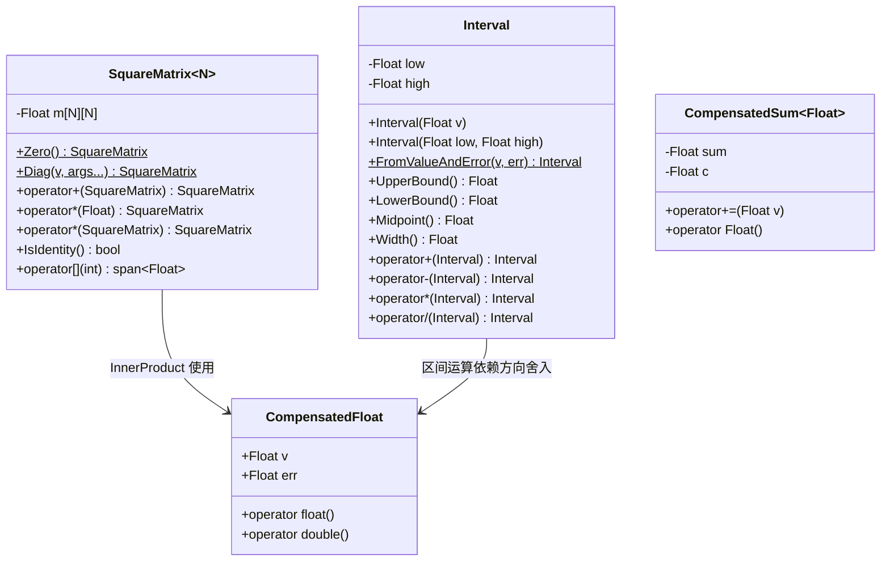
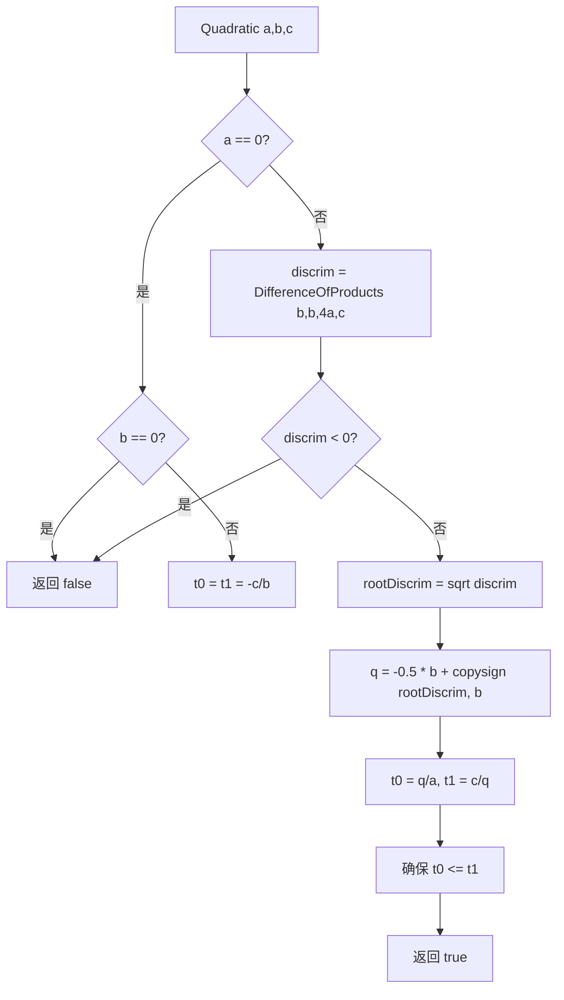

# math.h / math.cpp

## 概述
该文件是 pbrt 渲染器最核心的数学工具库，提供了从基本常量到高级线性代数、区间算术、样条插值、球面映射等全方位的数学支持。它定义了 Pi 等数学常量、位操作函数、Morton 编码、补偿浮点求和、方阵类（SquareMatrix）、区间类（Interval）以及各种数值算法，是整个渲染管线的数学基石。

## 主要类与接口
| 类/结构体/函数 | 说明 |
|---|---|
| **常量** | `Pi`、`InvPi`、`Inv2Pi`、`PiOver2`、`PiOver4`、`Sqrt2`、`ShadowEpsilon` |
| **位操作** | `ReverseBits32/64`、`LeftShift2/3`、`EncodeMorton2/3`、`DecodeMorton2`、`Compact1By1/2` |
| `CompensatedSum<Float>` | Kahan 补偿求和，减少浮点累加误差 |
| `CompensatedFloat` | 带误差项的浮点数，用于精确计算 |
| `SquareMatrix<N>` | N 阶方阵模板类，支持加法、乘法、转置、求逆、行列式等操作 |
| `Interval` | 区间算术类，用于保守的浮点误差追踪，支持四则运算、平方根、三角函数等 |
| `Lerp` / `Clamp` / `Mod` | 基本插值、钳位、取模函数 |
| `Radians` / `Degrees` | 角度与弧度互转 |
| `SafeSqrt` / `SafeASin` / `SafeACos` | 安全的数学函数（处理边界情况） |
| `Sqr` / `Pow<n>` | 平方和编译时幂运算 |
| `FastExp` | 快速近似指数函数 |
| `Gaussian` / `GaussianIntegral` | 高斯函数及其积分 |
| `Logistic` / `LogisticCDF` / `TrimmedLogistic` | 逻辑斯蒂分布函数 |
| `ErfInv` | 逆误差函数近似 |
| `I0` / `LogI0` | 修正贝塞尔函数 I0 及其对数 |
| `SmoothStep` | 平滑阶梯函数 |
| `Sinc` / `WindowedSinc` / `SinXOverX` | sinc 函数及窗函数 sinc |
| `EvaluatePolynomial` | Horner 法多项式求值 |
| `DifferenceOfProducts` / `SumOfProducts` | 数值稳定的乘积差/和 |
| `InnerProduct` | 补偿精度的内积计算 |
| `Quadratic` | 求解二次方程（支持 float、double 和 Interval） |
| `NewtonBisection` | Newton-二分法混合求根 |
| `FindInterval` | 二分查找有序数组中的区间 |
| `IsPowerOf2` / `RoundUpPow2` / `IsPowerOf4` / `RoundUpPow4` | 2 的幂和 4 的幂相关操作 |
| `Log2Int` / `Log2` / `Log4Int` | 对数函数 |
| `PermutationElement` | 基于哈希的伪随机排列元素 |
| `NextPrime` | 查找下一个素数 |
| `CatmullRom` / `CatmullRomWeights` / `IntegrateCatmullRom` / `InvertCatmullRom` | Catmull-Rom 样条插值及相关操作 |
| `EqualAreaSquareToSphere` / `EqualAreaSphereToSquare` | 等面积正方形-球面映射 |
| `WrapEqualAreaSquare` | 等面积映射的边界环绕处理 |
| `LinearLeastSquares` | 线性最小二乘求解 |
| `TwoProd` / `TwoSum` | 精确的二元乘法/加法（返回结果和误差） |

## 架构图

## 算法流程图

## 依赖关系
- **依赖**：
  - `pbrt/pbrt.h`（全局类型定义）
  - `pbrt/util/check.h`（断言检查）
  - `pbrt/util/float.h`（浮点操作、方向舍入函数）
  - `pbrt/util/pstd.h`（工具函数）
  - `pbrt/util/print.h`（ToString 格式化）
  - `pbrt/util/vecmath.h`（Vector3f、Point2f 类型用于球面映射）
- **被依赖**：
  - `pbrt/util/image.h`（图像处理使用 Gaussian、WindowedSinc 等）
  - `pbrt/util/lowdiscrepancy.h`（低差异序列使用 ReverseBits32、EncodeMorton2 等）
  - `pbrt/util/memory.h`（内存管理使用 math 工具）
  - 几乎所有需要数学计算的 pbrt 模块
