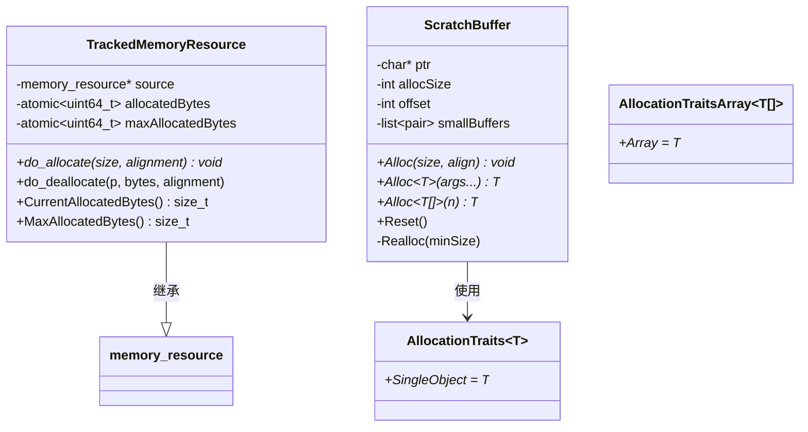
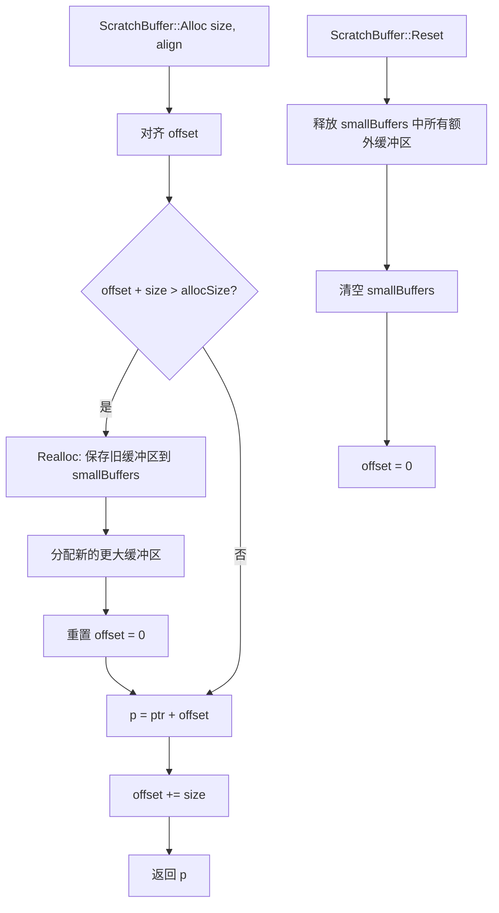

# memory.h / memory.cpp

## 概述
该文件提供了 pbrt 渲染器的内存管理基础设施，包含内存使用追踪、临时内存分配器（ScratchBuffer）以及操作系统层面的物理内存使用量查询。TrackedMemoryResource 可以监控通过其分配的内存总量和峰值，而 ScratchBuffer 提供了一种高效的线程局部临时内存分配方案，适用于光线追踪中需要频繁创建和销毁临时对象的场景。

## 主要类与接口
| 类/结构体/函数 | 说明 |
|---|---|
| `GetCurrentRSS()` | 获取当前进程的常驻内存集大小（RSS），支持 Windows、macOS、Linux |
| `TrackedMemoryResource` | 内存资源追踪器，继承自 `pstd::pmr::memory_resource`，记录已分配字节数和峰值 |
| `TrackedMemoryResource::CurrentAllocatedBytes()` | 返回当前已分配的字节数 |
| `TrackedMemoryResource::MaxAllocatedBytes()` | 返回历史峰值分配字节数 |
| `AllocationTraits<T>` | 分配特征模板，区分单对象和数组分配 |
| `ScratchBuffer` | 高效的临时内存分配器，按缓存行对齐，支持单对象和数组分配 |
| `ScratchBuffer::Alloc(size, align)` | 分配指定大小和对齐的原始内存 |
| `ScratchBuffer::Alloc<T>(args...)` | 分配并构造单个 T 类型对象 |
| `ScratchBuffer::Alloc<T[]>(n)` | 分配并默认构造 T 类型数组 |
| `ScratchBuffer::Reset()` | 重置分配器，释放所有额外缓冲区 |

## 架构图

## 算法流程图

## 依赖关系
- **依赖**：
  - `pbrt/pbrt.h`（全局类型定义，Allocator）
  - `pbrt/util/check.h`（断言检查）
  - `pbrt/util/math.h`（数学工具）
  - `pbrt/util/pstd.h`（PMR 内存资源接口）
  - `pbrt/util/print.h`（格式化输出）
  - 平台特定头文件：`windows.h`/`psapi.h`（Windows）、`mach/mach.h`（macOS）、`unistd.h`（Linux）
- **被依赖**：
  - `pbrt/util/log.cpp`（日志系统使用 GetCurrentRSS 监控内存）
  - `pbrt/util/loopsubdiv.cpp`（细分曲面使用 monotonic_buffer_resource）
  - 光线追踪积分器（使用 ScratchBuffer 进行临时内存分配）
