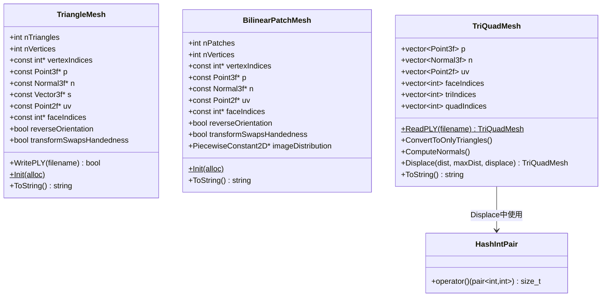
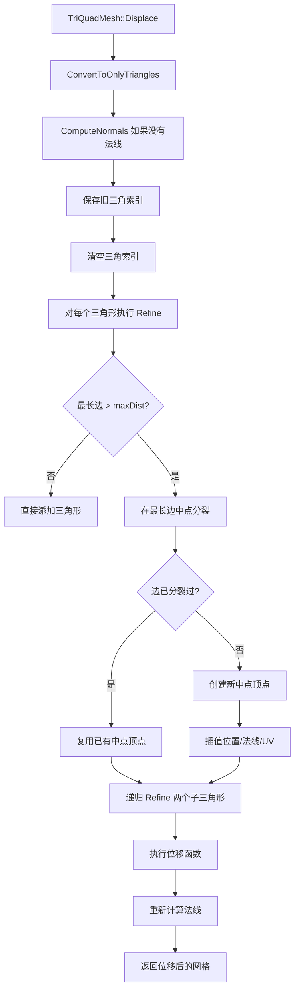

# mesh.h / mesh.cpp

## 概述
该文件定义了 pbrt 渲染器的网格几何数据结构，包括三角网格（TriangleMesh）、双线性面片网格（BilinearPatchMesh）以及混合三角-四边形网格（TriQuadMesh）。这些数据结构是渲染器中所有多边形几何体的基础表示，支持顶点位置、法线、切向量、UV 坐标和面索引等属性，并提供 PLY 文件格式的读写能力。通过缓冲区缓存（BufferCache）机制优化内存使用。

## 主要类与接口
| 类/结构体/函数 | 说明 |
|---|---|
| `TriangleMesh` | 三角网格类，存储顶点索引、位置、法线、切向量、UV 和面索引 |
| `TriangleMesh::TriangleMesh(...)` | 构造函数，将顶点变换到渲染空间并通过 BufferCache 去重存储 |
| `TriangleMesh::WritePLY(filename)` | 将三角网格写出为 PLY 文件 |
| `TriangleMesh::Init(alloc)` | 静态初始化方法 |
| `BilinearPatchMesh` | 双线性面片网格类，与 TriangleMesh 类似但每个面片有 4 个顶点 |
| `BilinearPatchMesh::Init(alloc)` | 静态初始化方法 |
| `TriQuadMesh` | 混合三角-四边形网格，支持 PLY 读取、三角化、法线计算和自适应细分 |
| `TriQuadMesh::ReadPLY(filename)` | 静态方法，从 PLY 文件读取网格数据 |
| `TriQuadMesh::ConvertToOnlyTriangles()` | 将所有四边形转换为三角形 |
| `TriQuadMesh::ComputeNormals()` | 根据面法线计算顶点法线 |
| `TriQuadMesh::Displace(dist, maxDist, displace)` | 自适应细分后进行位移映射 |
| `HashIntPair` | 整数对哈希函数对象，用于边分裂字典 |
| `WritePLY(filename, triIndices, quadIndices, p, n, uv, faceIndices)` | 独立的 PLY 写入函数 |

## 架构图

## 算法流程图

## 依赖关系
- **依赖**：
  - `pbrt/pbrt.h`（全局类型定义）
  - `pbrt/util/containers.h`（HashMap）
  - `pbrt/util/error.h`（错误处理）
  - `pbrt/util/hash.h`（MixBits 用于 HashIntPair）
  - `pbrt/util/parallel.h`（并行工具）
  - `pbrt/util/pstd.h`（span 等工具）
  - `pbrt/util/vecmath.h`（Point3f、Normal3f、Vector3f、Point2f）
  - `pbrt/util/buffercache.h`（缓冲区缓存去重）
  - `pbrt/util/check.h`（断言）
  - `pbrt/util/log.h`（日志）
  - `pbrt/util/print.h`（格式化输出）
  - `pbrt/util/stats.h`（统计计数器）
  - `pbrt/util/transform.h`（变换矩阵）
  - `rply/rply.h`（PLY 文件读写库）
- **被依赖**：
  - `pbrt/util/loopsubdiv.cpp`（Loop 细分输出 TriangleMesh）
  - 三角形形状（Triangle shape）和双线性面片形状（BilinearPatch shape）
  - 场景加载器（解析 PLY 文件时使用 TriQuadMesh::ReadPLY）
