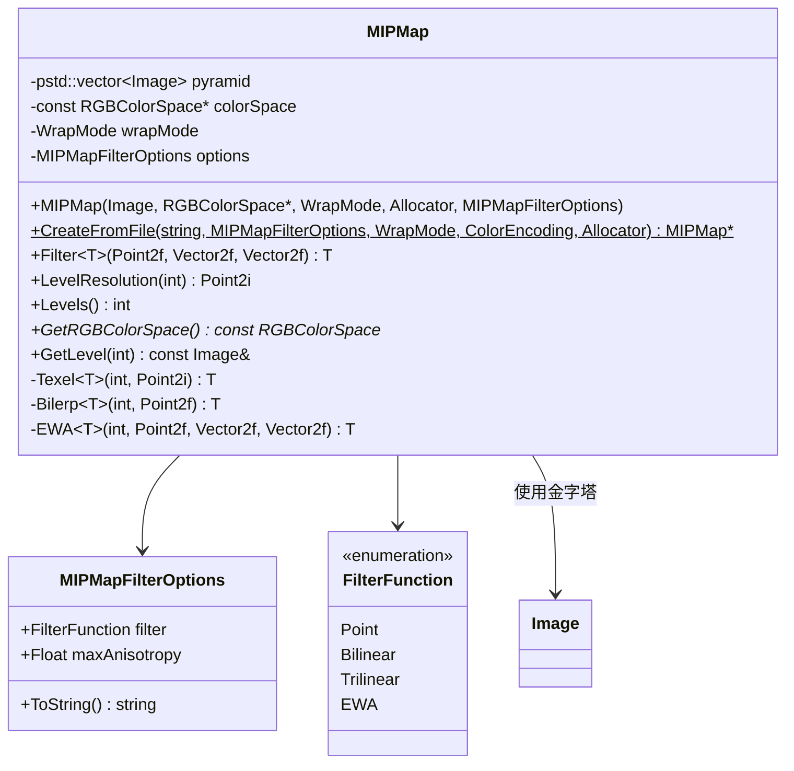
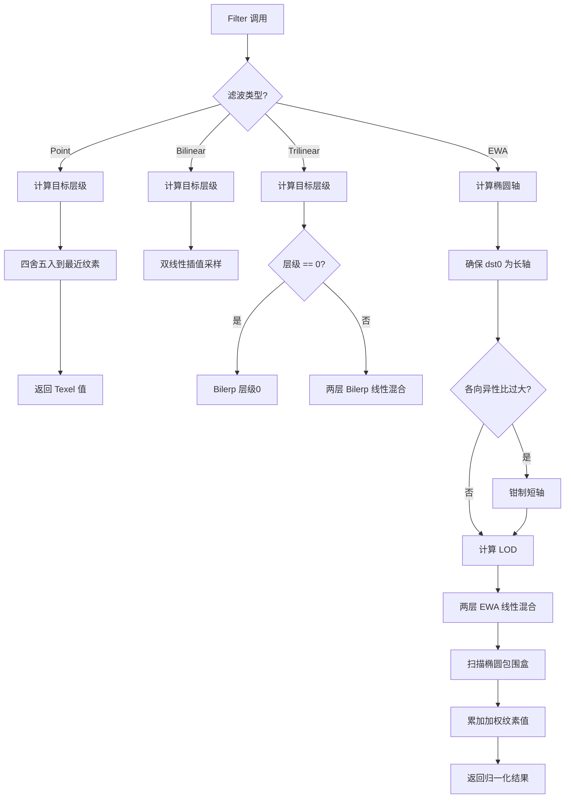

# mipmap.h / mipmap.cpp

## 概述
该文件实现了多级渐远纹理映射（MIP Map）功能，是 PBRT 纹理系统的核心组件。MIPMap 类负责从图像生成多分辨率金字塔，并在渲染过程中根据纹理空间的微分信息选择合适的采样层级和滤波方式，支持点采样、双线性、三线性和 EWA（椭圆加权平均）四种滤波模式，以实现高质量的抗锯齿纹理采样。

## 主要类与接口
| 类/结构体/函数 | 说明 |
|---|---|
| `FilterFunction` | 枚举类型，定义四种纹理滤波方式：Point（点采样）、Bilinear（双线性）、Trilinear（三线性）、EWA（椭圆加权平均） |
| `ParseFilter` | 从字符串解析滤波函数类型，返回 `pstd::optional<FilterFunction>` |
| `MIPMapFilterOptions` | 结构体，封装 MIP Map 的滤波选项，包含滤波函数类型和最大各向异性比 |
| `MIPMap` | 核心类，管理图像金字塔并提供纹理滤波接口 |
| `MIPMap::MIPMap` | 构造函数，从图像生成多级金字塔 |
| `MIPMap::CreateFromFile` | 静态工厂方法，从文件加载图像并创建 MIPMap |
| `MIPMap::Filter<T>` | 模板方法，根据纹理坐标和微分向量执行滤波采样，支持 Float 和 RGB 类型 |
| `MIPMap::Texel<T>` | 获取指定层级和坐标的纹素值 |
| `MIPMap::Bilerp<T>` | 双线性插值采样 |
| `MIPMap::EWA<T>` | 椭圆加权平均滤波，使用预计算的高斯查找表 |
| `MIPFilterLUT` | 预计算的 EWA 滤波权重查找表（128 项） |

## 架构图


## 算法流程图


## 核心函数详解

### `MIPMap::Filter<T>` (mipmap.cpp:229-284)

```cpp
template <typename T>
T MIPMap::Filter(Point2f st, Vector2f dst0, Vector2f dst1) const;
```

纹理滤波的统一入口。根据 `MIPMapFilterOptions::filter` 的值分派到不同的滤波路径。

**参数说明**

| 参数 | 含义 |
|------|------|
| `st` | 纹理坐标 (s, t)，范围 [0, 1] |
| `dst0` | 纹理坐标对屏幕 x 轴的偏导数 ∂(s,t)/∂x |
| `dst1` | 纹理坐标对屏幕 y 轴的偏导数 ∂(s,t)/∂y |

`dst0` 和 `dst1` 共同描述了一个像素在纹理空间中覆盖的区域形状（平行四边形，可近似为椭圆）。

#### dst0 与 dst1 的物理意义及层级选择原理

**物理定义**

- `dst0 = ∂(s,t)/∂x`：纹理坐标 (s, t) 对屏幕像素坐标 x 的偏导数，表示屏幕上向右移动一个像素时，纹理坐标的变化量
- `dst1 = ∂(s,t)/∂y`：纹理坐标 (s, t) 对屏幕像素坐标 y 的偏导数，表示屏幕上向下移动一个像素时，纹理坐标的变化量

这两个向量构成雅可比矩阵 `J = [dst0, dst1]`，将屏幕空间的单位正方形（一个像素）映射到纹理空间的一个平行四边形——即该像素的**纹理空间足迹**（texture footprint）。

**直觉理解：三个典型场景**

1. **正对墙面中央**：相机垂直看向一面贴了纹理的墙壁。此时每个像素在纹理空间覆盖的区域近似正方形，`dst0 ≈ (ε, 0)`、`dst1 ≈ (0, ε)`，两个向量正交且长度接近，足迹是小而均匀的方块。ε 的大小取决于墙面距离——越远则 ε 越大（一个像素覆盖更多纹素）。

2. **远处透视缩小**：同一面墙距离相机很远。每个像素覆盖纹理空间中更大的区域，`|dst0|` 和 `|dst1|` 都变大，足迹仍接近正方形但面积增大。需要使用金字塔中更高（分辨率更低）的层级来避免走样。

3. **地面向远方延伸**：相机以掠射角看向地面。沿视线远离方向，一个像素在纹理空间被极度拉伸——`|dst0|`（沿远离方向的分量）远大于 `|dst1|`（沿横向的分量）。足迹变成细长的椭圆或平行四边形，**各向异性**（anisotropy）非常显著。这正是 EWA 滤波的用武之地。

**层级选择原理（奈奎斯特准则）**

金字塔层级选择的核心目标：让一个像素的足迹大约覆盖 **1 个纹素**。

- 若足迹远大于 1 个纹素 → 欠采样 → 走样（闪烁/摩尔纹）→ 需要更高层级（更小分辨率）
- 若足迹远小于 1 个纹素 → 过采样 → 浪费且过度模糊 → 需要更低层级（更高分辨率）

设足迹的特征宽度为 `w`（以纹素为单位），则目标层级为：

```
level = log₂(w)
```

因为金字塔每上升一层分辨率减半，第 `k` 层的纹素尺寸是第 0 层的 `2^k` 倍。当 `2^k ≈ w` 时，该层的一个纹素恰好匹配足迹大小，即 `k = log₂(w)`。代码中的 `Levels() - 1 + Log2(width)` 与此等价（因为 `width` 已经是 [0,1] 纹理空间中的值，乘以分辨率后就是纹素单位的宽度）。

**非 EWA vs EWA 的层级策略差异**

| | 非 EWA（Point / Bilinear / Trilinear） | EWA |
|---|---|---|
| **特征宽度** | `max(|dst0.x|, |dst0.y|, |dst1.x|, |dst1.y|)`，取所有偏导分量的最大值 | `|dst1|`（短轴长度，交换后 dst1 为短轴） |
| **足迹近似** | 正方形（边长 = 最大分量 × 2） | 椭圆（由 dst0、dst1 精确定义） |
| **各向异性处理** | 不处理——用最大分量"兜底"，斜视角下会过度模糊 | 椭圆核本身沿长轴展开，已处理各向异性 |
| **层级含义** | 匹配足迹最大维度 | 仅匹配短轴方向的频率 |

非 EWA 之所以取最大分量，是因为它无法表达方向性——只能用正方形覆盖整个足迹，必须取最坏情况以避免走样。EWA 则因椭圆滤波器已经沿长轴方向充分采样，层级只需匹配短轴方向的采样密度。

**总结**

| 足迹属性 | 对应信息 | 影响 |
|---|---|---|
| 足迹大小（`|dst0|`、`|dst1|`） | 像素覆盖多少纹素 | 金字塔层级（LOD）选择 |
| 足迹形状（dst0 与 dst1 的方向） | 椭圆的朝向和长短轴比 | EWA 椭圆核的方向 |
| 各向异性程度（`|dst0| / |dst1|`） | 长短轴比 | 超过 `maxAnisotropy` 时钳制短轴 |

#### 非 EWA 路径（Point / Bilinear / Trilinear）

三种模式共享同一个 LOD 计算逻辑：

```
width = 2 * max(|dst0.x|, |dst0.y|, |dst1.x|, |dst1.y|)
level = (nLevels - 1) + log2(width)
```

用四个偏导分量的最大值近似滤波宽度，本质上是用一个**正方形**包围像素的纹理空间足迹，忽略方向信息。`log2(width)` 将宽度映射到金字塔的连续层级。

特殊情况：若 `level >= Levels() - 1`（纹理极度缩小），直接返回金字塔顶层（1×1）纹素值。

**Point 采样** (行 241-246)

将 `st` 四舍五入到 `iLevel` 层最近的纹素坐标，返回单个纹素值。最快但质量最低。

**Bilinear 采样** (行 248-250)

在 `iLevel` 层对 `st` 周围 2×2 纹素做双线性插值。消除了纹素边界的阶梯感，但在层级切换处有突变。

**Trilinear 采样** (行 252-262)

对相邻两层 `iLevel` 和 `iLevel+1` 分别做 Bilerp，再按小数部分 `level - iLevel` 线性混合：

```cpp
Lerp(level - iLevel, Bilerp<T>(iLevel, st), Bilerp<T>(iLevel + 1, st))
```

消除了层级切换处的突变。若 `iLevel == 0` 则只采样第 0 层。

#### EWA 路径

进入 EWA 滤波前执行三步准备：

**1. 确保 dst0 为长轴** (行 265-266)

```cpp
if (LengthSquared(dst0) < LengthSquared(dst1))
    pstd::swap(dst0, dst1);
```

**2. 各向异性钳制** (行 270-275)

当椭圆长短轴比超过 `maxAnisotropy`（默认 8）时，将短轴放大到使比值恰好等于上限：

```cpp
if (shorterVecLength * maxAnisotropy < longerVecLength && shorterVecLength > 0) {
    Float scale = longerVecLength / (shorterVecLength * maxAnisotropy);
    dst1 *= scale;
}
```

这是采样质量与性能的折中——极细长椭圆需要遍历过多纹素。

**3. 基于短轴的 LOD 选择与两层插值** (行 280-283)

```cpp
Float lod = max(0, Levels() - 1 + Log2(shorterVecLength));
int ilod = floor(lod);
return Lerp(lod - ilod, EWA<T>(ilod, ...), EWA<T>(ilod + 1, ...));
```

LOD 基于**短轴**长度而非长轴。因为 EWA 滤波器本身会沿长轴方向展开椭圆，已经处理了各向异性；金字塔层级只需匹配短轴方向的频率即可。最终对相邻两层的 EWA 结果做线性插值。

---

### `MIPMap::EWA<T>` (mipmap.cpp:300-349)

```cpp
template <typename T>
T MIPMap::EWA(int level, Point2f st, Vector2f dst0, Vector2f dst1) const;
```

在指定金字塔层级上执行椭圆加权平均（Elliptical Weighted Average）滤波，使用椭圆形高斯核对纹素加权平均。

#### 步骤一：坐标变换到纹素空间 (行 305-311)

```cpp
st[0] = st[0] * levelRes[0] - 0.5f;
dst0[0] *= levelRes[0];
dst1[0] *= levelRes[0];
// y 方向同理
```

将 [0,1] 纹理坐标和偏导数缩放到当前层级的纹素尺度。`-0.5f` 是因为纹素中心位于半整数位置。

#### 步骤二：计算椭圆隐式方程系数 (行 313-320)

椭圆在纹理空间中的隐式方程为 `A·s² + B·s·t + C·t² < F`，归一化后为 `A·s² + B·s·t + C·t² < 1`：

```cpp
A = dst0[1]² + dst1[1]² + 1
B = -2 * (dst0[0]*dst0[1] + dst1[0]*dst1[1])
C = dst0[0]² + dst1[0]² + 1
F = A*C - B²/4
// 归一化：A, B, C 各除以 F
```

- 系数来源于雅可比矩阵 `J = [dst0, dst1]` 构造的协方差矩阵 `JᵀJ` 的逆矩阵，定义了一个二维高斯分布的等值椭圆
- `+1` 项确保椭圆至少覆盖一个纹素，避免退化

#### 步骤三：计算椭圆的轴对齐包围盒 (行 322-329)

```cpp
Float det = -B² + 4AC;
Float uSqrt = SafeSqrt(det * C);
Float vSqrt = SafeSqrt(A * det);
int s0 = ceil(st[0] - 2 * invDet * uSqrt);
int s1 = floor(st[0] + 2 * invDet * uSqrt);
int t0 = ceil(st[1] - 2 * invDet * vSqrt);
int t1 = floor(st[1] + 2 * invDet * vSqrt);
```

**为什么需要 AABB？**

椭圆是任意朝向的曲线，无法直接用简单的循环边界枚举其内部的整数坐标。因此代码采用**包围盒 + 逐点判定**策略：

1. 先求一个轴对齐矩形 `[s0, s1] × [t0, t1]` 完全包住椭圆
2. 在矩形内双重 `for` 循环逐纹素扫描
3. 对每个纹素计算 `r2`，仅 `r2 < 1`（椭圆内部）的纹素参与累加

包围盒外的纹素根本不会被访问；包围盒内但椭圆外的纹素被 `r2 < 1` 跳过，额外开销仅是一次二次方程求值。

**包围盒的数学推导**

椭圆的隐式方程（归一化后）为：

```
A·s² + B·s·t + C·t² = 1
```

`= 1` 是椭圆边界，`< 1` 是内部。求 AABB 就是分别求椭圆在 s 和 t 方向上的极值。

**求 s 方向半宽度**：将椭圆方程视为关于 t 的一元二次方程：

```
C·t² + (B·s)·t + (A·s² - 1) = 0
```

椭圆在 s 方向的极值点，是上式恰好只有一个解（判别式 Δ = 0）的位置：

```
Δ = (Bs)² - 4C(As² - 1) = 0
(B² - 4AC)s² + 4C = 0
s² = 4C / (4AC - B²) = 4C / det
s = ±2√(C / det)
```

代码中 `2 · invDet · uSqrt` 展开后正是这个值：

```
2 · (1/det) · √(det · C) = 2 · √(C / det)
```

**求 t 方向半宽度**：同理，将椭圆方程视为关于 s 的一元二次方程，令判别式为零：

```
t = ±2√(A / det)
```

对应 `2 · invDet · vSqrt = 2 · (1/det) · √(A · det) = 2√(A / det)`。

最后 `ceil` 下界、`floor` 上界，将连续范围收缩到整数纹素坐标，既不遗漏椭圆内的纹素，又不引入多余的空隙。

#### 步骤四：遍历纹素并加权累加 (行 331-348)

```cpp
for (int it = t0; it <= t1; ++it) {
    for (int is = s0; is <= s1; ++is) {
        Float r2 = A*ss² + B*ss*tt + C*tt²;   // 椭圆距离
        if (r2 < 1) {                           // 在椭圆内
            int index = r2 * MIPFilterLUTSize;   // 映射到 LUT 索引
            Float weight = MIPFilterLUT[index];   // 查高斯权重
            sum += weight * Texel<T>(level, {is, it});
            sumWts += weight;
        }
    }
}
return sum / sumWts;   // 归一化，保证能量守恒
```

- `r2` 是当前纹素到椭圆中心的"椭圆距离"，`r2 ∈ [0, 1)` 表示在椭圆内
- `MIPFilterLUT` 是预计算的 128 项高斯权重表：`LUT[i] = exp(-2 · i/127) - exp(-2)`，从中心（权重 ≈ 0.865）到边缘（权重 = 0）平滑衰减
- 除以 `sumWts` 做归一化，保证能量守恒

---

### Filter 与 EWA 的协作关系

```
Filter 入口
  ├── 非 EWA: 各向同性近似（正方形足迹）
  │     ├── Point:     最近纹素
  │     ├── Bilinear:  单层 2×2 插值
  │     └── Trilinear: 双层 2×2 插值 + 层间混合
  └── EWA: 各向异性滤波（椭圆足迹）
        1. 交换确保 dst0 为长轴
        2. 钳制各向异性比 ≤ maxAnisotropy
        3. 用短轴长度计算 LOD
        4. 对相邻两层分别调用 EWA() 并线性插值
              └── EWA(): 椭圆高斯加权采样
```

**设计思想**：非 EWA 模式用各向同性近似（正方形），速度快但在斜视角下会过度模糊；EWA 模式用椭圆形核精确匹配像素在纹理空间的投影形状，能在各向异性场景（如地面向远处延伸）下保留更多细节，代价是需要遍历椭圆包围盒内所有纹素。

## 依赖关系
- **依赖**：
  - `pbrt/pbrt.h` - 基础定义
  - `pbrt/util/image.h` - 图像类，用于金字塔构建
  - `pbrt/util/pstd.h` - 可移植标准库容器
  - `pbrt/util/vecmath.h` - 向量数学
  - `pbrt/options.h` - 渲染选项
  - `pbrt/util/check.h` - 断言检查
  - `pbrt/util/color.h` - 颜色工具
  - `pbrt/util/colorspace.h` - 色彩空间
  - `pbrt/util/error.h` - 错误处理
  - `pbrt/util/file.h` - 文件操作
  - `pbrt/util/log.h` - 日志系统
  - `pbrt/util/math.h` - 数学工具
  - `pbrt/util/print.h` - 字符串格式化
  - `pbrt/util/stats.h` - 统计系统
- **被依赖**：
  - `pbrt/textures.h` - 纹理系统使用 MIPMap 进行纹理滤波
