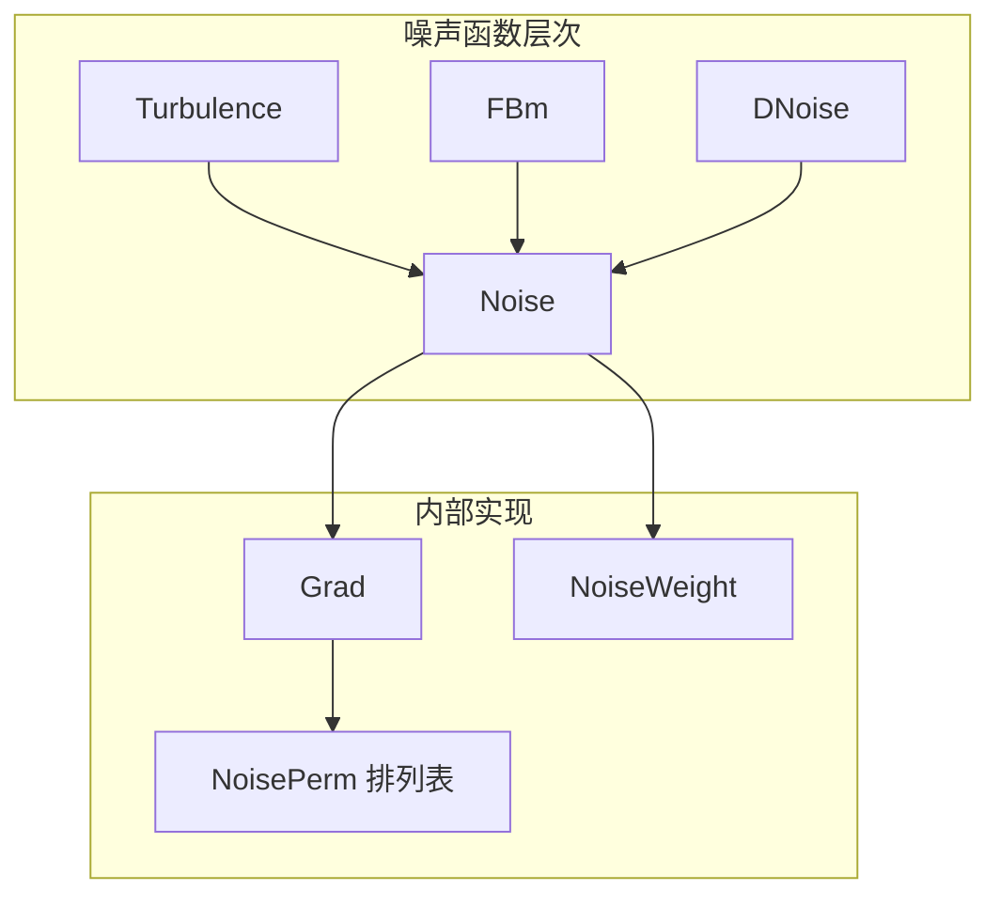
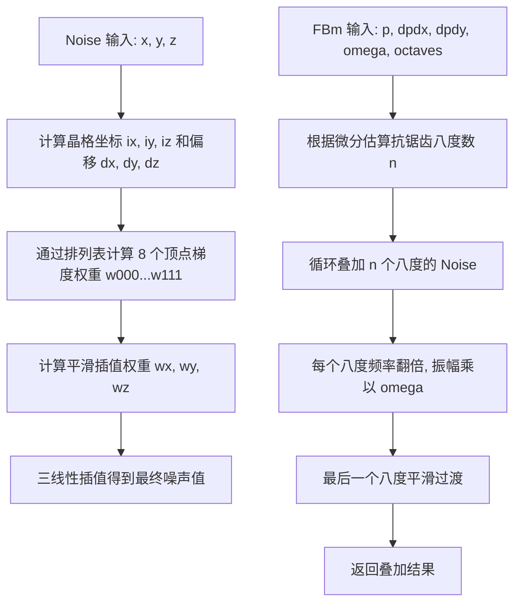

# noise.h / noise.cpp

## 概述
该文件实现了 Perlin 噪声及其衍生算法，是 PBRT 程序化纹理生成系统的基础组件。它提供了基础的 3D Perlin 噪声函数、噪声梯度函数、分形布朗运动（FBm）和湍流（Turbulence）函数，这些函数广泛用于程序化纹理的生成，如大理石、木纹、云雾等自然材质效果。

## 主要类与接口
| 类/结构体/函数 | 说明 |
|---|---|
| `Noise(Float x, Float y, Float z)` | 基础 3D Perlin 噪声函数，接受三个浮点坐标，返回 [-1, 1] 范围的噪声值 |
| `Noise(Point3f p)` | Perlin 噪声的 Point3f 重载版本 |
| `DNoise(Point3f p)` | 计算噪声函数的近似梯度向量（有限差分法，delta = 0.01） |
| `FBm(Point3f, Vector3f, Vector3f, Float, int)` | 分形布朗运动，将多个八度的噪声叠加产生自相似纹理，支持抗锯齿 |
| `Turbulence(Point3f, Vector3f, Vector3f, Float, int)` | 湍流函数，类似 FBm 但取噪声绝对值，产生更锐利的纹理特征 |
| `Grad(int, int, int, Float, Float, Float)` | 内部辅助函数，计算格点梯度与偏移向量的点积 |
| `NoiseWeight(Float t)` | 内部辅助函数，计算平滑插值权重 6t^5 - 15t^4 + 10t^3 |
| `NoisePerm` | 预定义的 512 项排列表，用于噪声哈希 |

## 架构图

## 算法流程图

## 依赖关系
- **依赖**：
  - `pbrt/pbrt.h` - 基础定义（PBRT_CPU_GPU 宏等）
  - `pbrt/util/vecmath.h` - 向量数学（Point3f、Vector3f、Lerp 等）
- **被依赖**：
  - `pbrt/textures.h` - 程序化纹理（如 FBmTexture、WrinkledTexture 等）使用噪声函数
