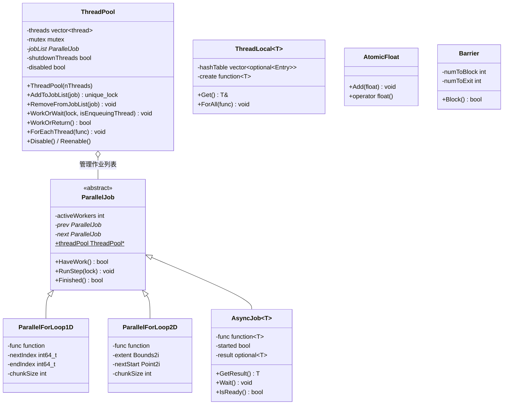
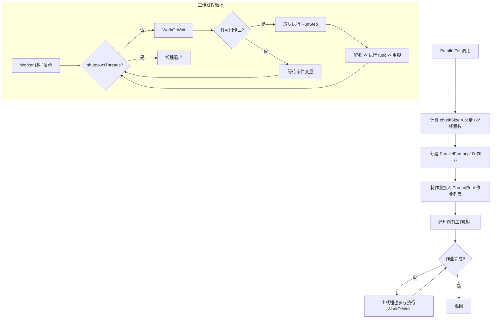

# parallel.h / parallel.cpp

## 概述
该文件实现了 PBRT 的并行计算基础设施，是整个渲染器多线程执行的核心框架。它提供了线程池管理、并行循环（1D/2D）、原子浮点类型、线程局部存储、同步屏障以及异步任务执行等功能。几乎所有需要并行化的渲染计算（如光线追踪、图像处理、场景构建等）都依赖此模块。

## 主要类与接口
| 类/结构体/函数 | 说明 |
|---|---|
| `ParallelInit(int nThreads)` | 初始化线程池，nThreads <= 0 时使用所有可用核心 |
| `ParallelCleanup()` | 销毁线程池并释放资源 |
| `AvailableCores()` | 返回系统可用的 CPU 核心数 |
| `RunningThreads()` | 返回当前运行的线程数（线程池大小 + 1） |
| `ParallelFor(start, end, func)` | 1D 并行循环，自动分块执行 |
| `ParallelFor2D(extent, func)` | 2D 并行循环，将 2D 区域划分为图块并行处理 |
| `ThreadLocal<T>` | 线程局部存储模板类，基于开放寻址哈希表实现 |
| `AtomicFloat` | 原子浮点数，支持 CPU/GPU 环境下的原子加法操作 |
| `AtomicDouble` | 原子双精度浮点数 |
| `Barrier` | 线程同步屏障，所有线程到达后才继续执行 |
| `ThreadPool` | 线程池实现，管理工作线程和作业列表 |
| `ParallelJob` | 并行作业基类，定义作业接口 |
| `ParallelForLoop1D` | 1D 并行循环的作业实现 |
| `ParallelForLoop2D` | 2D 并行循环的作业实现 |
| `AsyncJob<T>` | 异步作业模板类，支持异步执行和结果获取 |
| `RunAsync(func, args...)` | 异步任务启动函数，返回 AsyncJob 指针 |
| `ForEachThread(func)` | 在每个线程上执行指定函数 |
| `DisableThreadPool()` / `ReenableThreadPool()` | 临时禁用/重启线程池 |

## 架构图

## 算法流程图

## 依赖关系
- **依赖**：
  - `pbrt/pbrt.h` - 基础定义
  - `pbrt/util/float.h` - 浮点位操作（FloatToBits/BitsToFloat）
  - `pbrt/util/vecmath.h` - 向量数学（Bounds2i、Point2i 等）
  - `pbrt/util/check.h` - 断言检查
  - `pbrt/util/print.h` - 字符串格式化
  - `pbrt/gpu/util.h` - GPU 工具（条件编译）
- **被依赖**：
  - 被渲染器中几乎所有主要模块广泛使用，包括但不限于：积分器、场景构建、图像处理、薄膜、光源、聚合体、统计系统、进度报告等
