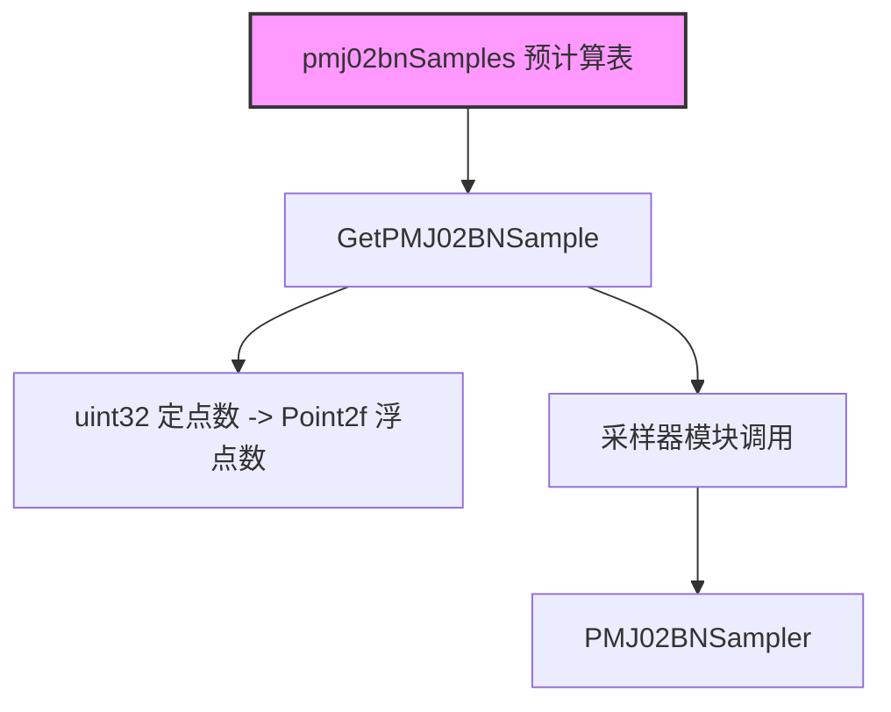

# pmj02tables.h / pmj02tables.cpp

## 概述
该文件提供了 PMJ02BN（Progressive Multi-Jittered (0,2) Blue Noise）采样点集的预计算查找表。PMJ02BN 是一种高质量低差异序列，兼具 (0,2)-序列的分层特性和蓝噪声的频谱特性，在渲染中用于生成高质量的像素采样模式。该文件包含 5 组共 65536 个二维采样点的定点数表示，是 PBRT 中 PMJ02BN 采样器的数据基础。

## 主要类与接口
| 类/结构体/函数 | 说明 |
|---|---|
| `nPMJ02bnSets` | 常量，PMJ02BN 采样集数量，值为 5 |
| `nPMJ02bnSamples` | 常量，每组采样点数量，值为 65536 |
| `pmj02bnSamples` | 三维数组 `[5][65536][2]`，存储 uint32 定点数格式的二维采样点坐标 |
| `GetPMJ02BNSample(int setIndex, int sampleIndex)` | 内联函数，从表中获取指定集合和索引的采样点，将 uint32 定点数转换为 Point2f 浮点坐标。GPU 上使用 float 精度，CPU 上使用 double 精度以保证像素采样排序的准确性 |

## 架构图

## 依赖关系
- **依赖**：
  - `pbrt/pbrt.h` - 基础定义
  - `pbrt/util/pstd.h` - 可移植标准库（DCHECK 等）
  - `pbrt/util/vecmath.h` - Point2f 类型
  - `pbrt/util/error.h` - 错误处理（cpp 文件）
  - `pbrt/util/math.h` - 数学工具（cpp 文件）
- **被依赖**：
  - `pbrt/samplers.h` - PMJ02BN 采样器使用此表获取采样点
