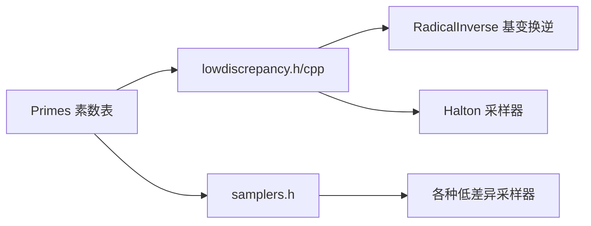

# primes.h / primes.cpp

## 概述
该文件提供了一个预计算的素数查找表，包含前 1000 个素数（从 2 到 7919）。这些素数主要用于低差异序列生成中的基数选择，例如 Halton 序列和 Hammersley 序列中每个维度需要不同的素数基数来保证序列的良好分布特性。

## 主要类与接口
| 类/结构体/函数 | 说明 |
|---|---|
| `PrimeTableSize` | 常量，素数表大小，值为 1000 |
| `Primes[PrimeTableSize]` | 整型数组，存储前 1000 个素数，从 2 开始到 7919 |

## 架构图

## 依赖关系
- **依赖**：
  - `pbrt/pbrt.h` - 基础定义（PBRT_CONST 宏等）
  - `pbrt/util/pstd.h` - 可移植标准库
- **被依赖**：
  - `pbrt/util/lowdiscrepancy.h` / `pbrt/util/lowdiscrepancy.cpp` - 低差异序列生成，使用素数表作为基数
  - `pbrt/samplers.h` - 采样器中使用素数表
