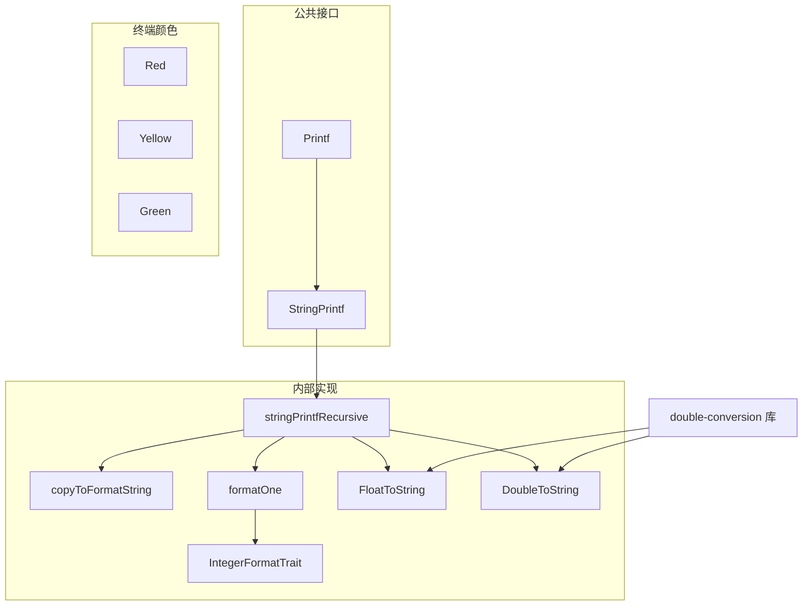

# print.h / print.cpp

## 概述
该文件实现了 PBRT 的类型安全字符串格式化系统，是整个渲染器日志、调试输出和对象序列化的基础设施。它提供了 `StringPrintf` 和 `Printf` 函数，通过递归模板实现类型安全的格式化输出，能够自动处理各种类型（包括自定义类型的 `ToString()` 方法）。此外还提供了终端彩色输出的辅助函数。

## 主要类与接口
| 类/结构体/函数 | 说明 |
|---|---|
| `StringPrintf(fmt, args...)` | 核心格式化函数，返回格式化后的 std::string，支持类型安全的参数处理 |
| `Printf(fmt, args...)` | 格式化输出到 stdout |
| `detail::FloatToString(float)` | 使用 double-conversion 库将 float 精确转换为最短字符串表示 |
| `detail::DoubleToString(double)` | 使用 double-conversion 库将 double 精确转换为最短字符串表示 |
| `detail::stringPrintfRecursive` | 递归模板函数，逐个处理格式化参数 |
| `detail::copyToFormatString` | 解析格式字符串，提取下一个格式指示符 |
| `detail::formatOne` | 格式化单个非类对象值 |
| `detail::IntegerFormatTrait<T>` | 整数类型的格式符特征模板 |
| `Red(string)` | 返回终端红色加粗的 ANSI 转义字符串 |
| `Yellow(string)` | 返回终端黄色加粗的 ANSI 转义字符串 |
| `Green(string)` | 返回终端绿色加粗的 ANSI 转义字符串 |
| `operator<<(ostream, T)` | 重载输出运算符，自动调用对象的 ToString() 方法 |

## 架构图

## 依赖关系
- **依赖**：
  - `pbrt/pbrt.h` - 基础定义
  - `pbrt/util/log.h` - 日志系统（LOG_FATAL 用于错误报告）
  - `pbrt/util/check.h` - 断言检查（cpp 文件）
  - `double-conversion` - 第三方库，用于精确的浮点数到字符串转换
- **被依赖**：
  - 被渲染器中几乎所有模块广泛使用，用于日志输出、调试信息和对象字符串化。在项目中有超过 50 个文件直接或间接依赖此模块
