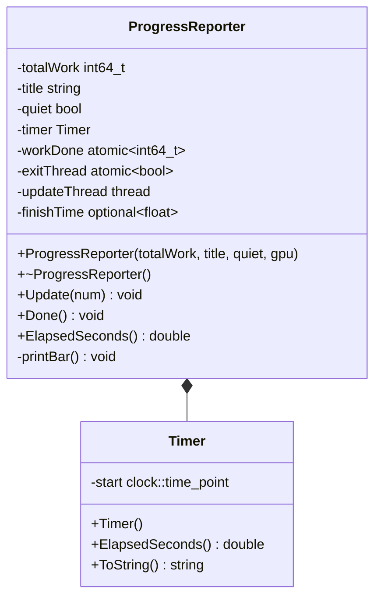
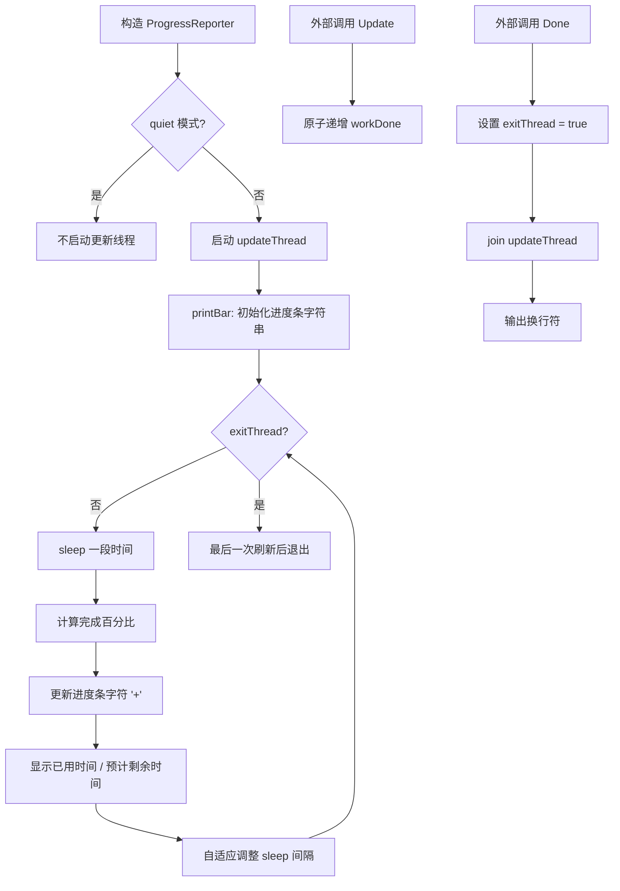

# progressreporter.h / progressreporter.cpp

## 概述
该文件实现了渲染进度报告系统，包括一个高精度计时器和一个终端进度条显示器。ProgressReporter 类在渲染过程中以可视化进度条的方式显示当前任务的完成百分比、已用时间和预计剩余时间。它使用独立的更新线程来周期性地刷新显示，同时支持 GPU 渲染模式下基于 CUDA 事件的进度追踪。

## 主要类与接口
| 类/结构体/函数 | 说明 |
|---|---|
| `Timer` | 高精度计时器类，基于 `std::chrono::steady_clock`，提供 `ElapsedSeconds()` 方法返回已流逝的秒数 |
| `ProgressReporter` | 进度报告器，管理进度条的创建、更新和完成 |
| `ProgressReporter::ProgressReporter(totalWork, title, quiet, gpu)` | 构造函数，指定总工作量、标题、是否静默以及是否 GPU 模式 |
| `ProgressReporter::Update(num)` | 更新已完成的工作量，支持 GPU 事件模式 |
| `ProgressReporter::Done()` | 标记任务完成，等待更新线程结束 |
| `ProgressReporter::ElapsedSeconds()` | 返回已用时间，任务完成后返回记录的完成时间 |
| `TerminalWidth()` | 内部静态函数，获取终端宽度（跨平台实现） |

## 架构图

## 算法流程图

## 依赖关系
- **依赖**：
  - `pbrt/pbrt.h` - 基础定义
  - `pbrt/util/pstd.h` - optional 类型
  - `pbrt/util/check.h` - 断言检查
  - `pbrt/util/parallel.h` - 并行工具（ParallelFor）
  - `pbrt/util/print.h` - 字符串格式化
  - `pbrt/gpu/util.h` - GPU 工具（条件编译）
  - `cuda_runtime.h` - CUDA 事件（GPU 模式，条件编译）
- **被依赖**：
  - `pbrt/wavefront/integrator.cpp` - 波前积分器进度显示
  - `pbrt/cpu/integrators.cpp` - CPU 积分器进度显示
  - `pbrt/parser.cpp` - 场景解析进度
  - `pbrt/cmd/imgtool.cpp` - 图像工具进度
  - `pbrt/cmd/pspec.cpp` - 功率谱分析工具进度
