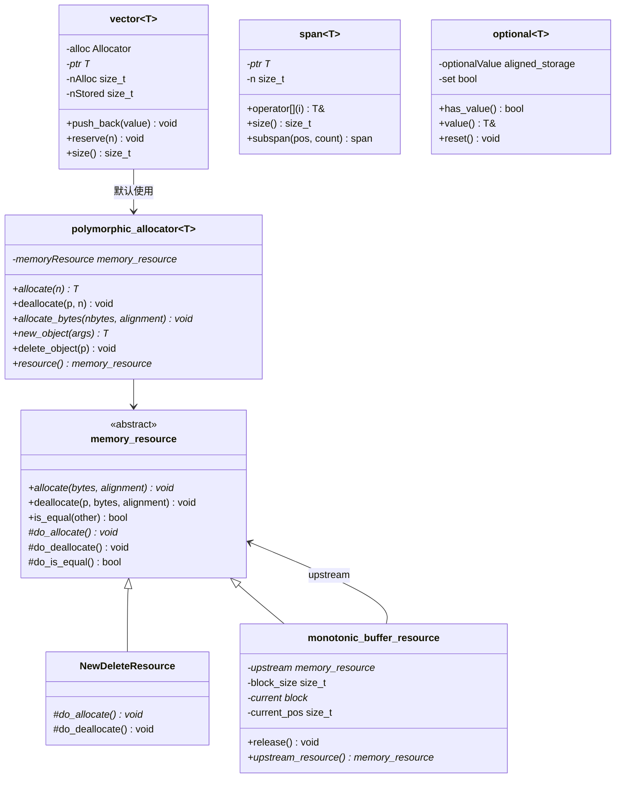

# pstd.h / pstd.cpp

## 概述
该文件实现了 PBRT 的可移植标准库（portable std），提供了一套能在 CPU 和 GPU（CUDA）环境下统一使用的基础数据结构和数学工具。由于标准库中许多容器和函数无法直接在 GPU 设备代码中使用，pstd 命名空间下重新实现了 array、optional、span、vector、tuple、complex 等类型，以及 floor、ceil、round、sqrt、abs 等数学函数的跨平台版本。此外还包含完整的多态内存分配器（pmr）体系。

## 主要类与接口
| 类/结构体/函数 | 说明 |
|---|---|
| `pstd::array<T, N>` | 固定大小数组，支持 CPU/GPU，包含零大小特化 |
| `pstd::optional<T>` | 可选值容器，基于 placement new 和对齐存储实现 |
| `pstd::span<T>` | 非拥有型连续内存视图，部分参考 Google Abseil 的实现 |
| `pstd::vector<T, Allocator>` | 动态数组，默认使用多态分配器，支持 CPU/GPU |
| `pstd::tuple<Ts...>` | 元组，递归继承实现，支持按索引和按类型获取元素 |
| `pstd::complex<T>` | 复数类型，支持 CPU/GPU 的基本复数运算 |
| `pstd::swap(a, b)` | 交换函数 |
| `pstd::bit_cast<To, From>` | 类型位转换（类似 C++20 std::bit_cast） |
| `pstd::sqrt / abs / copysign / floor / ceil / round / fmod` | 数学函数的跨平台封装 |
| `pstd::pmr::memory_resource` | 多态内存资源基类 |
| `pstd::pmr::monotonic_buffer_resource` | 单调增长缓冲区资源，分配快速但不支持单个释放 |
| `pstd::pmr::polymorphic_allocator<T>` | 多态分配器，支持 allocate/deallocate/new_object/delete_object |
| `pstd::pmr::new_delete_resource()` | 全局 new/delete 内存资源 |
| `pstd::pmr::get_default_resource()` | 获取默认内存资源 |
| `pstd::pmr::set_default_resource(r)` | 设置默认内存资源 |
| `MakeSpan / MakeConstSpan` | 创建 span 的辅助函数模板 |

## 架构图

## 依赖关系
- **依赖**：
  - `pbrt/util/check.h` - 断言检查（CHECK、DCHECK 等）
  - `pbrt/util/memory.h` - 内存工具（cpp 文件）
- **被依赖**：
  - 被整个 PBRT 项目极其广泛地使用（超过 60 个文件），几乎所有需要使用容器、可选值或内存分配的模块都依赖 pstd。主要使用者包括：
    - 向量数学模块（vecmath.h）
    - 图像模块（image.h）
    - 采样模块（sampling.h）
    - MIPMap 模块（mipmap.h）
    - 光源/材质/形状等渲染核心模块
