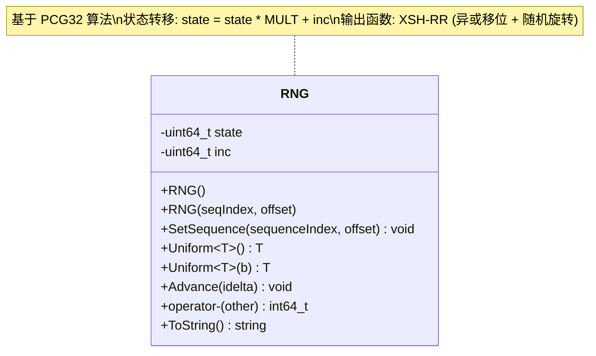
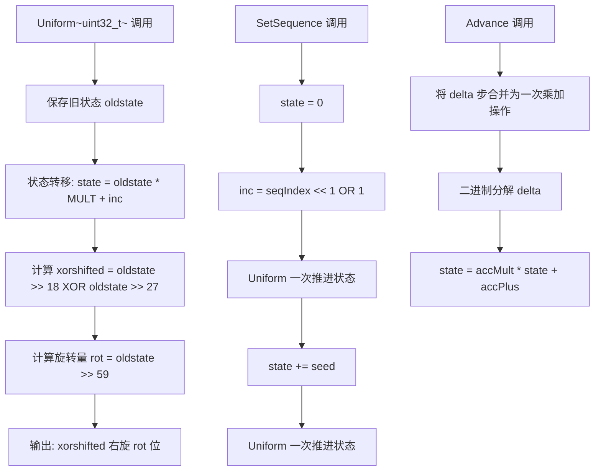

# rng.h / rng.cpp

## 概述
该文件实现了 PBRT 的伪随机数生成器，基于 PCG32（Permuted Congruential Generator）算法。RNG 类是整个渲染器随机采样的基础，提供高质量、可重复的均匀随机数序列。它支持 CPU 和 GPU 代码环境，提供多种基本数值类型的均匀分布采样，并支持序列设置、前进和距离计算等操作。

## 主要类与接口
| 类/结构体/函数 | 说明 |
|---|---|
| `RNG` | PCG32 伪随机数生成器类 |
| `RNG()` | 默认构造，使用预定义的状态和流 |
| `RNG(seqIndex, offset)` | 构造指定序列和偏移的 RNG |
| `RNG(seqIndex)` | 构造指定序列的 RNG，偏移通过 MixBits 哈希自动生成 |
| `SetSequence(sequenceIndex, offset)` | 设置 PCG32 的序列和种子 |
| `Uniform<uint32_t>()` | 生成 [0, 2^32) 均匀分布的 uint32 随机数（核心生成方法） |
| `Uniform<uint64_t>()` | 组合两次 uint32 生成 uint64 随机数 |
| `Uniform<int32_t>()` / `Uniform<int64_t>()` | 生成有符号整数随机数 |
| `Uniform<float>()` | 生成 [0, OneMinusEpsilon) 均匀分布的 float 随机数 |
| `Uniform<double>()` | 生成 [0, OneMinusEpsilon) 均匀分布的 double 随机数 |
| `Uniform(T b)` | 生成 [0, b) 均匀分布的整数随机数（拒绝采样消除偏差） |
| `Advance(int64_t idelta)` | 将 RNG 状态前进指定步数（O(log n) 复杂度） |
| `operator-(const RNG&)` | 计算两个相同序列 RNG 之间的距离 |

## 架构图

## 算法流程图

## 依赖关系
- **依赖**：
  - `pbrt/pbrt.h` - 基础定义
  - `pbrt/util/check.h` - 断言检查
  - `pbrt/util/float.h` - OneMinusEpsilon 常量
  - `pbrt/util/hash.h` - MixBits 哈希函数
  - `pbrt/util/math.h` - 数学工具
  - `pbrt/util/pstd.h` - 可移植标准库
  - `pbrt/util/print.h` - 字符串格式化（cpp 文件）
- **被依赖**：
  - `pbrt/util/sampling.h` - 采样模块中的 WeightedReservoirSampler 等使用 RNG
  - `pbrt/samplers.h` - 各种采样器使用 RNG 生成随机数
  - `pbrt/cpu/integrators.h` - 积分器中的随机决策
  - 多个测试文件使用 RNG 进行随机化测试
