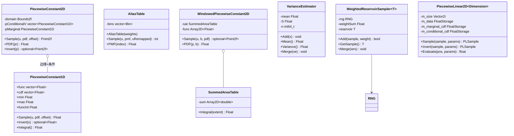

# sampling.h / sampling.cpp

## 概述
该文件实现了 PBRT 中最全面的采样函数库，是整个渲染器蒙特卡洛积分的核心工具集。它提供了大量一维和二维概率分布的采样与逆采样函数（包括均匀分布、线性分布、指数分布、正态分布、逻辑分布等），以及球面几何采样（半球、球、圆盘、锥体、球面三角形、球面矩形）、多重重要性采样权重计算、分段常数/线性分布、别名表、累积面积表、方差估计器和加权蓄水池采样等高级采样工具。

## 主要类与接口

### 多重重要性采样
| 类/结构体/函数 | 说明 |
|---|---|
| `BalanceHeuristic(nf, fPdf, ng, gPdf)` | 平衡启发式 MIS 权重 |
| `PowerHeuristic(nf, fPdf, ng, gPdf)` | 功率启发式 MIS 权重（默认二次幂） |

### 一维分布采样
| 类/结构体/函数 | 说明 |
|---|---|
| `SampleDiscrete(weights, u, pmf, uRemapped)` | 离散分布采样 |
| `SampleLinear / InvertLinearSample` | 线性分布采样及逆变换 |
| `SampleExponential / InvertExponentialSample` | 指数分布采样及逆变换 |
| `SampleNormal / InvertNormalSample` | 正态分布采样及逆变换 |
| `SampleLogistic / InvertLogisticSample` | 逻辑分布采样及逆变换 |
| `SampleTrimmedLogistic / InvertTrimmedLogisticSample` | 截断逻辑分布采样 |
| `SampleSmoothStep / InvertSmoothStepSample` | 平滑阶梯函数采样 |
| `SampleTent / InvertTentSample` | 帐篷分布采样 |
| `SampleCatmullRom / SampleCatmullRom2D` | Catmull-Rom 样条采样 |
| `SampleTrimmedExponential` | 截断指数分布采样 |
| `SampleVisibleWavelengths` | 可见光波长采样 |

### 二维/三维几何采样
| 类/结构体/函数 | 说明 |
|---|---|
| `SampleBilinear / InvertBilinearSample` | 双线性分布采样 |
| `SampleUniformDiskPolar / SampleUniformDiskConcentric` | 均匀圆盘采样（极坐标/同心映射） |
| `SampleUniformHemisphere / SampleCosineHemisphere` | 均匀半球/余弦加权半球采样 |
| `SampleUniformSphere` | 均匀球面采样 |
| `SampleUniformCone` | 均匀锥体采样 |
| `SampleUniformTriangle` | 均匀三角形采样 |
| `SampleSphericalTriangle / InvertSphericalTriangleSample` | 球面三角形均匀面积采样及逆变换 |
| `SampleSphericalRectangle / InvertSphericalRectangleSample` | 球面矩形均匀立体角采样及逆变换 |
| `SampleHenyeyGreenstein` | Henyey-Greenstein 相函数采样 |
| `SampleTwoNormal` | Box-Muller 双正态采样 |

### 分布类
| 类/结构体/函数 | 说明 |
|---|---|
| `PiecewiseConstant1D` | 一维分段常数分布，支持 CDF 采样和逆变换 |
| `PiecewiseConstant2D` | 二维分段常数分布，基于边缘-条件分解 |
| `AliasTable` | 别名表，O(1) 时间离散分布采样 |
| `SummedAreaTable` | 累积面积表，支持矩形区域积分的快速查询 |
| `WindowedPiecewiseConstant2D` | 支持窗口约束的二维分段常数分布采样 |
| `PiecewiseLinear2D<Dimension>` | 二维分段线性分布，支持额外参数维度的条件分布 |

### 统计与蓄水池采样
| 类/结构体/函数 | 说明 |
|---|---|
| `VarianceEstimator<Float>` | 在线方差估计器（Welford 算法），支持合并 |
| `WeightedReservoirSampler<T>` | 加权蓄水池采样器，单遍扫描按权重随机选择样本 |

### 采样点生成器
| 类/结构体/函数 | 说明 |
|---|---|
| `Uniform1D / Uniform2D / Uniform3D` | 均匀随机点序列生成器 |
| `Stratified1D / Stratified2D / Stratified3D` | 分层随机点序列生成器 |
| `Hammersley2D / Hammersley3D` | Hammersley 低差异点序列生成器 |
| `Sample1DFunction / Sample2DFunction` | 函数采样辅助，将连续函数离散化为分布表 |

## 架构图

## 算法流程图

```mermaid
flowchart TD
    subgraph 球面三角形采样
        A[输入: 三角形顶点 v, 参考点 p, 随机数 u] --> B[计算方向 a, b, c 并归一化]
        B --> C[计算边法线和顶点角度 alpha, beta, gamma]
        C --> D[均匀采样球面三角形面积 A']
        D --> E[求解 cos beta' 确定弧上点]
        E --> F[沿弧插值得到 c']
        F --> G[沿 b-c' 弧采样最终方向 w]
        G --> H[计算重心坐标并返回]
    end

    subgraph 别名表构建
        I[输入: 权重数组] --> J[归一化为概率 p_i]
        J --> K[计算 pHat_i = p_i * n]
        K --> L[分入 under 和 over 列表]
        L --> M[配对处理: under 项设置别名为 over 项]
        M --> N[多余概率重新归类]
        N --> O{列表非空?}
        O -->|是| M
        O -->|否| P[完成别名表构建]
    end
```

## 依赖关系
- **依赖**：
  - `pbrt/pbrt.h` - 基础定义
  - `pbrt/util/check.h` - 断言检查
  - `pbrt/util/containers.h` - Array2D 容器
  - `pbrt/util/lowdiscrepancy.h` - RadicalInverse 函数（Hammersley 生成器）
  - `pbrt/util/math.h` - 数学工具（Sqr, Lerp, Clamp, SafeSqrt 等）
  - `pbrt/util/memory.h` - 内存分配器
  - `pbrt/util/print.h` - 字符串格式化
  - `pbrt/util/pstd.h` - 可移植标准库
  - `pbrt/util/rng.h` - 随机数生成器
  - `pbrt/util/vecmath.h` - 向量数学
  - `pbrt/util/float.h` - 浮点工具（cpp 文件）
  - `pbrt/util/scattering.h` - 散射工具（cpp 文件）
- **被依赖**：
  - `pbrt/lights.h` / `pbrt/lights.cpp` - 光源采样
  - `pbrt/lightsamplers.h` - 光源采样器
  - `pbrt/shapes.h` / `pbrt/shapes.cpp` - 几何形状采样
  - `pbrt/bxdfs.cpp` - BSDF 采样
  - `pbrt/bssrdf.cpp` - 次表面散射采样
  - `pbrt/film.h` - 胶片滤波
  - `pbrt/filters.h` - 图像滤波器
  - `pbrt/media.cpp` - 参与介质采样
  - `pbrt/cpu/integrators.cpp` - CPU 积分器
  - `pbrt/spectrum.h` / `pbrt/spectrum.cpp` - 光谱采样
  - `pbrt/cmd/imgtool.cpp` - 图像工具
  - 多个测试文件
