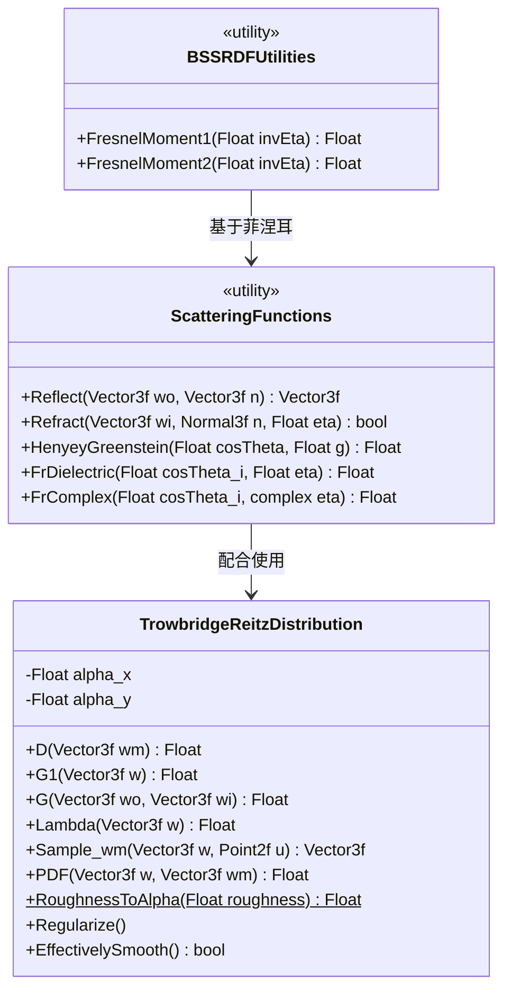
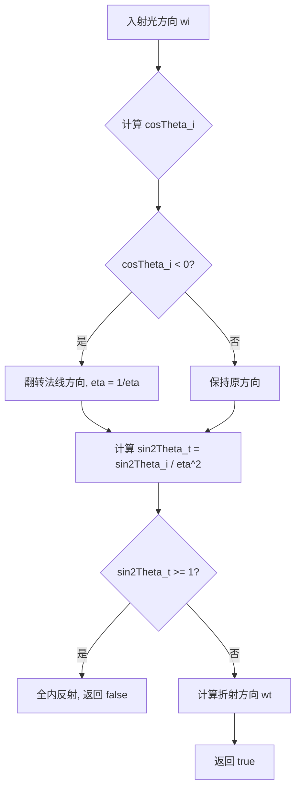

# scattering.h / scattering.cpp

## 概述
该文件实现了渲染中与光散射相关的核心物理计算，包括反射、折射、菲涅耳方程以及微面分布模型。在 PBRT 渲染管线中，这些函数和类是 BSDF（双向散射分布函数）计算的基础组件，直接影响材质的光照表现效果。

## 主要类与接口
| 类/结构体/函数 | 说明 |
|---|---|
| `Reflect(wo, n)` | 计算反射方向向量，基于入射方向和法线 |
| `Refract(wi, n, eta, etap, wt)` | 基于 Snell 定律计算折射方向，处理全内反射情况 |
| `HenyeyGreenstein(cosTheta, g)` | Henyey-Greenstein 相函数，用于体积散射中描述各向异性散射 |
| `FrDielectric(cosTheta_i, eta)` | 计算电介质（透明材质）的菲涅耳反射系数 |
| `FrComplex(cosTheta_i, eta)` | 计算复折射率材质（金属等导体）的菲涅耳反射系数 |
| `FrComplex(cosTheta_i, eta, k)` | 光谱版本的复数菲涅耳计算，逐波长采样处理 |
| `FresnelMoment1(invEta)` | 菲涅耳一阶矩，用于 BSSRDF 次表面散射计算 |
| `FresnelMoment2(invEta)` | 菲涅耳二阶矩，用于 BSSRDF 次表面散射计算 |
| `TrowbridgeReitzDistribution` | Trowbridge-Reitz（GGX）微面分布类，描述粗糙表面的微观几何特征 |

### TrowbridgeReitzDistribution 主要方法
| 方法 | 说明 |
|---|---|
| `D(wm)` | 微面法线分布函数（NDF），返回给定微面法线方向的概率密度 |
| `G1(w)` | Smith 单方向遮蔽函数 |
| `G(wo, wi)` | Smith 联合遮蔽-阴影函数 |
| `Lambda(w)` | 辅助函数，用于计算 Smith 遮蔽函数 |
| `Sample_wm(w, u)` | 基于可见法线采样 (VNDF) 生成微面法线 |
| `PDF(w, wm)` | 返回采样微面法线的概率密度 |
| `RoughnessToAlpha(roughness)` | 将粗糙度参数转换为 alpha 参数 |
| `Regularize()` | 正则化 alpha 参数，避免过于光滑导致的数值问题 |
| `EffectivelySmooth()` | 判断表面是否足够光滑，可视为镜面 |

## 架构图

## 算法流程图

## 依赖关系
- **依赖**：
  - `pbrt/pbrt.h` — 全局定义与类型
  - `pbrt/util/math.h` — 数学工具（Sqr, Clamp, SafeSqrt 等）
  - `pbrt/util/spectrum.h` — 光谱采样类型 SampledSpectrum
  - `pbrt/util/taggedptr.h` — 标签指针系统
  - `pbrt/util/vecmath.h` — 向量数学（Vector3f, Normal3f, Point2f 等）
- **被依赖**：
  - BSDF 相关模块（各种材质实现）
  - 体积散射模块（介质相函数）
  - BSSRDF 次表面散射模块
