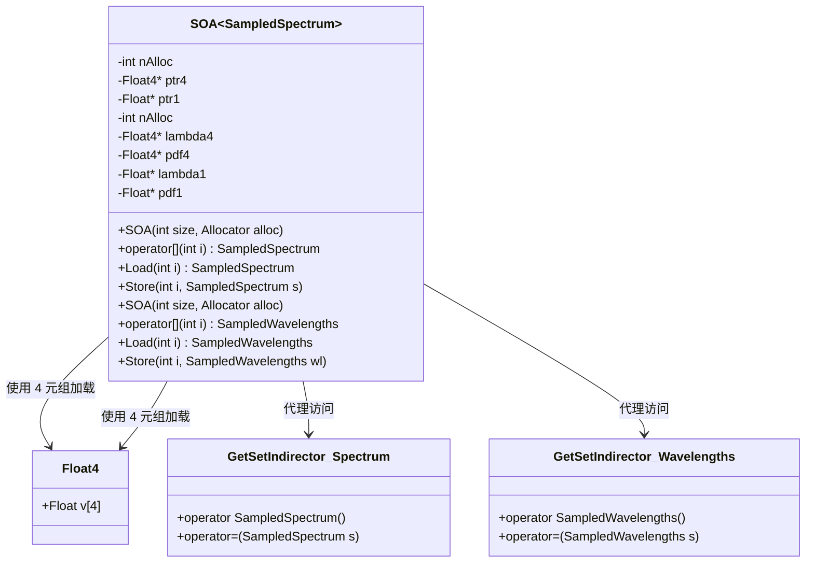
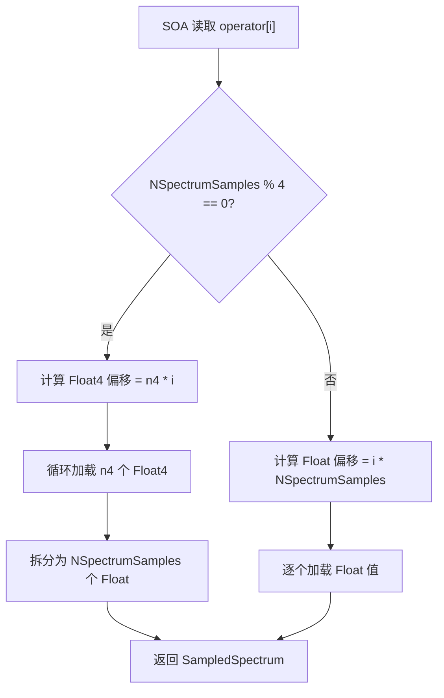

# soa.h

## 概述
该文件实现了结构体数组（Structure of Arrays, SOA）的内存布局模板特化，主要为 `SampledSpectrum` 和 `SampledWavelengths` 两个光谱类型提供 SOA 存储方案。在 GPU 渲染管线中，SOA 布局能够显著提升内存访问的合并效率，是 PBRT-v4 支持 GPU 加速渲染的关键数据组织方式。

## 主要类与接口
| 类/结构体/函数 | 说明 |
|---|---|
| `Float4` | 16 字节对齐的四元浮点结构体，用于 GPU 上的高效内存加载/存储 |
| `Load4(const Float4 *p)` | 从内存加载 Float4 数据，GPU 上使用 float4 原生类型加速 |
| `Store4(Float4 *p, Float4 v)` | 将 Float4 数据写入内存，GPU 上使用 float4 原生类型加速 |
| `SOA<SampledSpectrum>` | SampledSpectrum 的 SOA 布局特化，支持按索引读写光谱数据 |
| `SOA<SampledWavelengths>` | SampledWavelengths 的 SOA 布局特化，存储波长和 PDF 两组数据 |
| `GetSetIndirector` | 内部代理类，通过重载 `operator=` 和类型转换实现透明的读写操作 |

## 架构图

## 算法流程图

## 依赖关系
- **依赖**：
  - `pbrt/pbrt.h` — 全局定义（PBRT_CPU_GPU, Float 等）
  - `pbrt/base/bssrdf.h` — BSSRDF 基类定义
  - `pbrt/base/material.h` — 材质基类定义
  - `pbrt/base/medium.h` — 介质基类定义
  - `pbrt/bsdf.h` — BSDF 定义
  - `pbrt/bssrdf.h` — BSSRDF 实现
  - `pbrt/interaction.h` — 交互点定义
  - `pbrt/ray.h` — 光线定义
  - `pbrt/util/math.h` — 数学工具
  - `pbrt/util/pstd.h` — 平台标准库抽象
  - `pbrt/util/spectrum.h` — SampledSpectrum 和 SampledWavelengths 类型
  - `pbrt/util/vecmath.h` — 向量数学类型
  - `pbrt_soa.h` — 自动生成的 SOA 代码（通过 include 引入）
- **被依赖**：
  - GPU 渲染内核（wavefront 路径追踪）
  - 工作队列管理模块
