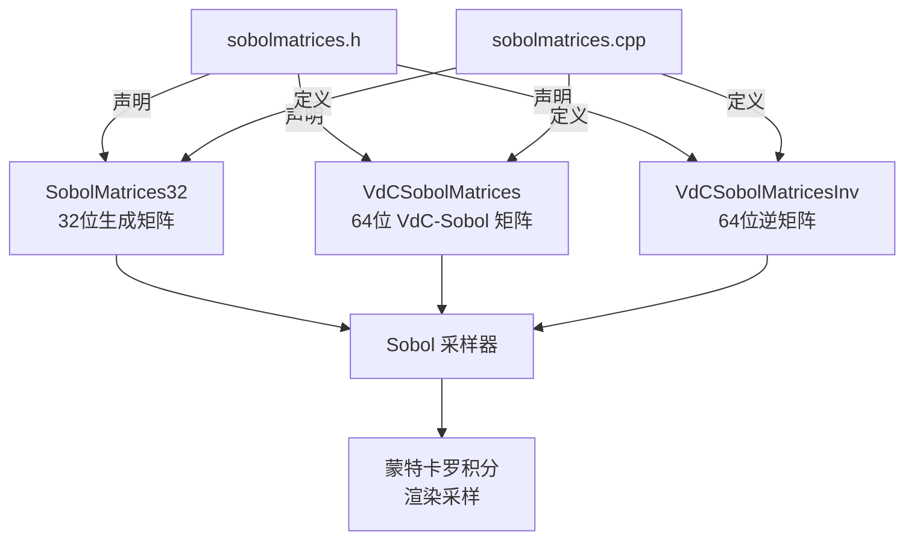

# sobolmatrices.h / sobolmatrices.cpp

## 概述
该文件定义并存储了 Sobol 准随机序列的生成矩阵数据。Sobol 序列是一种低差异序列（Low-Discrepancy Sequence），在渲染中用于生成高质量的采样点分布，相比纯随机采样能够更均匀地覆盖采样空间，从而加速蒙特卡罗积分的收敛。这些矩阵是渲染器采样系统的核心数据资源。

## 主要类与接口
| 类/结构体/函数 | 说明 |
|---|---|
| `NSobolDimensions` | 常量，值为 1024，表示支持的最大 Sobol 维度数 |
| `SobolMatrixSize` | 常量，值为 52，表示每个维度的生成矩阵位数 |
| `SobolMatrices32` | 32 位 Sobol 生成矩阵数组，大小为 NSobolDimensions * SobolMatrixSize |
| `VdCSobolMatrices` | 64 位 Van der Corput-Sobol 混合生成矩阵 |
| `VdCSobolMatricesInv` | VdCSobolMatrices 的逆矩阵，用于反向变换 |

## 架构图

## 依赖关系
- **依赖**：
  - `pbrt/pbrt.h` — 全局定义（PBRT_CONST 等宏）
  - `<cstdint>` — 标准整数类型
- **被依赖**：
  - Sobol 采样器实现
  - 蓝噪声采样器（基于 Sobol 序列的变体）
  - 低差异采样相关模块
