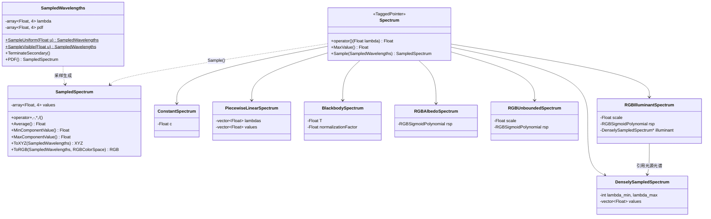
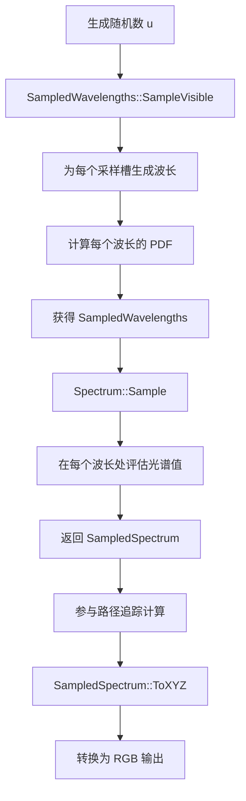

# spectrum.h / spectrum.cpp

## 概述
该文件是 PBRT-v4 光谱系统的核心实现，定义了多种光谱表示方式和光谱采样机制。在基于物理的渲染中，光谱表示是颜色计算的基础——渲染器不直接操作 RGB 颜色，而是在光谱域中进行辐射度计算，最终再转换为 RGB 输出。该模块提供了从常量光谱到基于 RGB 的参数化光谱等多种表示，支持 4 波长同时采样的谱渲染架构。

## 主要类与接口
| 类/结构体/函数 | 说明 |
|---|---|
| `Spectrum` | 光谱基类（TaggedPointer），统一接口，可指向以下任一具体光谱类型 |
| `SampledSpectrum` | 采样光谱，存储 NSpectrumSamples（4）个波长处的光谱值，是渲染计算的核心数据类型 |
| `SampledWavelengths` | 采样波长集合，存储当前光线路径所使用的波长及其 PDF |
| `ConstantSpectrum` | 常量光谱，所有波长返回相同值 |
| `DenselySampledSpectrum` | 密集采样光谱，逐纳米存储光谱值（默认 360-830nm） |
| `PiecewiseLinearSpectrum` | 分段线性光谱，通过波长-值对进行线性插值 |
| `BlackbodySpectrum` | 黑体辐射光谱，基于普朗克定律按温度生成 |
| `RGBAlbedoSpectrum` | RGB 反照率光谱，使用 Sigmoid 多项式将 RGB 映射为光谱（值域 [0,1]） |
| `RGBUnboundedSpectrum` | RGB 无界光谱，允许光谱值超出 [0,1] 范围 |
| `RGBIlluminantSpectrum` | RGB 光源光谱，在 RGB-光谱映射基础上叠加光源光谱分布 |
| `Blackbody(lambda, T)` | 内联函数，计算给定波长和温度的黑体辐射亮度 |
| `Spectra::X()/Y()/Z()` | CIE XYZ 颜色匹配函数的密集采样光谱 |
| `Spectra::Init(alloc)` | 初始化全局光谱数据 |
| `GetNamedSpectrum(name)` | 根据名称查找预定义光谱 |
| `SpectrumToPhotometric(s)` | 将光谱转换为光度量（亮度） |
| `SpectrumToXYZ(s)` | 将光谱转换为 CIE XYZ 色彩空间 |
| `InnerProduct(f, g)` | 计算两个光谱的内积（逐波长积分） |
| `SafeDiv / Clamp / Sqrt / Pow / Exp` | SampledSpectrum 上的逐分量数学运算 |

### SampledWavelengths 关键方法
| 方法 | 说明 |
|---|---|
| `SampleUniform(u)` | 均匀采样可见光波长范围 |
| `SampleVisible(u)` | 按 CIE 可见光谱分布采样波长 |
| `TerminateSecondary()` | 终止次要波长的跟踪（如色散场景中只保留主波长） |
| `SecondaryTerminated()` | 检查次要波长是否已被终止 |
| `PDF()` | 返回当前采样波长的概率密度 |

## 架构图

## 算法流程图

## 依赖关系
- **依赖**（spectrum.h）：
  - `pbrt/pbrt.h` — 全局定义
  - `pbrt/util/check.h` — 断言检查
  - `pbrt/util/color.h` — RGB、XYZ 颜色类型
  - `pbrt/util/float.h` — 浮点工具
  - `pbrt/util/hash.h` — 哈希函数
  - `pbrt/util/math.h` — 数学工具
  - `pbrt/util/pstd.h` — 平台标准库抽象
  - `pbrt/util/sampling.h` — 采样工具（SampleVisibleWavelengths 等）
  - `pbrt/util/taggedptr.h` — TaggedPointer 基类
- **依赖**（spectrum.cpp）：
  - `pbrt/options.h` — 渲染选项
  - `pbrt/util/colorspace.h` — 色彩空间
  - `pbrt/util/error.h` — 错误处理
  - `pbrt/util/file.h` — 文件 I/O
  - `pbrt/util/print.h` — 格式化输出
  - `pbrt/util/rng.h` — 随机数生成
  - `pbrt/util/stats.h` — 统计
  - `pbrt/gpu/util.h` — GPU 工具（条件编译）
- **被依赖**：
  - 几乎所有渲染模块（材质、光源、积分器、相机等）
  - `soa.h` — SOA 布局特化
  - `scattering.h` — 散射计算中的光谱菲涅耳
