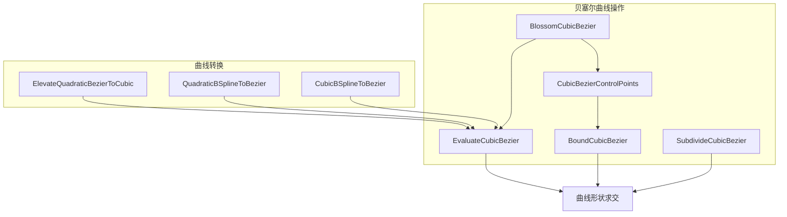
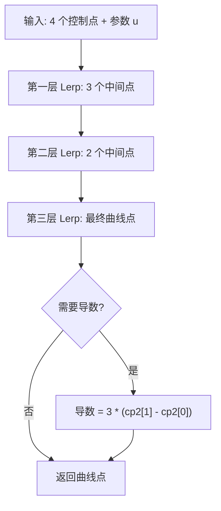

# splines.h

## 概述
该文件提供了贝塞尔曲线（Bezier Curve）和 B 样条曲线（B-Spline）的求值与操作工具函数。在 PBRT 渲染器中，这些样条函数主要用于曲线形状（如头发丝、毛发）的几何表示与光线求交计算。文件中的所有函数均为内联模板函数，支持 CPU 和 GPU 执行。

## 主要类与接口
| 类/结构体/函数 | 说明 |
|---|---|
| `BlossomCubicBezier(p, u0, u1, u2)` | 三次贝塞尔曲线的 Blossom（开花）求值算法，是 de Casteljau 算法的推广形式 |
| `EvaluateCubicBezier(cp, u)` | 求三次贝塞尔曲线在参数 u 处的点（调用 Blossom 实现） |
| `EvaluateCubicBezier(cp, u, deriv)` | 求三次贝塞尔曲线在参数 u 处的点及导数（切线方向） |
| `SubdivideCubicBezier(cp)` | 将三次贝塞尔曲线在中点处细分为两段，返回 7 个控制点 |
| `CubicBezierControlPoints(cp, uMin, uMax)` | 提取 [uMin, uMax] 区间上贝塞尔子曲线的 4 个控制点 |
| `BoundCubicBezier(cp)` | 计算三次贝塞尔曲线的轴对齐包围盒 |
| `BoundCubicBezier(cp, uMin, uMax)` | 计算指定参数区间上贝塞尔曲线的包围盒 |
| `ElevateQuadraticBezierToCubic(cp)` | 将二次贝塞尔曲线升阶为三次贝塞尔曲线 |
| `QuadraticBSplineToBezier(cp)` | 将二次均匀 B 样条转换为等价的贝塞尔控制点 |
| `CubicBSplineToBezier(cp)` | 将三次均匀 B 样条转换为等价的贝塞尔控制点 |

## 架构图

## 算法流程图

## 依赖关系
- **依赖**：
  - `pbrt/pbrt.h` — 全局定义
  - `pbrt/util/math.h` — 数学工具（Lerp 等）
  - `pbrt/util/pstd.h` — pstd::span, pstd::array 等容器
  - `pbrt/util/vecmath.h` — Point3f, Vector3f, Bounds3f 等几何类型
- **被依赖**：
  - 曲线形状（Curve shape）的几何表示与求交模块
  - 毛发渲染相关代码
