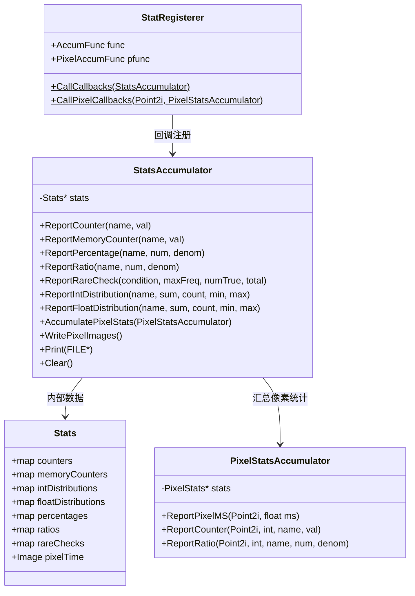
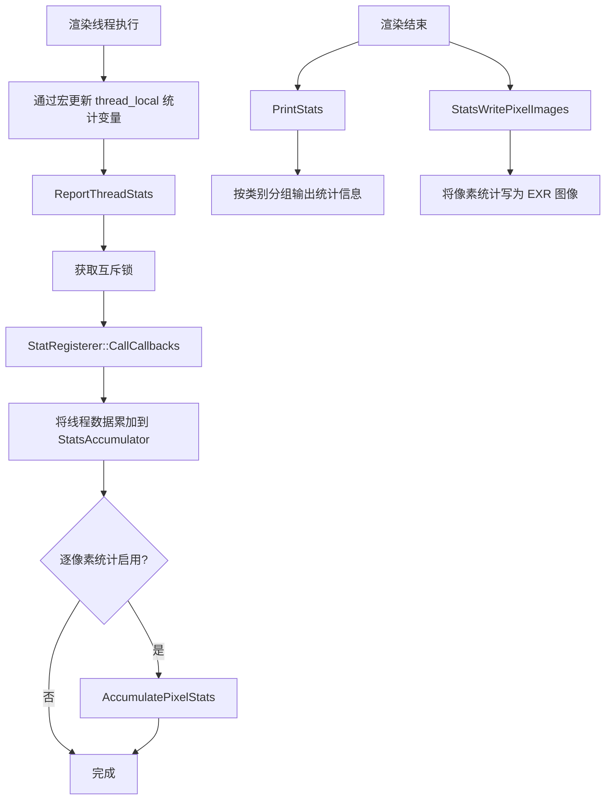

# stats.h / stats.cpp

## 概述
该文件实现了 PBRT 渲染器的性能统计与分析系统。它提供了一套宏和类，用于在渲染过程中收集计数器、内存使用、百分比、比率、数值分布等统计数据，并支持逐像素级别的统计信息采集与图像输出。该系统在性能调优和调试中发挥重要作用，帮助开发者定位渲染瓶颈。

## 主要类与接口
| 类/结构体/函数 | 说明 |
|---|---|
| `StatRegisterer` | 统计注册器，每个统计项通过静态对象注册回调函数，汇总时调用 |
| `StatsAccumulator` | 统计累加器，汇总所有线程的统计数据并格式化输出 |
| `PixelStatsAccumulator` | 逐像素统计累加器，记录每个像素的耗时、计数和比率 |
| `StatIntDistribution` | 整数分布统计结构体，跟踪和、计数、最小值、最大值 |
| `STAT_COUNTER(title, var)` | 宏，声明一个线程局部计数器 |
| `STAT_PIXEL_COUNTER(title, var)` | 宏，声明一个支持逐像素统计的计数器 |
| `STAT_MEMORY_COUNTER(title, var)` | 宏，声明一个内存使用计数器 |
| `STAT_INT_DISTRIBUTION(title, var)` | 宏，声明一个整数分布统计变量 |
| `STAT_FLOAT_DISTRIBUTION(title, var)` | 宏，声明一个浮点分布统计变量 |
| `STAT_PERCENT(title, num, denom)` | 宏，声明一个百分比统计（分子/分母） |
| `STAT_RATIO(title, num, denom)` | 宏，声明一个比率统计 |
| `STAT_PIXEL_RATIO(title, num, denom)` | 宏，声明一个支持逐像素的比率统计 |
| `PrintStats(FILE*)` | 将所有统计信息格式化输出到文件 |
| `StatsWritePixelImages()` | 将逐像素统计数据写为 EXR 图像文件 |
| `ReportThreadStats()` | 汇报当前线程的统计数据到全局累加器 |
| `ClearStats()` | 清空所有统计数据 |
| `StatsEnablePixelStats(bounds, baseName)` | 启用逐像素统计功能 |
| `StatsReportPixelStart(p)` | 标记像素处理开始（用于计时） |
| `StatsReportPixelEnd(p)` | 标记像素处理结束，记录耗时 |
| `PrintCheckRare(FILE*)` | 检查并输出 CHECK_RARE 断言的统计频率 |

## 架构图

## 算法流程图

## 依赖关系
- **依赖**（stats.h）：
  - `pbrt/pbrt.h` — 全局定义
  - `<cstdio>`, `<limits>`, `<string>` — 标准库
- **依赖**（stats.cpp）：
  - `pbrt/util/check.h` — 断言检查
  - `pbrt/util/image.h` — Image 类（EXR 图像写入）
  - `pbrt/util/memory.h` — 内存使用查询（GetCurrentRSS）
  - `pbrt/util/parallel.h` — 并行工具
  - `pbrt/util/print.h` — StringPrintf 格式化输出
  - `pbrt/util/string.h` — SplitString 字符串分割
  - `pbrt/util/vecmath.h` — Point2i, Bounds2i 等类型
- **被依赖**：
  - 渲染器主循环
  - 各种积分器实现
  - 采样器、加速结构等需要统计的模块
