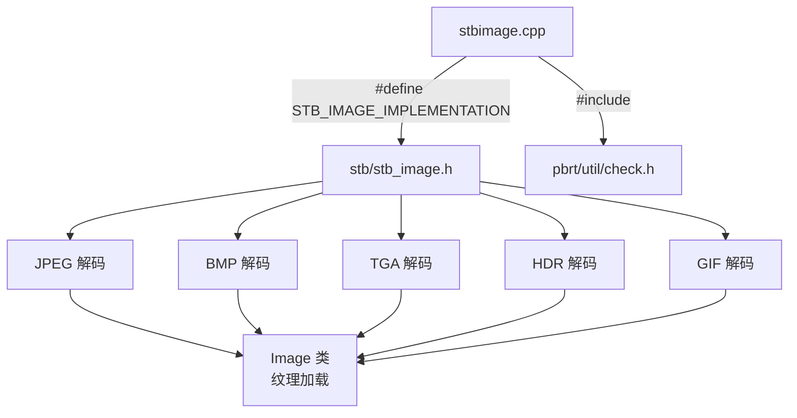

# stbimage.cpp

## 概述
该文件是一个编译单元封装文件，用于将第三方图像加载库 stb_image 集成到 PBRT 渲染器中。通过定义 `STB_IMAGE_IMPLEMENTATION` 宏，该文件触发 stb_image 头文件中的实现代码生成。stb_image 提供了对 JPEG、BMP、TGA、GIF、HDR 等多种图像格式的加载支持（PNG 已被显式禁用，PBRT 使用其他库处理 PNG）。该文件在渲染管线中为纹理和环境贴图加载提供底层图像解码能力。

## 主要类与接口
| 类/结构体/函数 | 说明 |
|---|---|
| `STB_IMAGE_IMPLEMENTATION` | 宏定义，触发 stb_image.h 中所有函数的实现代码生成 |
| `STBI_NO_PNG` | 宏定义，禁用 PNG 格式支持（PBRT 使用其他 PNG 库） |
| `STBI_NO_PIC` | 宏定义，禁用 PIC 格式支持（过于老旧的格式） |
| `STBI_ASSERT` | 重定义为 PBRT 的 CHECK 宏，统一断言机制 |

## 架构图

## 依赖关系
- **依赖**：
  - `pbrt/util/check.h` — CHECK 宏（替代 stb_image 的默认 assert）
  - `stb/stb_image.h` — Sean Barrett 的单头文件图像加载库
- **被依赖**：
  - `pbrt/util/image.cpp` — Image 类通过 stbi_load 系列函数加载图像文件
  - 纹理系统——加载纹理贴图
  - 环境光照——加载 HDR 环境贴图
