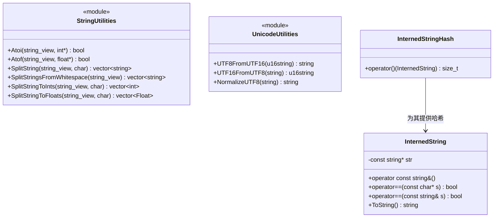

# string.h / string.cpp

## 概述
该文件提供了字符串处理的通用工具函数，包括字符串到数值的转换、字符串分割、UTF-8/UTF-16 编码转换以及 Unicode 规范化等功能。在 PBRT 渲染器中，这些工具函数主要用于场景文件解析、统计信息格式化和跨平台文件路径处理。

## 主要类与接口
| 类/结构体/函数 | 说明 |
|---|---|
| `Atoi(str, ptr)` | 将字符串转换为 int 或 int64_t，失败返回 false |
| `Atof(str, ptr)` | 将字符串转换为 float 或 double，失败返回 false |
| `SplitStringsFromWhitespace(str)` | 按空白字符分割字符串，返回单词列表 |
| `SplitString(str, ch)` | 按指定分隔符分割字符串 |
| `SplitStringToInts(str, ch)` | 分割字符串并转换为 int 数组 |
| `SplitStringToInt64s(str, ch)` | 分割字符串并转换为 int64_t 数组 |
| `SplitStringToFloats(str, ch)` | 分割字符串并转换为 Float 数组 |
| `SplitStringToDoubles(str, ch)` | 分割字符串并转换为 double 数组 |
| `UTF8FromUTF16(str)` | UTF-16 编码转换为 UTF-8 |
| `UTF16FromUTF8(str)` | UTF-8 编码转换为 UTF-16 |
| `WStringFromUTF8(str)` | UTF-8 转宽字符串（仅 Windows） |
| `UTF8FromWString(str)` | 宽字符串转 UTF-8（仅 Windows） |
| `NormalizeUTF8(str)` | Unicode NFC 规范化，使用 utf8proc 库实现 |
| `InternedString` | 字符串驻留类，通过指针比较实现高效字符串相等判断 |
| `InternedStringHash` | InternedString 的哈希函数对象 |

## 架构图

## 依赖关系
- **依赖**（string.h）：
  - `pbrt/pbrt.h` — 全局定义
  - `<ctype.h>`, `<string>`, `<string_view>`, `<vector>` — 标准库
- **依赖**（string.cpp）：
  - `pbrt/util/check.h` — 断言检查
  - `pbrt/util/error.h` — 错误报告（ErrorExit）
  - `utf8proc/utf8proc.h` — Unicode 处理库（NFC 规范化）
  - `<codecvt>`, `<locale>` — C++ 编码转换
- **被依赖**：
  - 场景文件解析器
  - `stats.cpp` — 统计信息分类处理（SplitString）
  - 文件路径处理相关模块
  - 属性名称驻留（InternedString）
