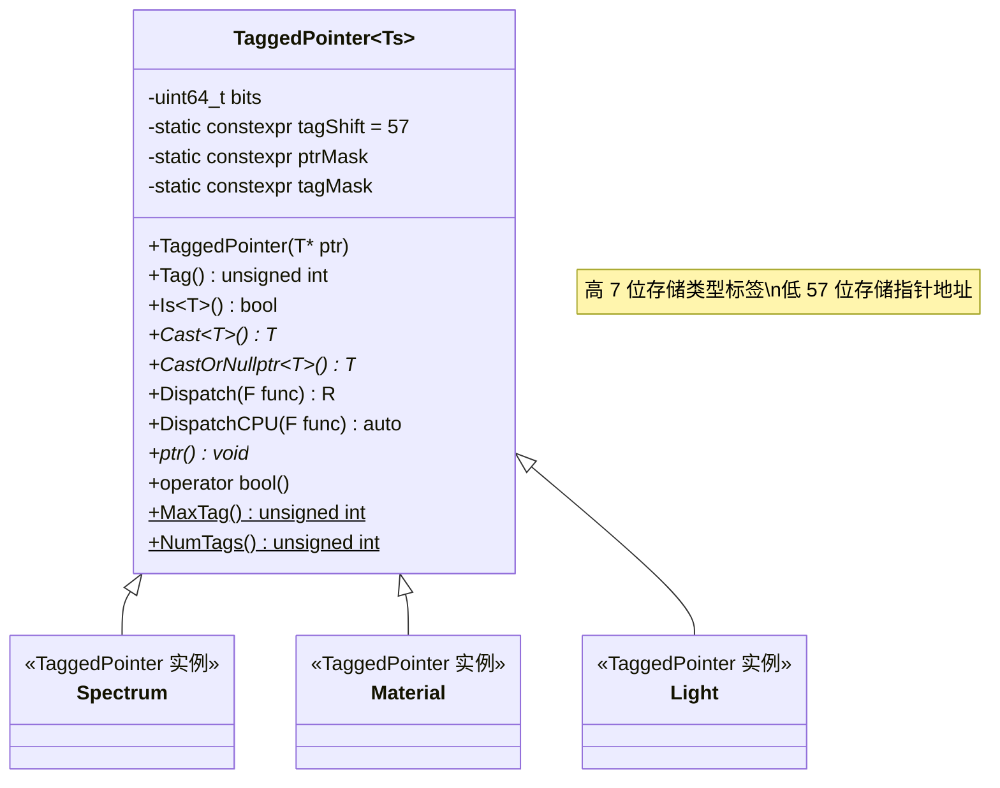
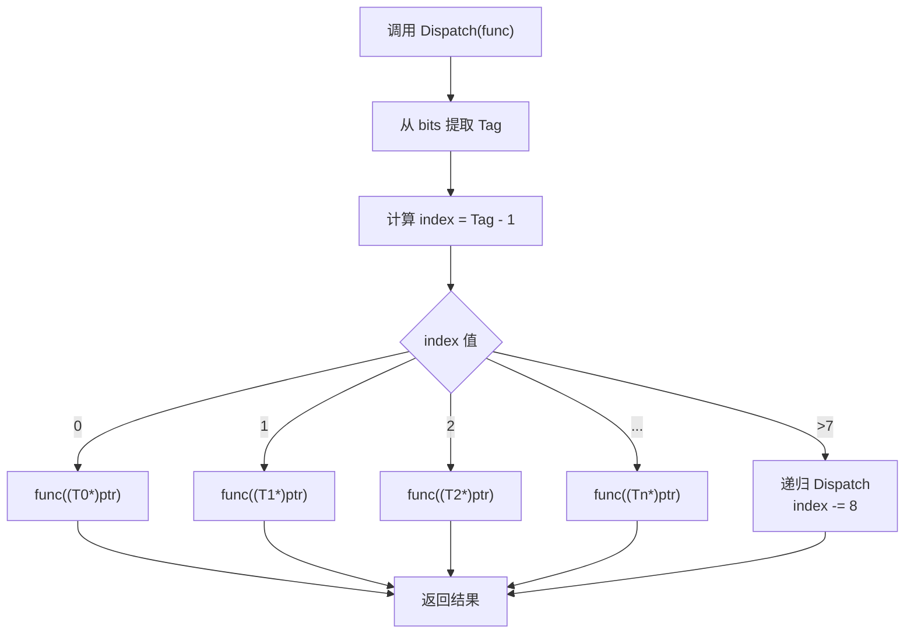

# taggedptr.h

## 概述
该文件实现了 PBRT-v4 的核心基础设施——标签指针（Tagged Pointer）系统。TaggedPointer 利用 64 位指针的高位空间嵌入类型标签，在不使用虚函数的情况下实现运行时多态分发。这一设计对 GPU 渲染至关重要，因为 GPU 不支持 C++ 虚函数机制。该系统被广泛用于 Spectrum、Material、Light、Medium、Shape 等几乎所有需要多态行为的接口。

## 主要类与接口
| 类/结构体/函数 | 说明 |
|---|---|
| `TaggedPointer<Ts...>` | 模板类，将指针和类型标签打包为一个 64 位整数 |
| `TaggedPointer::TypeIndex<T>()` | 编译期函数，返回类型 T 在类型列表中的索引 |
| `TaggedPointer::Tag()` | 返回当前存储的类型标签 |
| `TaggedPointer::Is<T>()` | 检查当前指针是否指向类型 T |
| `TaggedPointer::Cast<T>()` | 将指针强制转换为类型 T*（带断言检查） |
| `TaggedPointer::CastOrNullptr<T>()` | 安全转换，类型不匹配时返回 nullptr |
| `TaggedPointer::Dispatch(func)` | 核心方法——根据标签分发到对应类型的函数调用 |
| `TaggedPointer::DispatchCPU(func)` | 仅 CPU 版本的分发，允许返回类型推导 |
| `detail::Dispatch<F, R, Ts...>` | 内部分发实现，使用 switch-case 链实现类型索引到函数指针的映射 |
| `detail::DispatchCPU<F, R, Ts...>` | CPU 分发实现，返回类型使用 auto 推导 |
| `detail::IsSameType<Ts...>` | 元编程工具，检查可变参数包中所有类型是否相同 |
| `detail::ReturnType<F, Ts...>` | 元编程工具，推导分发函数的返回类型 |

## 架构图

## 算法流程图

## 依赖关系
- **依赖**：
  - `pbrt/pbrt.h` — 全局定义（TypePack, IndexOf 等元编程工具）
  - `pbrt/util/check.h` — DCHECK 断言
  - `pbrt/util/containers.h` — 容器工具
  - `pbrt/util/print.h` — StringPrintf 格式化输出
  - `<algorithm>`, `<string>`, `<type_traits>` — 标准库
- **被依赖**：
  - `pbrt/util/spectrum.h` — Spectrum 使用 TaggedPointer 实现多态
  - `pbrt/util/scattering.h` — 间接依赖
  - 材质系统（Material）
  - 光源系统（Light）
  - 介质系统（Medium）
  - 形状系统（Shape）
  - 纹理系统（Texture）
  - 相机系统（Camera）
  - 采样器系统（Sampler）
  - 几乎所有使用多态接口的 PBRT 模块
