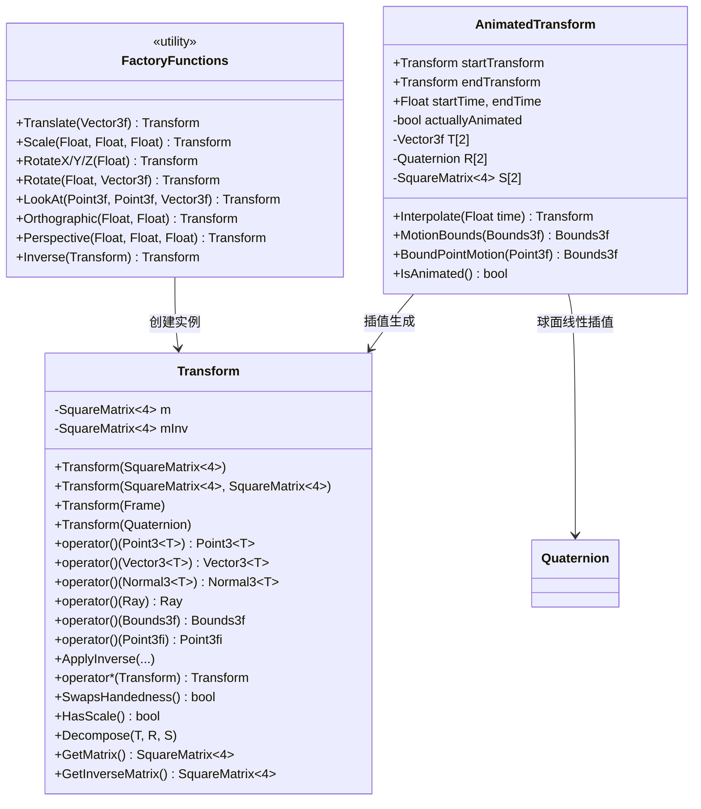
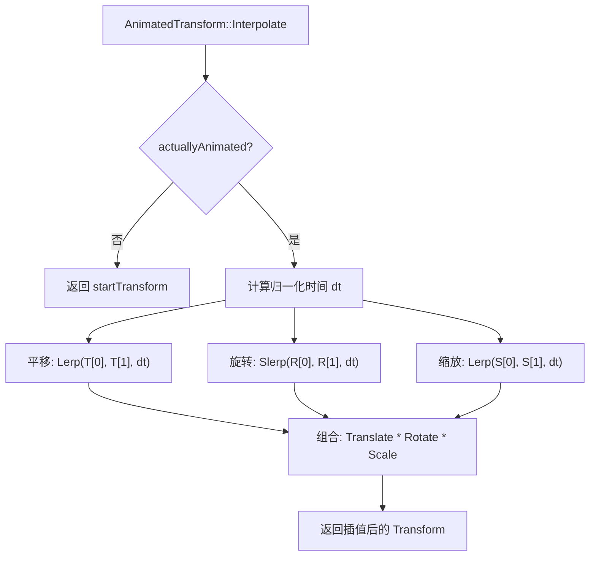

# transform.h / transform.cpp

## 概述
该文件实现了 PBRT 渲染器中的几何变换系统，包括静态变换（Transform）和动画变换（AnimatedTransform）。变换是渲染管线中不可或缺的组件，用于在不同坐标空间（对象空间、世界空间、相机空间等）之间转换点、向量、法线、光线和包围盒等几何实体。该模块还支持带浮点误差跟踪的变换操作，确保光线求交计算的数值稳定性。

## 主要类与接口
| 类/结构体/函数 | 说明 |
|---|---|
| `Transform` | 核心变换类，封装 4x4 变换矩阵及其逆矩阵 |
| `AnimatedTransform` | 动画变换类，支持在两个变换之间进行时间插值 |
| `Translate(delta)` | 创建平移变换 |
| `Scale(x, y, z)` | 创建缩放变换 |
| `RotateX/Y/Z(theta)` | 创建绕坐标轴旋转的变换 |
| `Rotate(theta, axis)` | 创建绕任意轴旋转的变换 |
| `RotateFromTo(from, to)` | 创建从一个方向旋转到另一个方向的变换 |
| `LookAt(pos, look, up)` | 创建"看向"变换（相机定位） |
| `Orthographic(znear, zfar)` | 创建正交投影变换 |
| `Perspective(fov, znear, zfar)` | 创建透视投影变换 |
| `Inverse(t)` | 返回变换的逆 |
| `Transpose(t)` | 返回变换的转置 |

### Transform 主要方法
| 方法 | 说明 |
|---|---|
| `operator()(Point3<T>)` | 变换点（含齐次除法） |
| `operator()(Vector3<T>)` | 变换向量（忽略平移分量） |
| `operator()(Normal3<T>)` | 变换法线（使用逆转置矩阵） |
| `operator()(Ray)` | 变换光线，含误差边界偏移 |
| `operator()(Bounds3f)` | 变换包围盒 |
| `operator()(Point3fi)` | 变换带区间误差的点，传播浮点误差 |
| `ApplyInverse(...)` | 各类型的逆变换 |
| `operator*(Transform)` | 变换组合（矩阵乘法） |
| `HasScale()` | 检查变换是否包含缩放 |
| `SwapsHandedness()` | 检查变换是否改变了坐标系手性 |
| `Decompose(T, R, S)` | 将变换分解为平移、旋转、缩放 |
| `IsIdentity()` | 检查是否为单位变换 |

### AnimatedTransform 主要方法
| 方法 | 说明 |
|---|---|
| `Interpolate(time)` | 在起止变换之间进行时间插值 |
| `MotionBounds(b)` | 计算运动物体在整个时间范围内的包围盒 |
| `BoundPointMotion(p)` | 计算单点在运动期间的包围盒 |
| `IsAnimated()` | 检查起止变换是否不同 |

## 架构图

## 算法流程图

## 依赖关系
- **依赖**（transform.h）：
  - `pbrt/pbrt.h` — 全局定义
  - `pbrt/ray.h` — Ray, RayDifferential 类型
  - `pbrt/util/float.h` — 浮点工具
  - `pbrt/util/hash.h` — 哈希函数
  - `pbrt/util/math.h` — 数学工具（Radians, SquareMatrix 等）
  - `pbrt/util/pstd.h` — 平台标准库抽象
  - `pbrt/util/vecmath.h` — 向量、点、法线、四元数、Frame、Bounds 等几何类型
- **依赖**（transform.cpp）：
  - `pbrt/interaction.h` — Interaction, SurfaceInteraction
  - `pbrt/util/check.h` — 断言检查
  - `pbrt/util/error.h` — 错误处理
  - `pbrt/util/print.h` — 格式化输出
- **被依赖**：
  - 形状（Shape）模块——对象空间到世界空间变换
  - 相机模块——世界空间到相机空间、投影变换
  - 光源模块——光源位姿变换
  - 加速结构——包围盒变换
  - 场景描述解析
