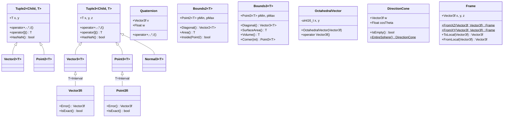

# vecmath.h / vecmath.cpp

## 概述
该文件是 PBRT 渲染器的向量数学基础库，定义了所有核心几何类型，包括二维/三维向量、点、法线、包围盒、四元数、方向锥体、八面体向量编码和坐标系框架等。这些类型构成了整个渲染器几何计算的基石，采用了 CRTP（Curiously Recurring Template Pattern）模板设计，在编译期实现高效的代码复用。所有类型均支持 CPU 和 GPU 执行。

## 主要类与接口
| 类/结构体/函数 | 说明 |
|---|---|
| `Tuple2<Child, T>` | 二维元组基类模板（CRTP），提供通用的算术运算符 |
| `Tuple3<Child, T>` | 三维元组基类模板（CRTP），提供通用的算术运算符 |
| `Vector2<T>` | 二维向量类，继承自 Tuple2 |
| `Vector3<T>` | 三维向量类，继承自 Tuple3 |
| `Vector3fi` | 带区间浮点误差的三维向量，用于误差跟踪 |
| `Point2<T>` | 二维点类，与向量的算术运算语义不同（点-点=向量） |
| `Point3<T>` | 三维点类 |
| `Point3fi` | 带区间浮点误差的三维点，用于光线求交的精确性 |
| `Normal3<T>` | 三维法线类，变换行为与向量不同（使用逆转置矩阵） |
| `Quaternion` | 四元数类，用于旋转表示和球面线性插值（Slerp） |
| `Bounds2<T>` | 二维轴对齐包围盒 |
| `Bounds3<T>` | 三维轴对齐包围盒 |
| `Bounds2iIterator` | Bounds2i 的迭代器，支持像素遍历 |
| `OctahedralVector` | 八面体法线编码，将单位向量压缩为 2 个 16 位整数 |
| `DirectionCone` | 方向锥体，表示一组方向的包围锥 |
| `Frame` | 坐标系框架，由三个正交基向量组成，支持局部/世界坐标转换 |

### 常用类型别名
| 别名 | 定义 |
|---|---|
| `Vector2f` / `Vector2i` | `Vector2<Float>` / `Vector2<int>` |
| `Vector3f` / `Vector3i` | `Vector3<Float>` / `Vector3<int>` |
| `Point2f` / `Point2i` | `Point2<Float>` / `Point2<int>` |
| `Point3f` / `Point3i` | `Point3<Float>` / `Point3<int>` |
| `Normal3f` | `Normal3<Float>` |
| `Bounds2f` / `Bounds2i` | `Bounds2<Float>` / `Bounds2<int>` |
| `Bounds3f` / `Bounds3i` | `Bounds3<Float>` / `Bounds3<int>` |

### 核心自由函数
| 函数 | 说明 |
|---|---|
| `Dot(v1, v2)` | 点积 |
| `AbsDot(v1, v2)` | 绝对值点积 |
| `Cross(v1, v2)` | 叉积 |
| `Length(v)` / `LengthSquared(v)` | 向量长度 / 长度平方 |
| `Normalize(v)` | 单位化向量 |
| `Distance(p1, p2)` | 两点距离 |
| `AngleBetween(v1, v2)` | 两向量夹角（数值稳定版本） |
| `GramSchmidt(v, w)` | Gram-Schmidt 正交化 |
| `CoordinateSystem(v1, v2, v3)` | 从单个向量构建正交坐标系 |
| `FaceForward(n, v)` | 使法线朝向与向量同侧 |
| `SphericalDirection(sinTheta, cosTheta, phi)` | 球面坐标转笛卡尔坐标 |
| `Union(b, p/b2)` | 包围盒与点/包围盒的并集 |
| `Intersect(b1, b2)` | 包围盒交集 |
| `Slerp(t, q0, q1)` | 四元数球面线性插值 |
| `InvertBilinear(p, v)` | 双线性插值的逆运算 |

## 架构图

## 依赖关系
- **依赖**（vecmath.h）：
  - `pbrt/pbrt.h` — 全局定义（Float, PBRT_CPU_GPU 等）
  - `pbrt/util/check.h` — DCHECK 断言
  - `pbrt/util/float.h` — Interval 区间算术类型
  - `pbrt/util/math.h` — 数学工具（Sqr, Lerp, SafeSqrt, Pi, DifferenceOfProducts 等）
  - `pbrt/util/print.h` — StringPrintf 格式化
  - `pbrt/util/pstd.h` — pstd::span, pstd::array 等
- **依赖**（vecmath.cpp）：
  - `pbrt/util/math.h` — Radians, Degrees
  - `pbrt/util/print.h` — StringPrintf
  - `pbrt/util/stats.h` — 统计
  - `pbrt/util/transform.h` — Rotate 函数（DirectionCone::Union 中使用）
- **被依赖**：
  - 渲染器中几乎所有模块——这是最基础的几何类型库
  - `transform.h` — 变换操作的被操作对象
  - `scattering.h` — 散射计算中的向量操作
  - `spectrum.h` — 间接使用
  - `splines.h` — 贝塞尔曲线控制点
  - `soa.h` — SOA 布局
  - `stats.h` — Point2i 用于像素坐标
