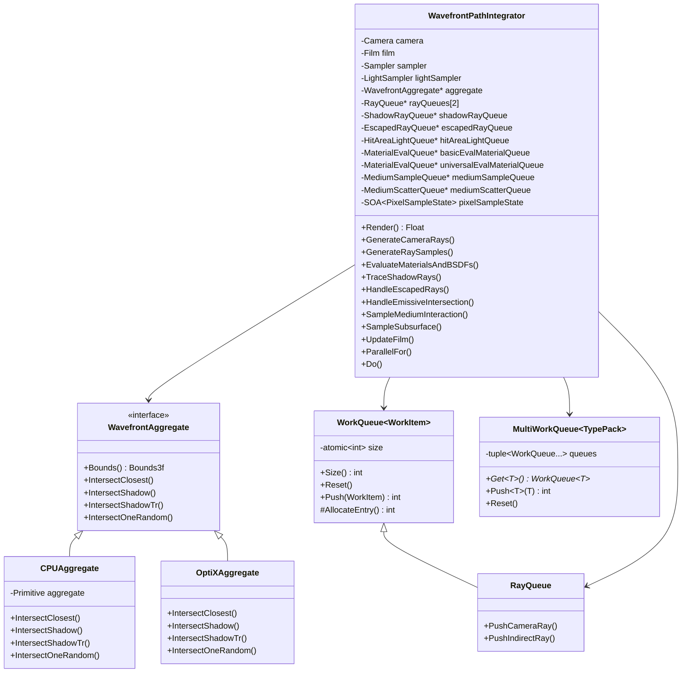
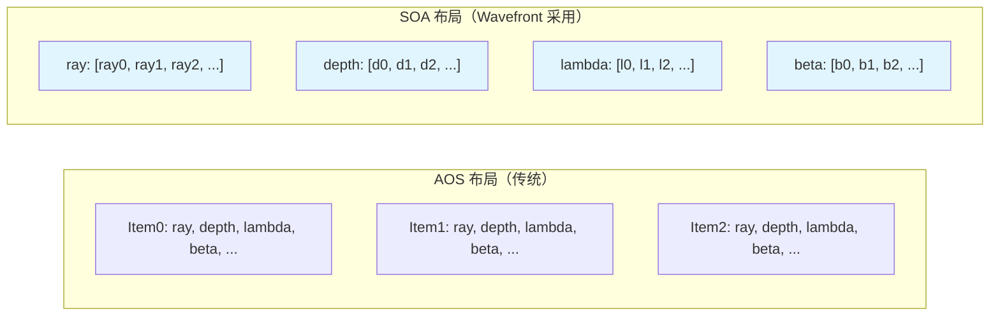
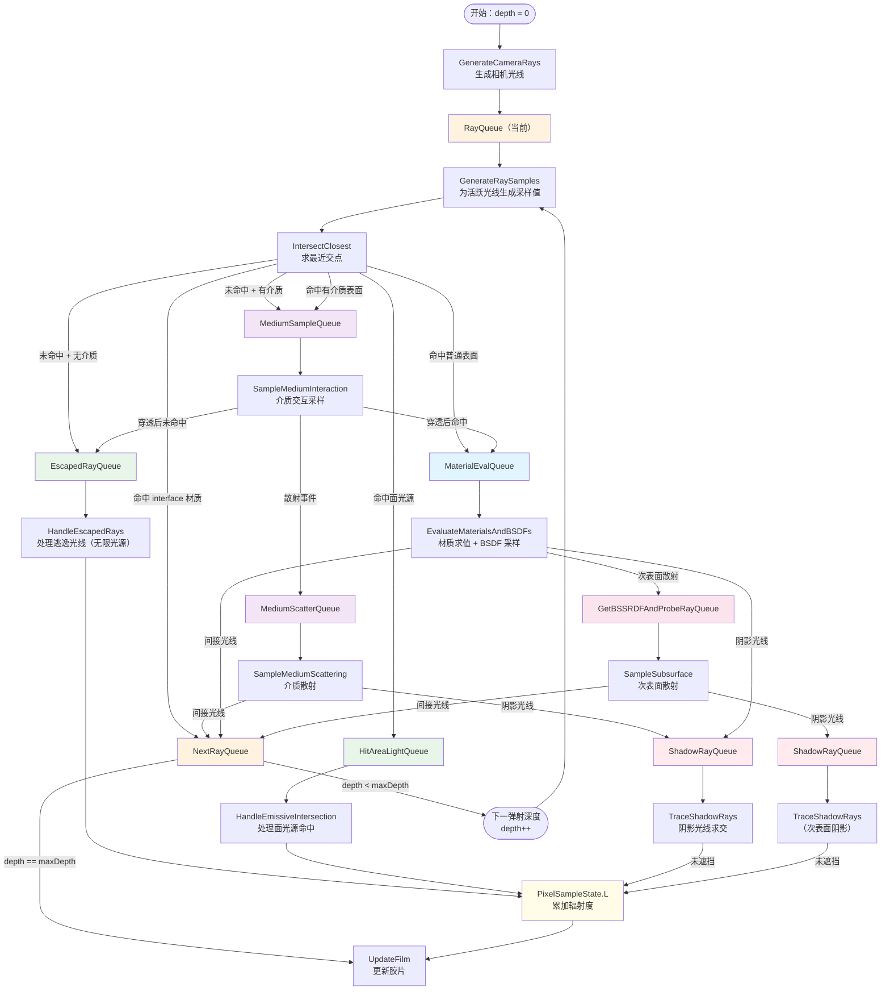
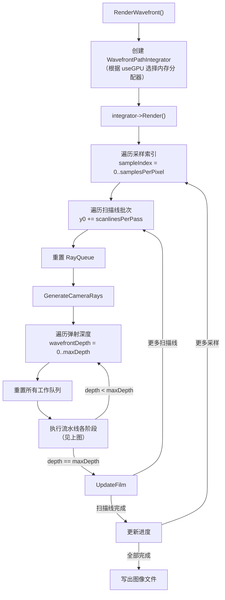
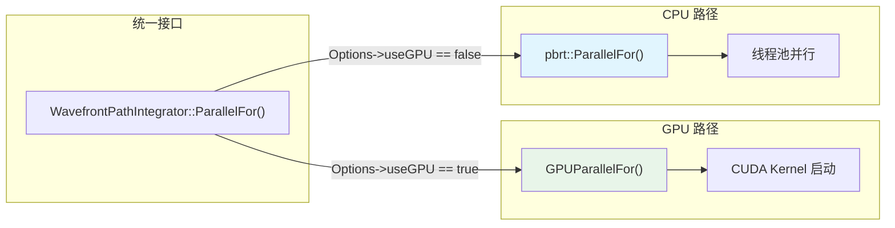

# Wavefront 路径追踪模块

## 概述

`wavefront/` 目录实现了 PBRT-v4 中面向 GPU 设计的 **Wavefront 路径追踪积分器**（`WavefrontPathIntegrator`）。与传统的逐像素递归路径追踪不同，Wavefront 架构将渲染流水线拆分为多个独立的 **内核阶段**（kernel stages），每个阶段批量处理同一类型的工作项（work items）。这种设计充分利用了 GPU 的大规模并行能力，同时也支持 CPU 多线程后端。

核心设计理念包括：

- **SOA（Structure of Arrays）数据布局**：所有工作项的数据以 SOA 方式组织，将同一字段的数据连续存储在内存中，而非将单个工作项的所有字段放在一起（AOS）。这显著提高了 GPU 上的内存合并访问（coalesced memory access）效率。
- **工作队列（Work Queues）驱动的流水线**：渲染的每个阶段（光线生成、求交、着色、阴影光线等）都通过工作队列连接。一个阶段从输入队列中消费工作项，处理后将新的工作项推入输出队列，供下一阶段消费。
- **CPU/GPU 双后端**：通过 `ParallelFor` / `GPUParallelFor` 抽象层和 `PBRT_CPU_GPU_LAMBDA` 宏，同一套核心逻辑可以在 CPU 和 GPU 上执行，GPU 后端通过 CUDA 和 OptiX 实现。

## 文件列表

| 文件 | 用途 |
|------|------|
| `wavefront.h` / `wavefront.cpp` | 模块入口，定义 `RenderWavefront()` 函数，负责创建 `WavefrontPathIntegrator` 并启动渲染 |
| `integrator.h` / `integrator.cpp` | 核心类 `WavefrontPathIntegrator` 和 `WavefrontAggregate` 的定义与实现，包含主渲染循环和所有流水线阶段的调度逻辑 |
| `workqueue.h` | 工作队列模板类 `WorkQueue<T>` 和 `MultiWorkQueue<T>`，提供线程安全的原子入队操作以及 `ForAllQueued` 批量处理函数 |
| `workitems.h` | 所有工作项结构体（`RayWorkItem`、`ShadowRayWorkItem`、`MaterialEvalWorkItem` 等）及具体队列类型（`RayQueue`、`ShadowRayQueue` 等）的定义 |
| `workitems.soa` | SOA 自动生成的元描述文件，使用 pbrt 自定义 DSL 描述工作项的 SOA 布局，由构建系统预处理生成 `wavefront_workitems_soa.h` |
| `aggregate.h` / `aggregate.cpp` | `CPUAggregate` 实现，封装 CPU 端的场景求交加速结构（GPU 端的 `OptiXAggregate` 位于 `gpu/optix/` 目录） |
| `intersect.h` | 求交后的工作分发逻辑：`EnqueueWorkAfterMiss`、`EnqueueWorkAfterIntersection`、`RecordShadowRayResult` 和 `TraceTransmittance` 等内联函数 |
| `camera.cpp` | 相机光线生成阶段 `GenerateCameraRays` 的实现 |
| `samples.cpp` | 采样生成阶段 `GenerateRaySamples` 的实现，为每条活跃光线生成直接光照、间接光照和次表面散射所需的随机样本 |
| `surfscatter.cpp` | 表面散射阶段 `EvaluateMaterialsAndBSDFs` 的实现，包括材质求值、BSDF 采样、直接光照采样和阴影光线入队 |
| `media.cpp` | 参与介质交互阶段 `SampleMediumInteraction` 和 `SampleMediumScattering` 的实现 |
| `subsurface.cpp` | 次表面散射阶段 `SampleSubsurface` 的实现 |
| `film.cpp` | 胶片更新阶段 `UpdateFilm` 的实现，将像素辐射度累加到胶片上 |

## 架构图

### 模块内部类关系

### SOA 数据布局示意

## 核心类与接口

### WavefrontPathIntegrator

主积分器类，协调所有渲染阶段的执行。关键成员与方法：

- **双缓冲光线队列** `rayQueues[2]`：使用乒乓（ping-pong）缓冲策略，`CurrentRayQueue(depth)` 和 `NextRayQueue(depth)` 交替作为当前阶段的输入和输出，通过 `depth & 1` 索引切换。
- **`Render()`**：主渲染循环，按扫描线分批处理像素。对于每个采样索引，依次执行：光线生成 -> 逐深度迭代（求交 -> 介质采样 -> 处理逃逸光线 -> 处理面光源命中 -> 材质求值/BSDF采样 -> 阴影光线追踪 -> 次表面散射）-> 胶片更新。
- **`ParallelFor()` / `Do()`**：CPU/GPU 统一的并行执行抽象。当 `Options->useGPU` 为真时调用 `GPUParallelFor`，否则调用 CPU 端的 `pbrt::ParallelFor`。
- **`pixelSampleState`**：类型为 `SOA<PixelSampleState>`，以 SOA 方式存储每个像素样本的完整状态（坐标、波长、辐射度、采样值、可见表面等），是各阶段之间共享数据的核心载体。

### WavefrontAggregate

场景求交加速结构的抽象接口，定义了四种求交操作：

| 方法 | 用途 |
|------|------|
| `IntersectClosest()` | 最近交点求交，根据结果将工作项分发到逃逸队列、面光源队列、材质求值队列或介质采样队列 |
| `IntersectShadow()` | 阴影光线遮挡测试（不透明场景） |
| `IntersectShadowTr()` | 带透射率的阴影光线追踪（参与介质场景） |
| `IntersectOneRandom()` | 次表面散射的随机交点采样 |

具体实现：
- **`CPUAggregate`**（本目录）：使用 CPU 端的 `Primitive` 加速结构
- **`OptiXAggregate`**（`gpu/optix/` 目录）：使用 NVIDIA OptiX 光线追踪引擎

### WorkQueue\<WorkItem\>

线程安全的工作队列模板类，继承自 `SOA<WorkItem>`：

- 使用原子计数器 `size` 管理队列长度，支持 CUDA 原子操作和 `std::atomic`
- `AllocateEntry()` 通过原子自增分配新条目
- `Push()` 将工作项写入已分配的位置
- `Reset()` 将计数器置零以复用队列内存

`ForAllQueued()` 全局函数对队列中所有工作项并行执行给定的回调函数。

### MultiWorkQueue\<TypePack\>

多类型工作队列容器，内部持有一组 `WorkQueue`，每种类型（如每种具体材质、每种相位函数）对应一个队列。用于 `MaterialEvalQueue` 和 `MediumScatterQueue`，实现按材质/相位函数类型的工作分类。

### 核心工作项结构体

| 结构体 | 用途 |
|--------|------|
| `PixelSampleState` | 像素样本的完整状态：坐标、辐射度 L、波长、滤波权重、可见表面、相机光线权重、采样值 |
| `RayWorkItem` | 活跃光线：光线本体、弹射深度、路径吞吐量 beta、MIS 权重 r_u/r_l |
| `EscapedRayWorkItem` | 未命中场景的逃逸光线，用于无限光源的辐射度计算 |
| `HitAreaLightWorkItem` | 命中面光源的光线，携带交点和发光属性 |
| `ShadowRayWorkItem` | 阴影光线：光线、最大距离、暂存辐射度贡献 Ld |
| `MaterialEvalWorkItem<M>` | 材质求值工作项，按具体材质类型模板化，携带交点的完整几何信息 |
| `MediumSampleWorkItem` | 介质采样工作项，用于 delta tracking 的介质交互 |
| `MediumScatterWorkItem
` | 介质散射工作项，按相位函数类型模板化 |
| `GetBSSRDFAndProbeRayWorkItem` | BSSRDF 求值与探测光线生成 |
| `SubsurfaceScatterWorkItem` | 次表面散射的交点查找与散射计算 |

## 依赖关系

### 本模块依赖的其他模块

| 依赖模块 | 依赖内容 |
|----------|----------|
| `base/` | 相机、胶片、滤波器、光源、光源采样器、材质、采样器、BxDF、介质等基础接口 |
| `util/soa.h` | SOA 数据布局的核心模板机制 |
| `util/parallel.h` | CPU 并行执行 `ParallelFor` |
| `cpu/primitive.h` 和 `cpu/aggregates.h` | CPU 端的场景加速结构 |
| `gpu/util.h` 和 `gpu/memory.h` | GPU 端的并行执行 `GPUParallelFor` 和 CUDA 统一内存管理 |
| `gpu/optix/aggregate.h` | GPU 端的 OptiX 加速结构（仅当 `PBRT_BUILD_GPU_RENDERER` 启用时） |
| `materials.h` / `lights.h` / `cameras.h` / `samplers.h` | 具体的材质、光源、相机、采样器实现 |
| `scene.h` | `BasicScene` 类，提供场景描述和资源创建 |

### 依赖本模块的其他模块

| 被依赖方 | 依赖内容 |
|----------|----------|
| `main.cpp` / 渲染入口 | 调用 `RenderWavefront()` 启动 Wavefront 渲染 |
| `gpu/optix/` | `OptiXAggregate` 实现 `WavefrontAggregate` 接口，使用本模块定义的工作项和队列类型 |

## 数据流

### Wavefront 渲染流水线（单次弹射深度）

### 主渲染循环结构

### 工作队列的 CPU/GPU 执行模型

`ForAllQueued()` 函数遵循相同的分发模式：在 GPU 模式下启动 CUDA 内核遍历队列中的所有工作项，在 CPU 模式下使用线程池的 `ParallelFor` 并行处理。队列的原子计数器在 GPU 上使用 `cuda::atomic`（或旧版 `atomicAdd`），在 CPU 上使用 `std::atomic`，确保多线程安全的入队操作。
