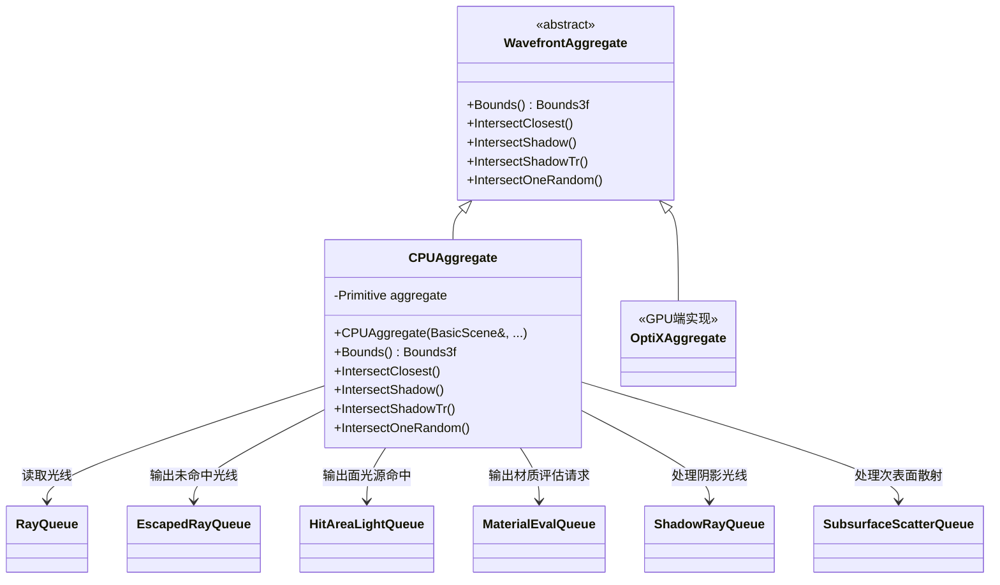
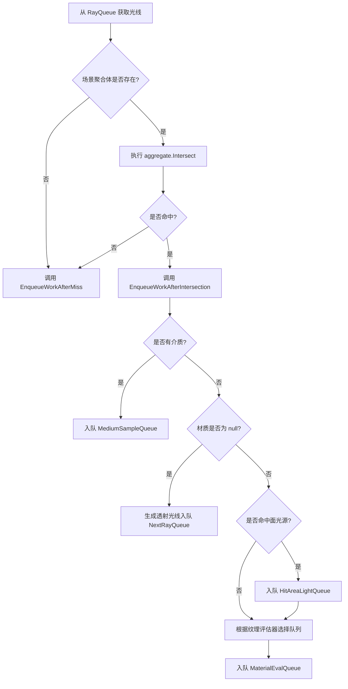

# aggregate.h / aggregate.cpp

## 概述
该文件实现了波前路径追踪积分器的 CPU 端几何加速结构聚合体。`CPUAggregate` 类继承自 `WavefrontAggregate` 抽象接口，封装了基于 CPU 的光线-场景求交操作，包括最近交点查找、阴影光线测试、带透射率的阴影光线测试以及次表面散射的随机交点查找。它在渲染管线中负责将光线队列中的光线批量与场景几何体进行求交，并将结果分发到相应的工作队列中。

## 主要类与接口
| 类/结构体/函数 | 说明 |
|---|---|
| `CPUAggregate` | CPU 端的场景聚合体实现，继承自 `WavefrontAggregate`，封装了 `Primitive` 类型的加速结构 |
| `CPUAggregate::IntersectClosest` | 对光线队列中的所有光线执行最近交点查找，并根据结果将工作项分发到逃逸光线队列、面光源命中队列、材质评估队列或介质采样队列 |
| `CPUAggregate::IntersectShadow` | 并行处理阴影光线队列，使用 `IntersectP` 进行简单的遮挡测试 |
| `CPUAggregate::IntersectShadowTr` | 处理带有透射率追踪的阴影光线，用于含参与介质场景中的阴影光线传播 |
| `CPUAggregate::IntersectOneRandom` | 为次表面散射在两点之间随机采样一个交点，使用加权蓄水池采样 |
| `Bounds()` | 返回场景聚合体的轴对齐包围盒 |

## 架构图

## 算法流程图

## 依赖关系
- **依赖**：`pbrt/cpu/primitive.h`、`pbrt/cpu/aggregates.h`、`pbrt/lights.h`、`pbrt/materials.h`、`pbrt/scene.h`、`pbrt/wavefront/integrator.h`、`pbrt/wavefront/workitems.h`、`pbrt/wavefront/intersect.h`、`pbrt/util/parallel.h`、`pbrt/util/soa.h`
- **被依赖**：`pbrt/wavefront/integrator.cpp`（在构造函数中创建 `CPUAggregate` 实例）
