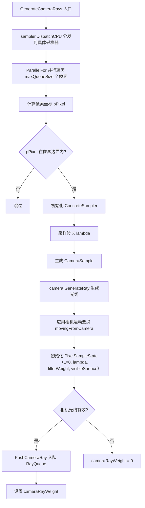

# camera.cpp

## 概述
该文件是 `WavefrontPathIntegrator` 的相机光线生成实现部分，不对应独立的头文件。它实现了 `GenerateCameraRays()` 方法，负责为每个像素生成相机光线、初始化像素采样状态，并将生成的光线推入光线队列。此阶段是波前渲染管线的第一步，为后续所有求交和着色工作提供初始光线。

## 主要类与接口
| 类/结构体/函数 | 说明 |
|---|---|
| `WavefrontPathIntegrator::GenerateCameraRays(y0, movingFromCamera, sampleIndex)` | 非模板版本的分发函数，通过 `sampler.DispatchCPU` 将调用转发到具体采样器类型的模板版本（排除 MLTSampler 和 DebugMLTSampler） |
| `WavefrontPathIntegrator::GenerateCameraRays<ConcreteSampler>(y0, movingFromCamera, sampleIndex)` | 模板版本，为指定扫描线范围内的每个像素并行生成相机光线 |

## 算法流程图

## 依赖关系
- **依赖**：`pbrt/pbrt.h`、`pbrt/cameras.h`、`pbrt/options.h`、`pbrt/samplers.h`、`pbrt/util/bluenoise.h`、`pbrt/util/spectrum.h`、`pbrt/util/vecmath.h`、`pbrt/wavefront/integrator.h`
- **被依赖**：作为 `WavefrontPathIntegrator` 方法的实现文件，由 `integrator.cpp` 中的 `Render()` 循环调用
