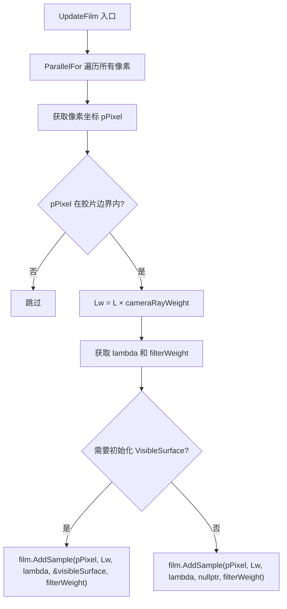

# film.cpp

## 概述
该文件是 `WavefrontPathIntegrator` 的胶片更新实现部分，不对应独立的头文件。它实现了 `UpdateFilm()` 方法，负责在每个扫描线批次完成所有波前深度的追踪后，将累积的辐射度值写入胶片。此阶段是波前渲染管线中每个批次的最后一步。

## 主要类与接口
| 类/结构体/函数 | 说明 |
|---|---|
| `WavefrontPathIntegrator::UpdateFilm()` | 并行遍历所有像素采样状态，将累积辐射度 L 乘以相机光线权重后写入胶片。支持可见表面（VisibleSurface）的写入 |

## 算法流程图

## 依赖关系
- **依赖**：`pbrt/pbrt.h`、`pbrt/film.h`、`pbrt/wavefront/integrator.h`
- **被依赖**：作为 `WavefrontPathIntegrator` 方法的实现文件，由 `integrator.cpp` 中的 `Render()` 循环在每个扫描线批次末尾调用
