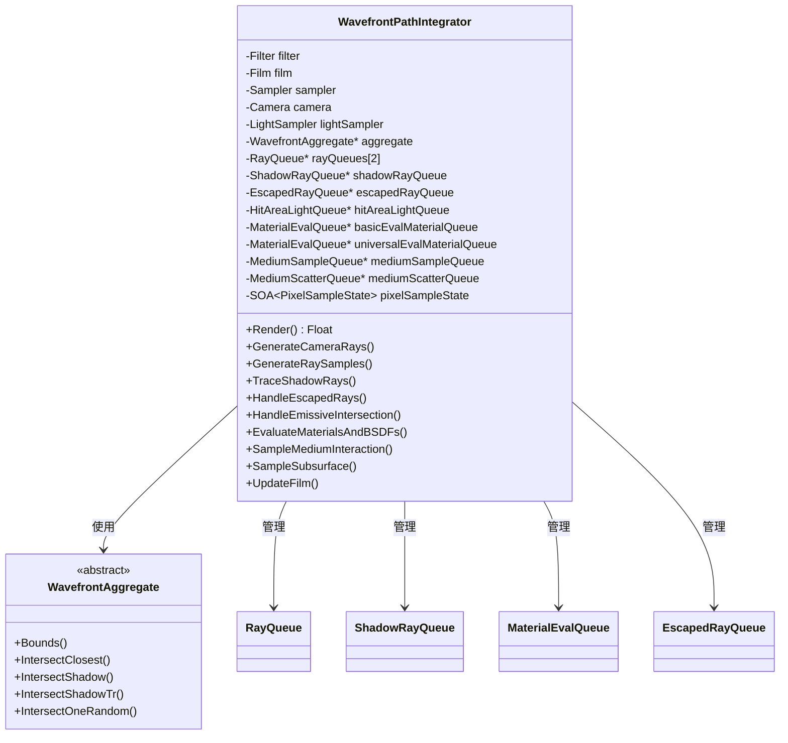
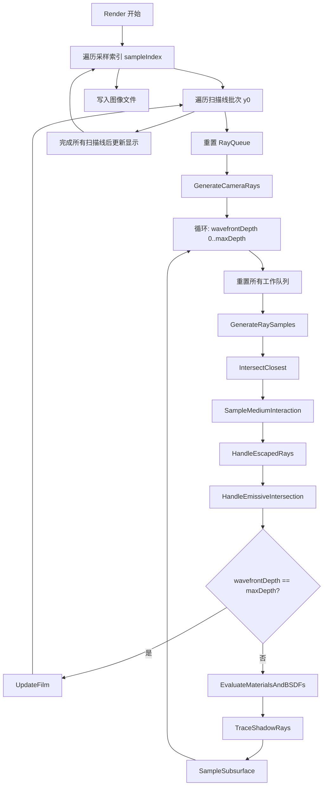

# integrator.h / integrator.cpp

## 概述
该文件定义并实现了波前路径追踪积分器（`WavefrontPathIntegrator`）的核心类，是整个 wavefront 渲染架构的中枢。它协调了相机光线生成、光线-场景求交、材质评估、光源采样、介质交互、次表面散射和胶片更新等所有渲染阶段。同时定义了 `WavefrontAggregate` 抽象接口，为 CPU 和 GPU 两种求交后端提供统一接口。

## 主要类与接口
| 类/结构体/函数 | 说明 |
|---|---|
| `WavefrontAggregate` | 抽象基类，定义了场景聚合体的求交接口（最近交点、阴影光线、带透射率阴影光线、随机交点） |
| `WavefrontPathIntegrator` | 波前路径追踪积分器主类，管理整个渲染循环和所有工作队列 |
| `WavefrontPathIntegrator::Render()` | 主渲染循环，按采样索引和扫描线批次驱动所有渲染阶段 |
| `WavefrontPathIntegrator::GenerateCameraRays()` | 生成相机光线并初始化像素采样状态 |
| `WavefrontPathIntegrator::GenerateRaySamples()` | 为当前波前深度的所有活跃光线生成采样值 |
| `WavefrontPathIntegrator::TraceShadowRays()` | 追踪阴影光线以评估直接光照 |
| `WavefrontPathIntegrator::SampleMediumInteraction()` | 处理参与介质中的光线传播和散射 |
| `WavefrontPathIntegrator::HandleEscapedRays()` | 处理未命中任何几何体的逃逸光线，计算无限远光源的贡献 |
| `WavefrontPathIntegrator::HandleEmissiveIntersection()` | 处理命中面光源的光线，计算发射辐射贡献 |
| `WavefrontPathIntegrator::EvaluateMaterialsAndBSDFs()` | 评估材质属性和 BSDF |
| `WavefrontPathIntegrator::SampleSubsurface()` | 处理次表面散射 |
| `WavefrontPathIntegrator::UpdateFilm()` | 将计算的辐射值写入胶片 |
| `WavefrontPathIntegrator::ParallelFor()` | 统一的并行化接口，根据配置选择 CPU 或 GPU 并行 |
| `WavefrontPathIntegrator::Do()` | 执行单个任务的统一接口 |
| `WavefrontPathIntegrator::Stats` | 渲染统计信息结构体，记录各深度的光线数量 |
| `updateMaterialNeeds()` | 辅助函数，分析场景中材质的需求以确定队列分配 |

## 架构图

## 算法流程图

## 依赖关系
- **依赖**：`pbrt/base/bxdf.h`、`pbrt/base/camera.h`、`pbrt/base/film.h`、`pbrt/base/filter.h`、`pbrt/base/light.h`、`pbrt/base/lightsampler.h`、`pbrt/base/sampler.h`、`pbrt/cameras.h`、`pbrt/film.h`、`pbrt/filters.h`、`pbrt/lights.h`、`pbrt/lightsamplers.h`、`pbrt/options.h`、`pbrt/wavefront/workitems.h`、`pbrt/wavefront/workqueue.h`、`pbrt/wavefront/aggregate.h`、`pbrt/gpu/util.h`（GPU 构建时）、`pbrt/util/parallel.h`、`pbrt/util/display.h`、`pbrt/util/gui.h`
- **被依赖**：`pbrt/wavefront/wavefront.cpp`、`pbrt/wavefront/camera.cpp`、`pbrt/wavefront/film.cpp`、`pbrt/wavefront/media.cpp`、`pbrt/wavefront/samples.cpp`、`pbrt/wavefront/subsurface.cpp`、`pbrt/wavefront/surfscatter.cpp`、`pbrt/wavefront/aggregate.h`
