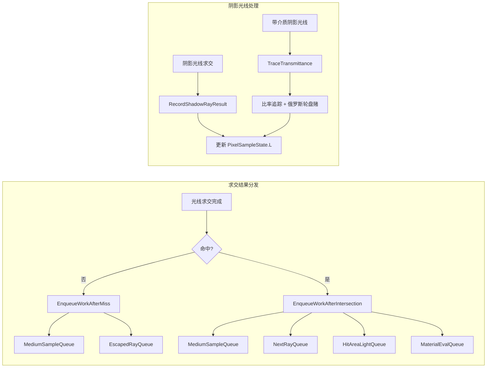
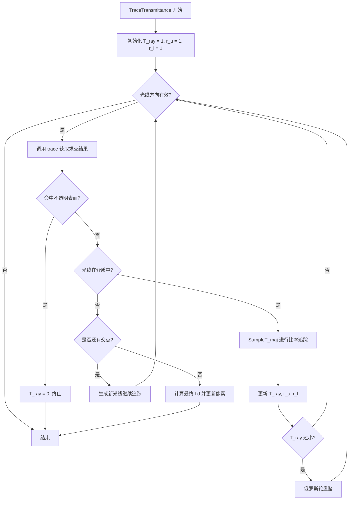

# intersect.h

## 概述
该头文件定义了波前路径追踪中光线求交后的工作分发辅助函数。它提供了三个关键的内联函数，用于在光线与场景求交后根据结果类型（未命中、命中、阴影光线遮挡）将工作项入队到对应的工作队列。此外还包含了带参与介质的阴影光线透射率追踪算法模板。这些函数同时支持 CPU 和 GPU 执行。

## 主要类与接口
| 类/结构体/函数 | 说明 |
|---|---|
| `EnqueueWorkAfterMiss()` | 光线未命中时的分发逻辑：如果光线在介质中则入队 `MediumSampleQueue`，否则入队 `EscapedRayQueue` |
| `RecordShadowRayResult()` | 记录阴影光线结果：如果未被遮挡，使用 MIS 权重计算直接光照贡献并累加到像素 |
| `EnqueueWorkAfterIntersection()` | 光线命中后的分发逻辑：处理介质接口、MixMaterial 解析、null 材质透射、面光源命中和材质评估队列选择 |
| `TransmittanceTraceResult` | 透射率追踪的结果结构体，包含是否命中、命中点位置和材质 |
| `TraceTransmittance()` | 模板函数，实现带参与介质的阴影光线透射率追踪，使用比率追踪（ratio tracking）和俄罗斯轮盘赌终止策略 |

## 架构图

## 算法流程图

## 依赖关系
- **依赖**：`pbrt/pbrt.h`、`pbrt/util/spectrum.h`、`pbrt/wavefront/workitems.h`
- **被依赖**：`pbrt/wavefront/aggregate.cpp`（`CPUAggregate` 的求交方法中使用这些辅助函数）、GPU 端 OptiX 代码
