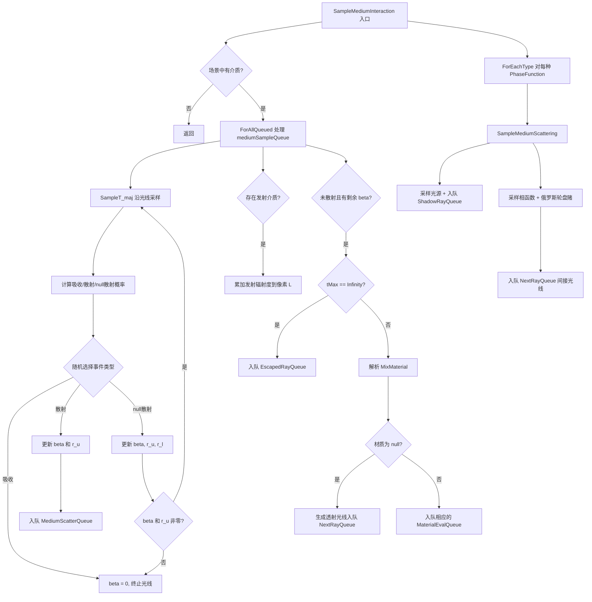

# media.cpp

## 概述
该文件是 `WavefrontPathIntegrator` 的参与介质交互实现部分，不对应独立的头文件。它实现了 `SampleMediumInteraction()` 和 `SampleMediumScattering()` 方法，负责处理光线在参与介质（如烟雾、云层等体积媒介）中的传播、吸收、散射和发射。该文件是波前渲染管线中处理体积渲染效果的核心模块。

## 主要类与接口
| 类/结构体/函数 | 说明 |
|---|---|
| `SampleMediumScatteringCallback` | 回调结构体，用于通过 `ForEachType` 对每种相函数类型调用 `SampleMediumScattering` |
| `WavefrontPathIntegrator::SampleMediumInteraction(wavefrontDepth)` | 处理介质采样队列中的所有工作项：执行 majorant 传输函数采样（`SampleT_maj`），根据随机选择的事件类型（吸收、散射、null散射）进行相应处理 |
| `WavefrontPathIntegrator::SampleMediumScattering<PhaseFunction>(wavefrontDepth)` | 模板方法，处理介质散射事件：采样直接光照（从光源采样）和间接光照（从相函数采样新方向），包含俄罗斯轮盘赌终止 |

## 算法流程图

## 依赖关系
- **依赖**：`pbrt/wavefront/integrator.h`、`pbrt/media.h`
- **被依赖**：作为 `WavefrontPathIntegrator` 方法的实现文件，由 `integrator.cpp` 中的 `Render()` 循环在每个波前深度中调用
